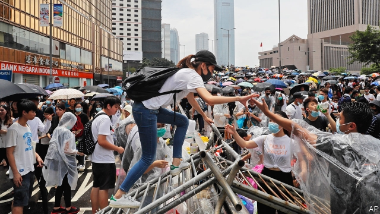
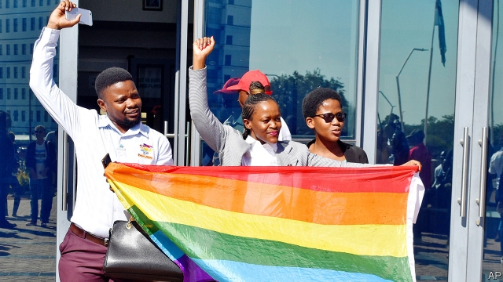

###### People v power

# Politics this week 

 

> Jun 15th 2019 

Police in Hong Kong used rubber bullets, tear gas and water hoses on crowds demonstrating against a proposed law that would allow people to be extradited to the Chinese mainland. Three days earlier, perhaps 1m marchers thronged the streets, worried that the law would make anyone in Hong Kong, citizens and visiting businessfolk alike, vulnerable to prosecution in Chinese courts, which are under the thumb of the Communist Party. See article. 

For the third time, a court in New Zealand prevented the government from extraditing a murder suspect to China. It asked the government to consider whether China could be relied upon to adhere to the human-rights treaties it has signed and whether a trial would be free from political interference. 

Tsai Ing-wen, the president of Taiwan, survived a primary challenge from Lai Ching-te, her former prime minister. She will face the winner of the opposition Kuomintang’s primary at the polls in January. 

Kassym-Jomart Tokayev was confirmed as Kazakhstan’s president in an election in which he won 71% of the vote—somewhat less than the 98% that his predecessor and patron, Nursultan Nazarbayev, won in 2015. Observers said both votes were unfair. Police arrested hundreds of peaceful demonstrators. See article. 

The government of the Australian state of Queensland issued the final approvals for the proposed Carmichael coal mine, to be built by Adani, an Indian conglomerate. Environmentalists oppose the mine, arguing that coal threatens the climate and the Great Barrier Reef. 

Mauricio Macri made a surprising selection for his running-mate in Argentina’s presidential election in October: Miguel Ángel Pichetto, who leads the Peronist bloc in the senate. The other presidential ticket will be all-Peronist, including Cristina Fernández de Kirchner, a former president. Previous Peronist regimes have borrowed and splurged with unusual recklessness. 

Jair Bolsonaro, Brazil’s president, contradicted the country’s central bank when he claimed a plan to create a monetary union with Argentina was under consideration. The central bank was further ruffled when Mr Bolsonaro said that a single currency could one day be used throughout South America. 

Donald Trump dropped his threat to raise tariffs on goods from Mexico, after its government promised to do more to stop migrants from Central America illegally crossing the border into the United States. In Mexico the deal was hailed for averting a potential crisis. Mr Trump’s critics said that some of the details were not, in fact, new. See article. 

Mr Trump claimed executive privilege (again) in withholding details from Congress about the procedure used for placing a question on the next census about citizenship. The House oversight committee recommended that the attorney-general and commerce secretary be held in contempt for refusing to co-operate. 

The New York Times decided to end political cartoons in its international edition, following the publication in April of a “clearly anti-Semitic and indefensible” caricature of Binyamin Netanyahu, Israel’s prime minister, as a dog leading a yarmulke-wearing Mr Trump. Presumably if the paper ever publishes a reprehensible article, it will thereafter have to distribute only blank pages. 

Dozens of people, including several children, were killed in a Dogon village in central Mali. The murders were blamed on a Fulani militia and are the latest in a series of tit-for-tat ethnic killings. In March a Dogon militia slaughtered more than 150 Fulani villagers. 

A child became the first person in Uganda to die of Ebola, a deadly virus that has infected more than 2,000 people in the Democratic Republic of Congo next door. The boy had travelled to Uganda from Congo with family members, some of whom are also infected; his grandmother also died. Uganda’s system for containing epidemics is far more effective than Congo’s. 

Protesters in Sudan called off a general strike and agreed to resume talks with the junta that took charge after the fall of the country’s dictator, Omar al-Bashir, in April. Negotiations over who would lead a transitional government had collapsed when security forces murdered at least 100 demonstrators on June 3rd. See article. 

 

Botswana’s high court legalised gay sex, striking down a colonial-era prohibition. Half of young people in Botswana now say they would not object to a gay neighbour, a marked increase in tolerance from previous generations. See article. 

Oil prices jumped after two tankers were reportedly damaged in a suspected attack off the coast of Oman. America has blamed Iran for several recent attacks on shipping. 

A Saudi Arabian teenager faces possible execution for taking part in a demonstration when he was ten years old. The boy, now 18, has been held for four years. 

Ivan Golunov, a Russian journalist who exposes corruption, was arrested after police claimed to have found drugs in his possession. Photos purporting to show a drug lab in his flat turned out to have been taken somewhere completely different. After huge protests, which included the front pages of normally quiescent newspapers, at his obvious framing, the authorities released him. See article. 

In Moldova police surrounded government buildings after a rival administration declared itself in charge. The pro-Russian president, who supports the new team, was sacked by the old team. See article. 

Ten candidates jostled to become leader of Britain’s Conservative Party, and thus the country’s next prime minister. Boris Johnson is the bookies’ favourite, but not Europe’s. See article. 

The British government amended the Climate Change Act to set a target of eliminating Britain’s net emissions of greenhouse gases by 2050. The “net zero” target is the first in any G7 country. There are two wrinkles: it is unclear whether the target will include emissions from aviation and shipping; and policies adopted to reach the target may make use of international offsets. 

Norway’s parliament voted to require the country’s sovereign-wealth fund, the world’s largest, to divest from fossil-fuel companies. Energy giants that have invested heavily in renewables, such as BP and Shell, are excluded. 

