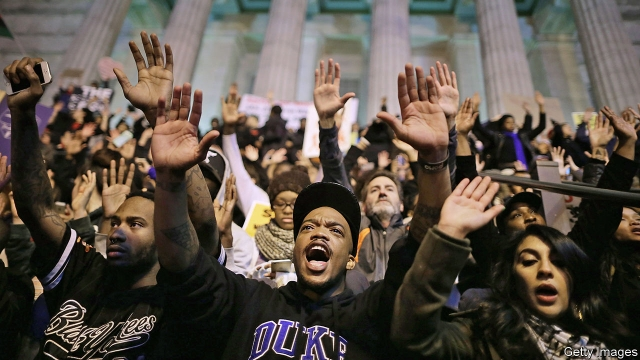
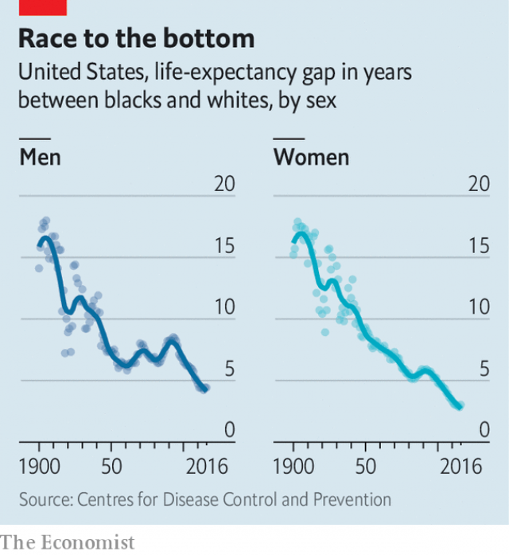

###### Black lives longer

# Black men in America are living almost as long as white men 

 

> print-edition iconPrint edition | United States | Jun 15th 2019 

BACK IN 1980 when Harlem was still a byword for poverty, criminality and the decline of New York City, black men in the neighbourhood had a worse chance of living to the age of 65 than men in Bangladesh did. At that time Harlem’s residents—almost all of them black, and many of them poor—died of heart disease at double the rate of whites. They died of liver cirrhosis, brought on by alcoholism or hepatitis, at ten times the rate of whites. And they were 14 times likelier to be murdered. Today the prominent corner of Malcolm X Boulevard and West 125th Street houses a Whole Foods, an upmarket grocery chain, and life expectancy is up to 76.2 years. That is still five years behind the rest of the city, but the gap is no longer so egregious. 

The case of Harlem exemplifies a remarkable trend in American public health that is seldom noticed: the persistent gap in life expectancy between whites and blacks has closed substantially, and is now at its narrowest ever. In 1900, the earliest date for which the Centres for Disease Control and Prevention (CDC) publishes statistics, the life expectancy for black boys at birth was 32.5—14.1 years shorter than for white boys. Put another way, the typical black boy had 30% less life to live. Incremental progress, however fitful, was made for the next century, but epidemics of crack, HIV and urban violence threatened to reverse it. By 1993, a peak year for violent crime, the life-expectancy gap between black and white men had widened again by nearly three years, to 8.5 years. 

But then it began a sustained, steady fall. In 2011 the black-white gap had narrowed to 4.4 years for men (5.7% less) and just 3.1 years (3.8% less) for women. Though progress then levelled off until 2016, the most recent year available from the CDC, the trend is stable and not reversing. 

The downward trajectory can be explained by several simultaneous phenomena, not all of them cheerful. Among the elderly, more of whom die after all than the rest, the narrowing is due to mortality from heart disease and cancer declining faster for blacks than for whites. But for premature deaths, racial gaps—especially between black and white men—have also narrowed because of substantially reduced mortality from homicide, the result of the great crime decline, and HIV, the result of improved medical therapies. Yet the emergence of the opioid epidemic, which kills whites at higher rates than other races, has also hastened the racial convergence. 

Criminologists still do not know why violent crime and homicides began to decline in the mid-1990s. A wide array of theories have been proposed: the eroding appeal of crack cocaine, mass incarceration actually working as intended, legalisation of abortion, less lead poisoning of children and the improving economy. But the public-health consequences are abundantly clear, particularly for black men who were and remain the most frequent victims of murder. Patrick Sharkey and Michael Friedson, two sociologists, conducted a thought experiment showing that life expectancy for black men would have been 0.8 years lower if homicide rates had persisted at their levels in 1991. That is a remarkably large health effect—on the order of entirely eliminating obesity among black men. The authors calculate that 17% of the narrowing of the life-expectancy gap for black and white men between 1991 and 2014 could be explained by the unexpected halving of the murder rate over that period. 

 

Considerable improvement in the treatment of HIV has also decreased premature deaths for black men, who were hammered by the epidemic. An estimated 42% of the 1.1m Americans living with HIV today are black, triple their share of the population. At the peak of the epidemic, around 1994, the virus was killing blacks at an age-adjusted rate of nearly 60 per 100,000—or three times the rate at which opioid overdoses killed whites in 2017. Though blacks still make up a majority of Americans killed by HIV, the overall rates of death have plummeted to around 10 per 100,000. 

At the same time as lifespans have been increasing for blacks, prospects for whites, especially the non-elderly, have sagged. This is mainly because of the rapid increase in deaths from drug overdoses, opioids chief among them. Death rates for whites caused by all drugs more than quadrupled from 1999 to 2017, and are now 32% higher than for blacks. Historically drug epidemics have disproportionately hit non-white Americans. But of the 47,600 people killed by opioids in 2017, 37,100 were white. Opioid addiction, suicide and overdose-related deaths all affect whites at much higher rates than blacks. Some of the reason for this may, ironically enough, lie in racial discrimination. 

About three in four heroin addictions began with a legitimate prescription. The hotspots of the opioid crisis—the tri-state meeting of Ohio, Kentucky and West Virginia as well as rural New England—where blizzards of pills were later followed by a rise in overdose deaths, are much whiter than the rest of the country. “It is consistent with pretty different rates of prescribing opioids. We supplied it very differently to whites versus blacks in these areas,” says Ellen Meara, a health economist at Dartmouth College. “But we also know that there’s a lot of racial discrimination in our health-care system.” 

Wherever they lived, blacks were less likely to obtain legal opioids in the first place. A study of pain-related visits to emergency departments between 1993 and 2005—a period that overlaps with the run-up to the crisis—shows that whites were substantially more likely to obtain an opioid prescription, even after controlling for the reported severity of pain and other factors. A wealth of studies have found similar effects. Doctors are also much more likely to stop prescribing opioids for blacks after detecting illicit drug use. In the case of opioids, racial bias probably saved lives. 

Despite improvements in the racial gap, inequality in life expectancy by class and income still remains. The CDC has begun publishing estimates of life expectancy at the census-tract (or neighbourhood) level. Life expectancy at the 90th percentile is 83.1 years compared with 73.1 years at the 10th. In Chicago, census tracts a few miles apart can differ in average life expectancies by two decades. The estimates are quite closely related to measures of income and poverty: a simple regression shows that a five-percentage-point increase in the poverty rate is associated with a one-year decline in life expectancy. 

Research by Raj Chetty, an economist, and his colleagues shows that the income gap in life expectancy has been growing even as the racial one has been declining. So has the education gap. Although people have long assumed that higher socioeconomic status bought better health, that was not as true for blacks as it was for whites, says Arline Geronimus, a public-health professor at the University of Michigan. Now that is changing. “The convergence is due to more affluent, educated blacks living longer while less-affluent, less-educated whites are not living as long. It shouldn’t be interpreted as though we’ve made great strides,” she says. Even so, the improvements for black men run counter to the drumbeat of pessimism about race in America. Black lives are longer. ◼ 

