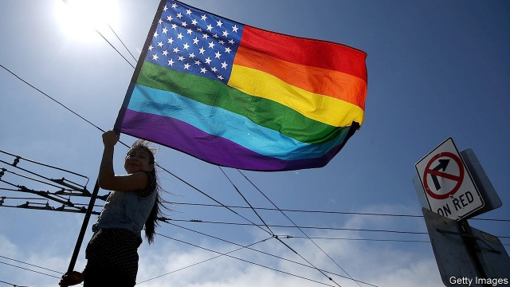
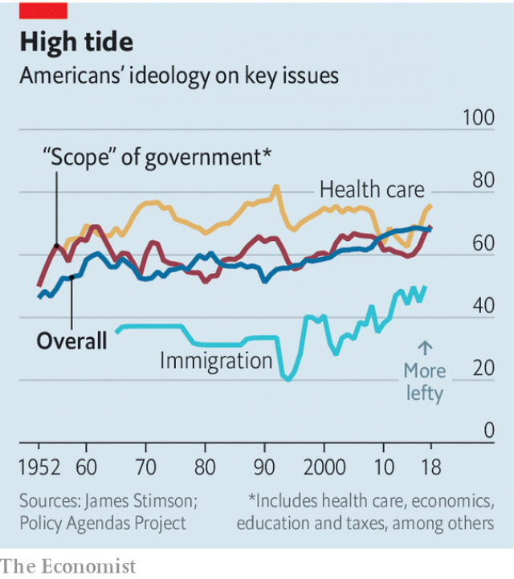

###### Political ideology

# Donald Trump’s presidency has moved America left 

 

> print-edition iconPrint edition | United States | Jun 15th 2019 

AMERICANS ARE more in favour of “big-government” policies today than at any point in the last 68 years. That is the conclusion of James Stimson, a political scientist, who has analysed long-running polls from the Universities of Chicago and Michigan to come up with annual estimates of the “public mood”. Mr Stimson estimates that the last time America was feeling this left-wing was in 1961, when the civil-rights movement was full-steam ahead and Alan Shepard became the first American to be launched into outer space. 

Public opinion is contradictory: many more Americans describe themselves as conservative than as liberal; yet Americans prefer left-leaning policies to right-leaning ones, even when these are accompanied by the promise of higher taxes. Mr Stimson’s data show a steady leftward shift in Americans’ views on the scope of government since 1952. And according to data from the Policy Agendas Project, an academic research group, the public also holds views that are more tolerant than ever on social issues like same-sex marriage; worries more about the environment; and is more enthusiastic about immigration and giving a helping hand to African-Americans. 

The American public’s preferences on policy have long shown an allergy to whatever the occupant of the White House is trying to do. In this respect public opinion is like a thermostat: when policy gets too hot, Americans turn the temperature down. When the government drifts too far right, Americans want to move back to the left, as happened in the 2018 mid-term elections. 

 

Mr Stimson is careful not to suggest that the leftward swing is only a reaction to Donald Trump’s presidency. He points out that the policy preferences he sees now “are the issues of American politics of earlier generations, the New Deal and Great Society agenda”. Mr Trump has done little to shift policy on Social Security, for example, so increasing leftiness on that issue may reflect real attitude-changes rather than thermostat-tweaking. On policy preferences at least, America is moving leftwards.◼ 

