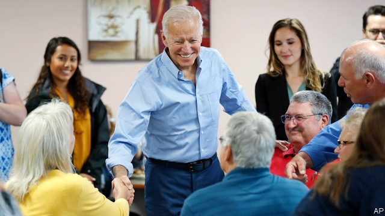

###### Green New Democrats

# The Democratic front-runners respond to the Green New Deal 

 

> print-edition iconPrint edition | United States | Jun 15th 2019 

ONE OF ELIZABETH WARREN’S formative political tangles, which prompted her move from law professor at Harvard to senator from Massachusetts, occurred in 2005 over a bankruptcy reform bill. Ms Warren was concerned about the repercussions for middle-class Americans, especially women, who would have a harder time filing for bankruptcy as a result of the bill. A particular target of her ire was Joe Biden, then a senator from Delaware and one of the bill’s strongest backers. “Senators like Joe Biden should not be allowed to sell out women in the morning and be heralded as their friend in the evening,” she wrote at the time. 

To this day the two are seen as ideological foes. Ms Warren appeals to the left of the party, while Mr Biden has made a concerted effort to court moderate Democratic voters. Yet both contenders, who are placed second and first respectively in the Democratic field in YouGov’s most recent poll for The Economist, have released environmental plans. The striking similarity of their schemes shows how the politics of climate change has evolved from a niche issue among Democrats to one of great urgency. 

Those who called for a Green New Deal, particularly Alexandria Ocasio-Cortez, a first-term congresswoman from New York, can claim some credit for this change. A series of recent calamitous weather events—fires, polar vortices, hurricanes and floods—has also helped. In a recent YouGov poll 19% of Democrats said the environment was the most important issue for them. That is second only to health care. 

The Green New Deal, as first proposed, had two problems. The first is that it was only a sketch, with handwaving in lieu of detail on the massive economic reorganisation it envisages. The second is that it included a gratuitous list of progressive measures—including a federal jobs guarantee, universal basic income and universal health insurance—that are only tangentially related to climate policy. Many top-tier Democratic candidates, who would no doubt balk at such sweeping changes, signed on to the Green New Deal nonetheless. Yet with the release of Mr Biden’s and Ms Warren’s plans, both less quixotic and more scrupulous than the earlier sketches, the debate is much improved. 

Mr Biden was one of the few leading Democratic contenders to resist endorsing the Green New Deal. He would instead release his own climate plan, he said. An adviser’s comment that Mr Biden was seeking a “middle ground” gave rise to grumbling among activists that his would be a mishmash that offered carbon taxes for liberals and fracking subsidies for conservatives. In fact, Mr Biden’s plan is more ambitious. 

He would like the American economy to be a net-zero emitter of carbon pollution by 2050. This would be achieved in two ways, including executive orders and actions (taking Barack Obama’s playbook for climate policy and applying it much more aggressively) that would bypass Congress. The second way, which would require legislation, is through $1.7trn in federal funding for what Mr Biden calls a “Clean Energy Revolution”. There are other proposals in there too, like developing high-speed rail and reforming zoning to encourage more dense, energy-efficient cities. 

One innovation is to threaten tariffs on countries without adequate environmental policies. America accounts for 15% of the world’s greenhouse-gas emissions. China accounts for nearly twice that. Mr Biden’s language on this point—he says he wants “strong new measures to stop other countries from cheating on their climate commitments”—sounds almost Trumpian. Given that Mr Biden is the clear front-runner for the nomination, this perhaps paves the way for a future attack on the president for focusing his trade actions on the wrong problem. Climate change is a more serious problem for America’s future than illegal immigration or bilateral trade deficits, Mr Biden could credibly argue. 

Ms Warren’s plan has a Trumpian echo, too: it was released under the banner of “economic patriotism”. It represents, according to her, “my commitment to a Green New Deal”—one that applies the analogy of wartime mobilisation during Franklin Roosevelt’s presidency to modern times. Hers is straightforward industrial policy, calling for $2trn of investment over the next ten years for research and development, with three-quarters of that vast sum spent through federal procurement. Ms Warren thinks that all this production would generate 1m jobs, which would pay at least $15 per hour and guarantee 12 weeks of paid family and medical leave. About $100bn of the money would be spent on a “Green Marshall Plan”, dedicated to exporting the clean-energy technology developed in America to other countries. 

Curiously, both proposals dodge the question of a price on carbon, whether through direct taxation or a cap-and-trade scheme. Though research into more cost-effective technology for carbon capture and sequestration or solar power is helpful and necessary, a carbon price incorporating the negative externality of pollution would seem a simple first step. Mr Biden’s plan only nods towards the principle “that polluters must bear the full cost of the carbon pollution they are emitting” and says nothing more on the subject. Ms Warren’s plan does not mention it at all. 

Both candidates employ clever staffers who know about carbon pricing. But they also employ strategists who note that carbon taxes are easily dismissed as energy taxes by political opponents. The lessons of 2010, when a Democratic effort to create a carbon market collapsed despite unified control of government, leading to an electoral backlash, have been well learned.◼ 

