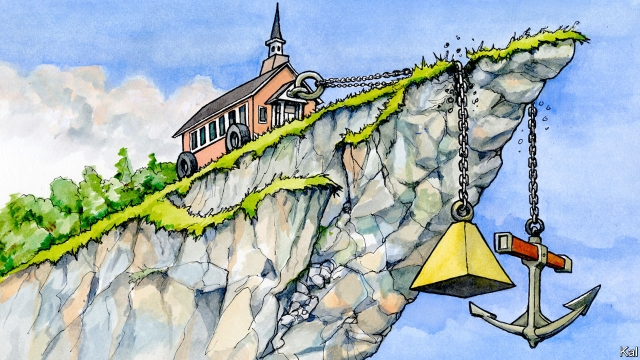

###### Lexington

# The Southern Baptists are beset by two related fiascos 

 

> print-edition iconPrint edition | United States | Jun 15th 2019 

FORTY YEARS ago in Houston, Texas, a group of conservative pastors pulled off a heist at the annual meeting of the Southern Baptist Convention that reshaped both America’s biggest Protestant denomination and its national politics. Liberal Baptists, who had dared question the literal truth of the Genesis myth, were denied leadership positions and, in due course, driven out. “Biblical inerrancy” was the conservatives’ war-cry. 

Within months they had joined battle in the culture and political wars, too. The Southern Baptists’ hitherto nuanced position on abortion—they would allow it whenever a woman’s well-being was in question—became one of implacable opposition. And the next year the convention’s president, Adrian Rogers, was among a throng of Southern Baptists around Ronald Reagan as he uttered the line that sealed the bond between Republicans and the religious right: “I know you can’t endorse me, but I endorse you.” 

This week in Birmingham, Alabama, Mr Rogers’s 46-year-old successor, J.D. Greear, one of the youngest men to lead the denomination, attempted a more cautious reorientation. “We are at a defining moment regarding the future of our convention,” he told a vast audience of “messengers” from its 47,000 churches. 

That was an understatement. The confidence that fuelled the 1979 resurgence is long gone. The convention’s membership of 15m, concentrated in the Bible belt, is its lowest in 30 years, and falling. Half of Southern Baptist children leave the faith; annual baptisms—which reached a high in the mid-1970s, when the moderates were ascendant—are at their lowest level in almost a century. Worse, the convention is gripped by two mutually reinforcing crises that are both illuminating and accentuating its decline. 

The first is a split over Donald Trump far more rancorous and damaging than most non-evangelicals appreciate. At last year’s confab, in Dallas, Mike Pence made headlines by giving a jarringly self-congratulatory speech. Less remarked on was the fact that around 40% of his audience had voted to bar the vice-president from speaking at all. The second crisis is a slew of sexual-abuse scandals that have made what is still the biggest Protestant denomination appear as unsafe for children as the Catholic church. 

Recent investigations by the Houston Chronicle and San Antonio Express-News found that over the past two decades nearly 400 Southern Baptist officials, including several well-known pastors, had been credibly accused or convicted of abuse. These twin crises are not merely bad in themselves. They also appear to have flipped how many Southern Baptists look on their decline, turning an attitude of righteous stoicism into something closer to panic. 

Though the revivalist hopes that attended the conservative resurgence were long ago dispelled, its enduring combination of fundamentalism and politicisation gave Southern Baptists two sorts of comfort. From the former, a hardened conviction of being heaven-bound even if the rest of society was going south; from the latter, the significant boon of presidential power every other cycle. Today’s crises have whipped both comfort blankets away. 

Most obviously, revelations that hundreds of women and children were abused in church camps and Sunday schools—and often cruelly suppressed when they tried to protest—have made it harder for Southern Baptists to find solace in their own holiness. Especially as the revelations point to something worse than a few bad apples: they are an indictment of the institutionalised male chauvinism that the conservative resurgence helped cement. 

Even before the scandals broke, leading evangelical women such as Beth Moore were straining against the doctrine of “complementarianism” (a hoary idea of gender difference that gives men the whip-hand in the home and bars women from preaching). The impunity that hundreds of powerful male abusers long enjoyed has made this seem even less supportable—especially as leading complementarianists, such as Paige Patterson, an architect of the resurgence, were among those tainted by the scandals. “Did we win confessional integrity only to sacrifice our moral integrity?” asked another conservative, Albert Mohler, as the first wave of revelations broke last year. “This is exactly what those who opposed the conservative resurgence warned would happen.” 

The damaging effect of this on the convention’s ability to evangelise—in theory, its core mission—is obvious. It has also highlighted the pre-existing damage done by politicisation, which has made the Southern Baptists largely unacceptable to half of America. And their contentious embrace of Mr Trump has made that situation even worse, by alienating the younger and non-white evangelicals they must recruit merely to tread water. Mr Greear, a conservative theologian with the relatively moderate outlook of his native North Carolina, has made increasing diversity in the convention a priority. Yet Mr Trump’s election, he acknowledges, has driven a “quiet exodus” of blacks from its churches. 

He is at least trying to confront both crises. This week he backed a change to the convention’s rule-book that will make it easier to expel any church that fails to respond satisfactorily to allegations of abuse. A guarded critic of Mr Pence’s speech last year, he also warned against cheerleading for Mr Trump. By the convention’s recent standards this is progress, albeit insufficient. 

It is unclear how much influence Mr Greear wields over the convention’s disparate parts. It is also not obvious how, in practical terms, he can expect to wean his brethren off party politics without revising the tenets of the 1979 resurgence, which he claims to support. So long as Southern Baptists put fighting abortion and gay rights before the acts of grace and social justice they once gave equal billing to, they have only one party to support: the Republicans, whose shrinking, white coalition is the future they are trying to escape. Mr Greear can clearly see that looming cliff-edge. He just cannot bring himself to hit the brake.◼ 

