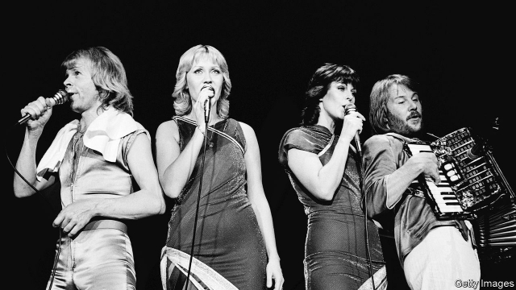

###### Worker-ownership funds

# The winner (no longer) takes it all 

 

> print-edition iconPrint edition | United States | Jun 15th 2019 

BERNIE SANDERS, a contender for the Democratic presidential nomination, will face plenty of opposition to his latest plan to force companies to hand over shares to workers. But at least he will not have to compete with ABBA. When the Swedish Social Democrats proposed the same idea in 1982, the pop group behind “The Winner Takes It All” and “Money, Money, Money” helped lead opposition to the proposal, producing pamphlets and even hosting an open air gig to protest. In the end, ABBA saw off the socialist menace. The idea was watered down by the Swedish government, then scrapped in the 1990s. 

Under the scheme being considered by the Sanders campaign, businesses will issue a small chunk of equity each year to a fund controlled by current workers. The fund will pay dividends to employees, while also giving them the same say as other shareholders. Supporters argue that companies rewarding bosses with equity has been the norm for years. If this is a sensible way to incentivise management, they ask, why not do the same for workers? Critics argue that it amounts to de facto confiscation by the state. 

The idea, first devised by Rudolf Meidner, a Swedish economist, in the 1970s, lay dormant until it was rediscovered by British wonks, who pitched it to an increasingly left-wing Labour opposition in Britain. John McDonnell, the shadow chancellor, adopted it and announced that, under a Labour government, workers at businesses with more than 250 staff would be gradually handed 10% of the stock. 

Also involved in blowing the dust off the idea have been Democracy Collaborative, a think-tank which has lobbied heavily for the proposal on both sides of the Atlantic. One of their main backers is the NoVo Foundation, a fund set up by Peter and Jennifer Buffett, with the cash fronted by Peter’s dad, Warren. A new model of business ownership is being developed with cash left over from the old one. 

British businesses have started eyeing the scheme nervously, now that Mr McDonnell’s Labour Party has a decent chance of taking power. Executives grumble that it is causing more of a headache than Britain leaving the EU. If Mr Sanders ends up in the White House, they will face a transatlantic pincer movement. 

For lefties on both sides of the Atlantic, this is part of the plan. American thinkers hoping to shove the Democratic Party further left can point to Britain as a laboratory of left-wing ideas. Meanwhile British politicos, whose bookshelves bulge with biographies of dead American presidents and boxsets of “The West Wing”, crave American approval. An idea backed by a presidential candidate seems less outlandish. 

How far the proposal will go under Mr Sanders has yet to be decided. It is flexible. In effect the policy creates a knob, which can be twiddled between a redistribution of capital and control, all the way to handing the means of production to workers wholesale (as was Mr Meidner’s original intention, until ABBA intervened). 

Polling for Democracy Collaborative indicates that people like the idea: about 55% of American voters support putting up to half of a company’s shares in a trust for workers. Even 50% of Republicans support such a scheme, with only 30% opposed. An idea that was rejected as too left-wing in 1980s Sweden is being revived in the twin engines of the Anglo-Saxon economy. Nevertheless, with ABBA on tour again in America this summer, maybe Mr Sanders should watch out.◼ 

