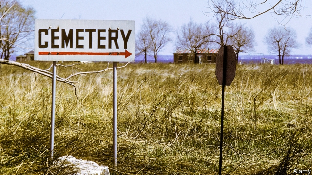

###### Potters’ fields

# What happens to those who die poor or unclaimed in NYC 

 

> print-edition iconPrint edition | United States | Jun 15th 2019 

“NO ONE WHO sleeps there had a dollar to their name in life…the bodies interred here are as utterly forgotten and wiped away as if they never existed.” This is how the New York Herald described Hart Island in 1874, five years after the city began burying its poor on the island off the Bronx. A century and a half later the poor and unclaimed are still buried in pine coffins, usually marked only with numbers, not names. These are stacked three deep in a trench, three feet below the surface. Each trench holds 150 adult coffins. Roughly 1,200 people are buried there each year. 

Jurisdictions across America are wrestling with what to do with their unclaimed dead. A state fund in West Virginia, which has been hit hard by opioid overdoses, ran out of money to bury the unclaimed dead last year. Some cities, including Los Angeles, cremate the unclaimed after a certain period, which is cheaper than burial. In North Carolina unclaimed bodies are cremated, then stored for three years before being scattered at sea. In Washington’s King County, which includes Seattle and its suburbs, the poor and the unclaimed are cremated and stored until a biennial burial ceremony. Because of the high number of migrant deaths in Pima County in Tucson, Arizona, its medical examiner’s office handles more unidentified remains relative to population than any office in America. 

Those who die without the means to pay for a funeral, which costs nearly $9,000 on average, end up on Hart Island. Nearly two-thirds had next of kin who opted for a public burial. In all about 1m people lie there. The earliest victims of AIDS were buried there in 1985, far away from the other graves. Hart Island may be the largest cemetery for victims of the epidemic. During heavy rains bones are sometimes washed away and end up on nearby beaches. 

The island, which has a stark beauty, is under the jurisdiction of the city’s Department of Corrections. Four days a week eight inmates from Rikers, New York’s biggest jail, travel to the island to dig graves and lower coffins into them. They are paid a $1 an hour. 

Because of Hart Island’s close connection with jail and prisoners, it is difficult for relatives (or anyone else) to visit. “It is clear to me we can do better, much better for the people buried on Hart Island,” says Corey Johnson, the Speaker of the city council. “This needs to be changed immediately.” He is backing a bill that would transfer operations to the Parks Department, create an office to help those who need help with a burial and make travel to the island easier. The city also needs to think about what to do when Hart Island is full. The Department of Corrections says there will only be space for eight or ten more years.◼ 

