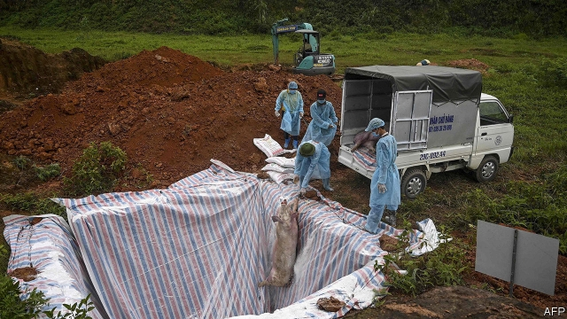
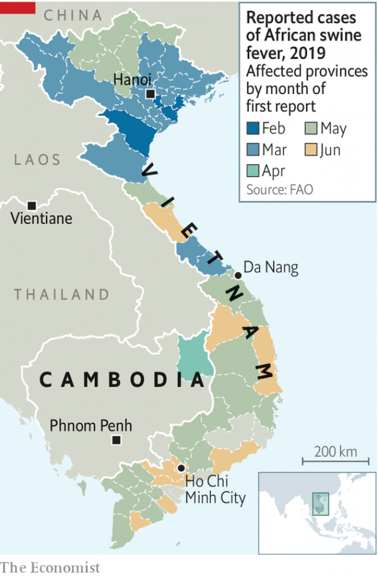

###### Swine on the line

# African swine fever spreads to South-East Asia 

 

> print-edition iconPrint edition | Asia | Jun 20th 2019 

THERE ARE few dishes that a typical Filipino, Thai or Vietnamese would not consider improved by the addition of pork. What better to stuff a squid with, or garnish a bowl of steaming noodles, or simply spit-roast and scoff? No wonder, then, that South-East Asia is home to more than 83m pigs. But the outbreak of African swine fever that has swept through China in recent months is now spreading across the region. Its governments are likely to find it no easier than China’s to contain the disease, which is harmless to humans but typically fatal to pigs. 

Swine fever first crossed the border from China into Vietnam in February. It has gradually worked its way south, and in April spread to Cambodia (see map). Thailand fears it is next. In fact, the disease could already be there or elsewhere: experts worry that monitoring and reporting are patchy. 

 

Pigs catch the disease from each other, from contaminated surfaces, from ticks and from food (slop containing infected pork or pig’s blood). There is also a risk that farmed pigs may be infected by wild ones, and vice versa. Those transporting not just live pigs, but also pork, across borders risk introducing swine fever to new areas. Meanwhile, pork prices have jumped more than 40% compared with a year ago and analysts expect overall inflation to rise in Vietnam and Cambodia as a result. 

Culling swine is one of the main ways officials hope to curb the disease. Vietnam has slaughtered 2.5m pigs, twice as many as China. Bans on the import of pigs and pork are another tactic. But many of the region’s pig farms are tiny, as in China. Their owners cannot afford to erect special fencing or buy commercial feed. The temptation, if they suspect their pigs are infected, is to kill or sell them quickly and quietly, to save themselves from financial ruin. Although the Vietnamese government compensates farmers who report sick pigs that are subsequently culled, the fear of slow or low payments can still put farmers off. 

Fortunately, international co-ordination, especially between governments and companies in South-East Asia’s pork industry, has been impressive, says Wantanee Kalpravidh of the Food and Agriculture Organisation, a UN agency. She lauds a scheme to send Thai pork to Cambodia to meet demand at affordable prices—on carefully cleaned and monitored vehicles—to discourage the smuggling of possibly contaminated meat from Vietnam. Somkuan Choowatanapakorn of Charoen Pokphand Foods, a big Thai agribusiness that handles lots of pork, says the company has “taken steps already” to train farmers to recognise and respond to the disease’s symptoms. He adds that contingency plans for an outbreak are also in place. 

Despite such efforts, the scale of the porcine plague in China means that South-East Asia will probably struggle with it for as long as its neighbour does. A working vaccine is still a long way off. It is hard to see what can save the region’s bacon. ◼ 

