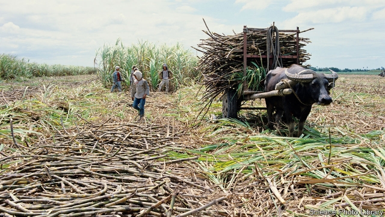

###### Blood and soil

# Filipino farmers are fighting—and dying—for land to till 

 

> print-edition iconPrint edition | Asia | Jun 22nd 2019 

THE MAN brushes away tears. He survived a massacre of nine sugarcane workers in October, he explains, simply because he had popped away to charge his mobile phone. The victims were part of a larger band of labourers who, fed up with endless legal wrangling over the redistribution of land from a plantation called Hacienda Nene, decided one day to start cultivating part of it. The murders took place that very night. The authorities say they suspect communist insurgents, implying they killed their own to generate sympathy for their cause. The survivor scoffs at this, arguing that it is landowners who benefit from the intimidation of the landless. “The irony is that the people feed those who kill them,” he remarks bitterly. 

Since 2016, according to the National Federation of Sugar Workers (NFSW), an activist group, 69 agricultural labourers have been murdered on Negros, an island where around 300,000 workers produce about half of the Philippines’ sugarcane. Workers are supposed to earn around 300 pesos ($5.75) a day. In practice, activists say, they often receive 100 pesos or less. And from planting in April until the harvest in August—the tiempo muerto or dead time—they often earn nothing at all. Redistribution of land from big estates to landless peasants should provide a way out of this penury. Indeed, the constitution enshrines the just distribution of farmland as a fundamental goal of the state. Yet progress is slow and agitation for more vigorous reform often deadly. 

Under the Comprehensive Agrarian Reform Programme, adopted in 1988, tenant farmers and landless agricultural labourers were entitled to apply to the government for land of their own. The land was to come from acquisitions—forcible if need be—from the owners of big estates, who were supposed to keep only five hectares of land, plus three more for each heir. Between 1987 and 2016 the government spent 286bn pesos on the programme. It distributed 4.8m hectares of land to 2.8m beneficiaries. Although the programme was supposed to end in 2016, the government is still working on a big backlog of cases, with some 600,000 hectares still to be parcelled out, much of it on Negros. 

President Rodrigo Duterte, who came to power three years ago, promised faster action. Initially he picked an agricultural activist to head the Department of Agrarian Reform, delighting poor farmers. But a congressional committee full of landowners blocked the appointment. 

The problem is partly administrative. Myriad government agencies and departments have struggled to work together to determine who should receive land and what it is worth. Records are patchy and landowners—naturally—resistant. Loopholes abound which allow the rich to keep their land. They are exempt, for example, if they can claim to be using their land for aquaculture, ecotourism or keeping livestock, according to Rolando Rillo of the NFSW. Another loophole involves using agricultural land for construction projects—a process Mr Duterte has said he wants to make easier. 

Moreover, even when redistribution goes ahead, beneficiaries can struggle. It can be hard to earn a living from just a single hectare of sugarcane—the size of plot many farmers on Negros have received. Some cannot afford inputs such as seed and fertiliser, let alone install irrigation systems. Successive governments have not kept promises to provide money and technical support. The NFSW estimates that 70% of redistributed land from sugarcane plantations on Negros has been leased back to the original owner. 

Nonetheless, land reform has done some good. A study from 2015 found that households that had benefited from redistribution had higher incomes. In 2009 the World Bank found “some significantly positive welfare impacts on its beneficiaries”. 

Other counter-poverty schemes, however, are more effective. When it comes to improving the wellbeing of the rural poor, “conditional cash transfers blow all other programmes away,” says Roehlano Briones of the Philippine Institute for Development Studies. And land reforms seem to foment conflict. The authorities contend that the activists who campaign for it are closet communists who recruit farmers to the New People’s Army (NPA), a 50-year-old insurgent group which America labels as terrorist. One activist admits: “There’s some crossover.” There are perhaps 300-400 NPA guerrillas on Negros, ranged against some 2,000 soldiers. 

The president has started a campaign to pacify the island. “It’s much, much worse under Duterte,” says the former head of a farming co-operative near the town of Toboso, describing a recent spate of night raids by soldiers on his hamlet. On-again-off-again peace talks with NPA leaders have not stemmed the fighting. 

Through locked gates in Bacolod, the biggest city on Negros, an activist says that he and his family have talked about how likely he is to be killed. He expresses optimism, however, that whenever his murder comes, it will at least serve to inspire other campaigners. ◼ 

