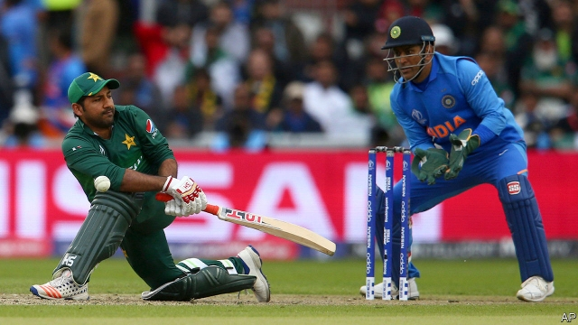

###### A sticky wicket

# For India and Pakistan, cricket is war by other means 

 

> print-edition iconPrint edition | Asia | Jun 22nd 2019 

IT IS HARD to imagine a more stressful job than Sarfaraz Ahmed’s. As captain of Pakistan’s national cricket team, he must brave bruising encounters with India, a far bigger country that happens to be just as mad about the sport, and a bitter rival off the pitch, too. The team leader must also weather Pakistani fans, who at the drop of a catch or fall of a wicket can shower love or dump torrential scorn with equal gusto. 

These days the job is harder than ever. This is not only because the four-yearly World Cup is under way, featuring ten national teams. Nor is it just because tensions with India have been riding especially high since February, when a terrorist bombing in Indian-held Kashmir sparked a tit-for-tat military escalation with Pakistan that brought the neighbours to the brink of nuclear war. In recent times Indian cricket, much like the Indian economy, has inexorably pulled ahead of the Pakistani game, propelled by higher revenues, hugely fatter salaries, more professional management and keener promotion of young talent. 

The pressure on Team Pakistan has in fact been mounting for years. The last—and only—time it won the World Cup was in 1992. The national captain then, and consequent national hero, is now Pakistan’s prime minister, Imran Khan. This sets a rather high bar for Mr Ahmed. To make things worse for the Pakistani captain, on the fateful morning of June 16th, shortly before his team faced off against India, Mr Khan tweeted some advice. Should Pakistan win the coin toss at the start of the match, he insisted, it should definitely choose to bat first. 

Mr Ahmed ignored the advice, only to watch India effortlessly crush his team. But the shock of ending 89 runs behind, and being left ninth out of ten in the tournament ranking, turned out to be merely the opening act in a long humiliation. Enraged by footage of the unfortunate captain failing to stifle a yawn during the match, and by rumours that his team had been gorging on fast food instead of training like the athletic Indians, Pakistan fans have heaped opprobrium on Mr Ahmed. 

“When I die I want Sarfaraz to lower me into the grave so he can let me down one more time,” wailed one tweet, to which came a tart response: “But he might drop you.” On Facebook, Pakistanis shared videos that contrasted scenes of the India captain, Virat Kohli, lifting ponderously huge weights, against a cheap television advertisement where Mr Ahmed appeared, dancing to a jingle promoting a chocolate-covered betel concoction. 

Needless to say, Indians enjoyed a fanfare of gloating. This subsided with unusual speed, however, as cricket fans took instead to sharing the self-deprecatory jokes coming over the border. But if ordinary Indians proved ready to concede that Pakistanis might be good chaps after all, politicians were not so generous. The pointed congratulations tweeted by Amit Shah, India’s new home minister, equated India’s win to its air force’s bombing of an alleged terrorist training camp in Pakistan in February: “Another strike on Pakistan by Team India and the result is the same.” A spokesman for Pakistan’s army, Asif Ghafoor, responded with equal humourlessness. India may excel at cricket, he conceded, but in the recent military exchange had missed its target, failed to stop a Pakistani counterstrike, destroyed one of its own helicopters by mistake and seen one of its own pilots shot down and captured. Howzat!◼ 

