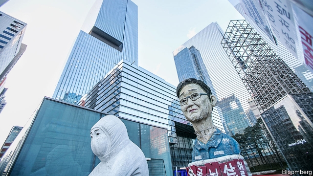

###### Chaebol in the dock

# South Korea’s left-wing president loses his zeal to humble big business 

 

> print-edition iconPrint edition | Asia | Jun 22nd 2019 

MOON JAE-IN could not have been clearer. In his inaugural address as South Korea’s president, in 2017, he promised “the cozy relationship between political and business circles will completely disappear.” He would force powerful conglomerates, known as chaebol, to reform and “boldly break from the malpractices of old days”. He was alluding, among other things, to the sprawling corruption scandal that had prompted the impeachment of Park Geun-hye, his predecessor. 

Prosecutors have indeed harried the chaebol under Mr Moon. Ms Park is serving a long prison sentence for a range of corruption charges. A former health minister was sent to jail for pressing the national pension fund to support a merger in 2015 which cemented Samsung’s founding family’s control over the group. Lee Jae-yong, Samsung’s day-to-day boss (in the place of his ailing father), has also spent time in prison for his alleged role in getting the pension fund to approve the merger. Although an appeals court overturned Mr Lee’s conviction for bribery last year, prosecutors have appealed to the Supreme Court. 

Corporate-governance campaigners say that Samsung manipulated the terms of the merger between Samsung C&T, a trade, construction, fashion and resorts group, and Cheil Industries in 2015. They say it inflated the value of Samsung Bioepis, an affiliate of Samsung BioLogics which at the time was part of Cheil, to the detriment of investors in C&T. The point, they say, was to allow Mr Lee to cement his control over the group without facing a large inheritance-tax bill. Last year a financial regulator found that Samsung BioLogics did indeed inflate the value of Bioepis by $3.9bn, though it did not opine on the motive for this. (Samsung is appealing.) 

Since then, prosecutors have stepped up their investigation into the possible involvement of senior Samsung executives both in the alleged accounting fraud and in subsequent attempts to conceal evidence related to the fraud and to the succession plan that it purportedly facilitated. In May prosecutors ripped open the floorboards in a BioLogics factory and found a stash of electronic devices which they say contain important evidence. They have arrested eight managers from Samsung BioLogics and Samsung Electronics, the group’s most valuable company, whom they suspect of manipulating evidence. Earlier this month they spent hours interrogating Chung Hyun-ho, the president of Samsung Electronics and Mr Lee’s closest aide, about his involvement in the plans. They may soon summon Mr Lee himself. 

Yet Mr Moon seems increasingly willing to embrace Samsung. In late April he visited a Samsung factory near Seoul, the capital, to launch a national semiconductor strategy. It was the president’s first official visit to a domestic Samsung facility since he took office. Cameras captured him smiling warmly while shaking hands with Mr Lee. Mr Moon said he applauded Samsung’s “ambitious” spending plans, which the administration would “actively work to aid”. That is just the sort of view Mr Moon used to criticise: that the chaebol are national champions deserving of political support. 

The president’s change of heart looks mainly motivated by economics. His policy of trying to create “inclusive” growth by boosting wages and small firms has yet to pay off. Last year GDP grew by 2.7%, the slowest pace in six years. A big rise in the minimum wage initially led to job losses, undoing much of the benefit for unskilled workers, the OECD reckons. Ahead of a legislative election in April, the government is under pressure to show economic gains. “In the short term, the easiest way to do that is to go to the chaebol for help,” says Kim Woo-chan of Korea University. 

That may also explain the government’s attitude in a related case. The prosecutors’ zeal has encouraged activist investors in Samsung C&T, who felt hard-done-by when the Cheil-C&T merger went ahead. Elliott, an American hedge fund best known for buying distressed debt, is suing the government for damages under KORUS, a free-trade deal with America. It alleges that the government’s decision to support the merger, and the subsequent collapse in C&T’s share price, cost it more than $700m. Another fund has followed suit. 

The justice ministry, which acts as the defendant, argues that the claim is based on hearsay and that the country has no case to answer. That is understandable: it would be a public-relations disaster for a left-wing government like Mr Moon’s to agree to a multimillion-dollar payout to a prowling hedge fund. But it is a tricky stance to maintain, given the convictions of former officials for influence-peddling in the case. If the ongoing proceedings claim more scalps, the government’s position will become more awkward still. 

Park Ju-gun of CEO Score, a corporate watchdog thinks prosecutors will struggle to prove that Mr Lee or his associates ordered the accounting fraud or were instrumental in destroying evidence—charges they deny. But even if the prosecutors fail, says Park Sangin of Seoul National University, they may unearth enough new evidence for the Supreme Court to decide to send Mr Lee’s bribery case back to a lower court. That court will then have to reconsider the reduction of his sentence in light of the new evidence. It is possible it may restore his original conviction. 

That would put Mr Moon under pressure from conservatives and business lobbyists to return to the old practice of pardoning erring chaebol leaders for the good of the nation. The president will be hoping it never comes to that. ◼ 

