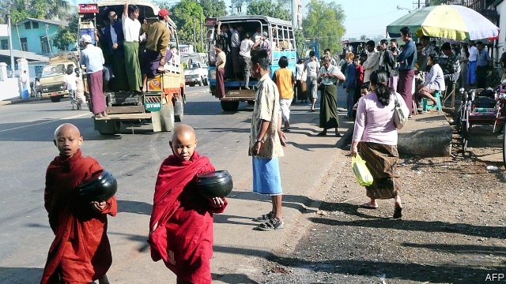

###### Orwell’s elephant

# A writer’s journey through Myanmar 

 

> print-edition iconPrint edition | Books and arts | Jun 22nd 2019 

A Savage Dreamland: Journeys in Burma. By David Eimer. Bloomsbury; 384 pages; £20. To be published in America in September; $34. 

LIKE ITS mercurial name, which shifts between one imposed by British colonisers and another by its generals, Burma, or Myanmar, is a country that defies easy categorisation. About the size of Germany and Poland combined, it is bigger and more diverse than its status on most maps suggests. It is also far more complex than it may seem. A major supplier in the global drugs trade, it is riddled with ethnic conflicts and still crippled by the legacies of imperialism and 50 years of military rule. 

David Eimer, a former South-East Asia correspondent for the Daily Telegraph, a British newspaper, tries to capture this quicksilver place in “A Savage Dreamland”. He is an intrepid reporter. He takes the reader down dirt-track roads, on the back of motorbikes or in a shaky bus on which his neighbour vomits up his curry; into rat-infested cinemas in Yangon; and around dilapidated colonial buildings and the bombastic military museums of Naypyidaw (the soulless capital built by the armed forces in 2005). 

He goes to places where tourists, and many journalists, fear to tread—such as Shan state, where he encounters rival armies and is probed by a lieutenant-colonel on the battle-readiness of the enemy. His interlocutors show just how diverse the country is: a gay Rohingya Muslim man in a society where Muslims are persecuted and same-sex relationships are illegal; a feminist film-maker who disavows Aung San Suu Kyi, the dissident turned democratically elected leader; and Tashi, an 18-year-old Tibetan who says most of his compatriots living in Burma would prefer to be across the border in Tibet, as it is more developed. “They have roads and television.” 

Mr Eimer backs his reporting with historical research, mostly focused on colonialism and its aftermath. He charts the litany of errors made by the British, the effects of which endure. They appeared to promise autonomy to minority groups if they fought on the British side against the Japanese and the Bamar (the majority ethnic group) in the second world war. Many of the repressive laws they introduced remain on the statute books. They employed Indians to do many jobs instead of locals, stirring anti-immigrant sentiment. He quotes a British adviser in the 1940s who encapsulated a purblind view of the Burmese as lazy and easy-going: “The Burman was a happy-go-lucky sort of chap, the Irishman of the east, free with his smiles.” 

The character who appears most frequently is George Orwell, who was based in Burma as a reluctant “colonial enforcer”; his grandmother was born in the country. Mr Eimer reverentially visits the family home. He cites Orwell’s work on Burma and sketches its background. 

This homage inadvertently highlights the contrast between Orwell’s lean prose and “A Savage Dreamland”, which, for all its gripping vignettes, can be baggy and repetitive. Sometimes Mr Eimer relies too heavily on anecdote and supposition. Perhaps this is a risk of charting such a wildly varied country. In “Shooting an Elephant”, a short story set in Burma, Orwell writes that, in East Asia, “a story always sounds clear enough at a distance, but the nearer you get to the scene of events the vaguer it becomes.” Mr Eimer’s book takes readers closer to his fascinating subject, and leaves some of its mysteries unsolved. ◼ 

