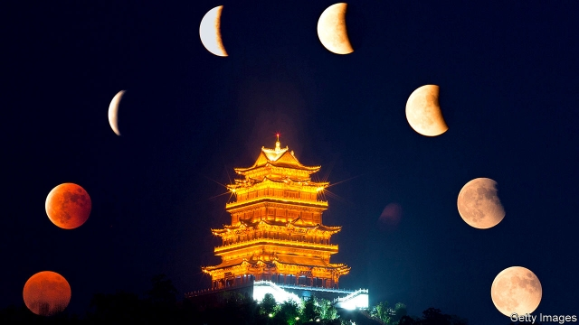

###### The lonely hidden army

# China’s grand, gloomy sci-fi is going global 

 

> print-edition iconPrint edition | Books and arts | Jun 22nd 2019 

IN THE FUTURE, when the Sun runs out of fuel and begins to expand, Earthlings dig thousands of mountain-sized rockets into their planet’s surface and use them to propel their home away from certain destruction. Billions die, as to turn the Earth into an effective mobile ark, its natural rotation must be halted. The resulting tsunamis wipe out entire continents, and with them all life not safely ensconced underground. 

This is the plot of “The Wandering Earth”, a Chinese film adapted from a short story of the same name by Liu Cixin, China’s leading writer of science fiction. After taking over $700m in cinemas, mostly in China, it launched on Netflix in May, making it the first Chinese sci-fi movie to go global. Like much Chinese sci-fi, the story is both darker and more grandiose than many Western blockbusters. The implicit loss of human life is on a par with some Marvel movies, but without the superheroes to soften the blow. Startlingly, the moral authority of the security forces is never challenged in the film. Far from being villains, they help save the world. 

As with other Chinese works in the genre, it is tempting to draw parallels with the Communist regime, even when the writers themselves do not—and dare not—make those analogies explicit. For Western readers, Chinese sci-fi thus offers a window into the country’s hopes and fears. Especially its fears. 

As China’s economy has grown over the past 30 years, its sci-fi writers’ vision has expanded, too. Their stories tend to focus on Earth itself—eschewing galaxies far far away and long ago—while being conceived on a stupendous scale. One recurring wide-angle shot in “The Wandering Earth”, for example, shows the planet gliding through space on a pincushion of blue flame, its atmosphere trailing off into a vacuum. 

Other Chinese science-fiction stories unfold in similarly mindboggling dimensions. In “Mountain”, another tale by Mr Liu, the alien ship that enters Earth’s orbit is so massive that its gravitational pull creates a tower of water in the ocean off the coast of Taiwan, up which the protagonist ascends. In another, “Sun of China”, a rural man moves to Beijing and finds work cleaning skyscraper windows. His industry and enterprise eventually lead him to manage the great artificial sun which China launches to light up its cities. 

Chinese sci-fi took its first step towards the global stage in 2014 with the English publication of “The Three-Body Problem”, the first book in a trilogy by Mr Liu. It tells the story of Earth’s first contact with an alien civilisation, the Trisolarans, whose planet is stuck in climatic chaos as it oscillates wildly between the three stars in its stellar system. The Trisolarans covet the environmental stability that comes with the relative dullness of Earth’s solar system and, armed with technological superiority, plan to take over. Barack Obama name-checked the book while he was president. Mark Zuckerberg liked it. The boss of Xiaomi, one of China’s biggest smartphone companies, has made the trilogy required reading for his employees. Li Yuanchao, China’s former vice-president, is also a fan. 

Mr Liu’s epic yarns have been well-received abroad, but China’s darkest sci-fi stories have not yet left home. Some of the most popular are written by his contemporary, Han Song. Mr Liu has been compared to the British futurist Arthur C. Clarke, says Mingwei Song of Wellesley College in Boston; Mr Han, meanwhile, is sometimes likened to Philip K. Dick, an American dystopian. Mr Liu’s stories are scientifically rigorous; Mr Han’s are allegorical and uncanny—but also grittier and more subversive. Mr Liu offers lucid descriptions of hypothetical Chinese futures. Mr Han conjures ugly parallels of the present. 

One of his stories, “The Passengers and the Creator”, plays out on a Boeing passenger jet. For its occupants, the aeroplane constitutes the entire universe. A closed economy of human flesh and sex-slavery sustains a surreal hierarchy based on seat numbers; eventually the hero finds a way to guide the plane out of the band of night in which it has been perpetually flying, down to Earth and into the light. Some readers have detected an allegory for the Chinese state—a people imprisoned by their mindset, cocooned in a bubble that must eventually be pierced. 

Mr Han has written a trilogy, too—this one firmly rooted on Earth. “Hospital” describes a future in which a benevolent artificial intelligence (AI) aspires to help humans enjoy long and happy lives. But something has gone wrong, and all of the citizens are treated as patients, in a horrifying case of Munchausen syndrome by proxy. Even after death, the AI sees that its subjects remain part of the system, running simulated versions of their lives. 

While Western sci-fi is often alarming, the truth is usually worth discovering. Even in the grimmest Western fables, such as the film “Soylent Green” (1973)—which ends with the revelation that the titular foodstuff is made of people—audiences at least have the comfort that drawing back the curtain might lead to positive change. Mr Song suggests that, by contrast, Chinese sci-fi makes a dystopia out of the act of discovery itself, often presenting the truth as not worth knowing, or not worth the risk. Parallels with the highly controlled flow of information in today’s China, and the danger associated with even trying to circumvent it, are hard to ignore. 

For all the camouflage offered by its fantastical canvas, and even as it gains admirers abroad, Chinese science fiction does not escape censorship at home. In the original manuscript of Mr Liu’s trilogy, for example, the pivotal incident is the killing of the protagonist’s family by Red Guards during the Cultural Revolution. The English translation retains that crux. But in the published Chinese version, notes Mr Song, the order of the chapters is changed so that the turmoil of that era is no longer central to the plot. Graphic descriptions of the murder are excised. 

The censors don’t yet appear to have caught up with Mr Han. The second novel in the “Hospital” trilogy even won Chinese sci-fi’s top honour in 2017, the first time so subversive a book had taken it, says Mr Song. Mr Han is still cranking out sci-fi stories. For his part, Mr Liu has not written a novel since the final instalment of “The Three-Body Problem”, instead focusing on movies and scripting “Wangzhe Rongyao” (“Honour of Kings”), a video game that was the world’s most popular in 2017. 

A crop of younger writers are now emerging in the duo’s wake. “Waste Tide”, by Chen Qiufan, takes place on an island devoted to electronics refuse in a fictionalised South China Sea. A member of the lowest caste, Mimi, toils away recycling computer components for her masters. One day she is infected by a virus from the rubbish, gaining special powers and igniting class warfare. The setting is not too far divorced from parts of real-life China, in which the by-products of the electronics industry create uninhabitably toxic environments. 

The writers of Chinese science fiction anticipated their genre’s rising profile. In 2010 Fei Dao, another author, described its devotees as a “lonely hidden army”. Chinese sci-fi, he said, might “unexpectedly rush out and change heaven and Earth”. That has not quite happened yet. But in the future, anything is possible. ◼ 

