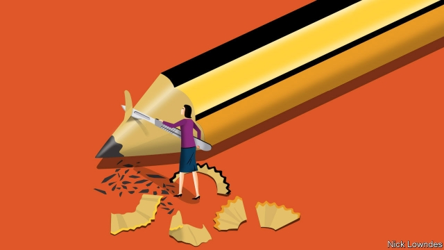

###### Johnson

# How to change a word’s meaning 

 

> print-edition iconPrint edition | Books and arts | Jun 22nd 2019 

“MISOGYNY” SEEMS a straightforward word. In dictionaries, it is “hatred of women”. In its etymology are the Greek verb misein, to hate, and gyne, women. The word, like the sentiment, has been around for a long time. Euripides, an ancient Greek playwright, was called a misogynes, or woman-hater. (“Well, in his tragedies, yes,” his peer Sophocles is said to have quipped, “but in bed at any rate he was a philogynes.”) The first known use of “misogynist” in English is from 1620—by a female group counter-attacking against a screed called “The Arraignment of Lewd, Idle, Froward [sic], and Unconstant Women”. 

In fact, very few interesting words are quite so stable. As they are used, their meanings drift. Furthermore, they need not remain true to their etymological roots, a belief known to linguists as the “etymological fallacy”. The word “person”, for instance, comes from the Latin for “mask”; the word “tragedy” may derive from the Greek for “goat-song”. Over time, words evolve. 

Much of that process is random. But it is also possible to make a conscious effort to shift how a word is used. One such bid is under way for “misogyny”. For decades, feminists have expanded its connotations beyond the idea of “hatred of women”. Recently Kate Manne, a philosopher at Cornell University, has become the voice of that campaign. She thinks the notion of a hatred for all women deep in the psychology of some men is philosophically untestable. In any case, few men, she says, really hate all women. Instead of misogyny meaning something men feel, she says it should designate something women face. 

Ms Manne distinguishes between sexist beliefs and systemic prejudice. For instance, the idea that women have certain innate characteristics (being loving and nurturing, say) and natural roles that derive from them (wife, mother) is sexist. It is when women fail to behave as they “should” that her version of misogyny comes into play—when men punish them for being too sexually active (or not enough), for neglecting their domestic responsibilities or for claiming “male” roles such as leadership. Her misogyny is the enforcement structure of sexism. 

In her recent book “Down Girl”, Ms Manne argues for an “ameliorative” approach to concepts (one she draws from another philosopher, Sally Haslanger), whereby they are made fit for philosophical scrutiny. The vindictive psychology of some men is beyond such analysis, but the expectations widely imposed on women, and how non-conformists are treated, can be probed, and maybe even changed. 

What words mean is generally determined another way: most linguists believe that they simply mean what people use them to mean. As virtually all modern lexicographers acknowledge, dictionaries are there to register actual usage, not to tell the mass of people that they are deploying a word incorrectly. If philosophers or activists want dictionaries to include a new meaning, they have to get people to use the word that way. 

Sometimes they succeed. In 2012 Julia Gillard, Australia’s prime minister, gave her renowned “misogyny speech”, lambasting her rival Tony Abbott for referring to Ms Gillard “making an honest woman of herself”, and for posing by a sign reading “ditch the witch”. Traditionalists pounced; Mr Abbott didn’t hate all women, they said, so Ms Gillard obviously didn’t know what misogyny meant. In response, Macquarie, an Australian dictionary publisher, expanded its definition of the word to include “entrenched prejudice against women”. 

There are other ways to wage a social struggle on the lexical front. Inventing a word is one; Ms Manne has written about “himpathy”, which she uses to describe outbreaks of disproportionate concern for the future of a man accused of harassment, rape or other violence towards women. The term is pointed and memorable, and is spreading online. 

Repurposing an existing word is harder; the inertia of the older meaning must be overcome. But this can be done, as (more intentionally than Ms Gillard) theorists and activists managed with “queer”. Whether inventing or repurposing words, in refusing to kowtow to inherited concepts Ms Manne is emulating Friedrich Nietzsche, who said that philosophers “must no longer accept concepts as a gift, nor merely purify and polish them, but first make and create them, present them and make them convincing”. Sound argument is needed to persuade other philosophers of such intellectual leaps; to enlist the wider world, a compelling vocabulary is vital. 

