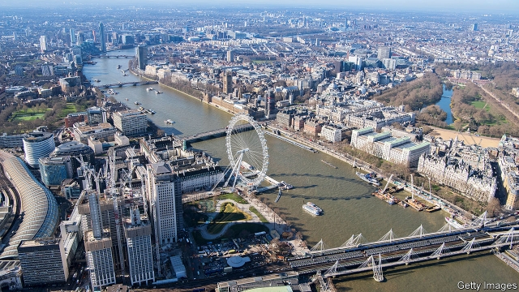

###### Down to the river

# Sweet Thames, run softly till I end my song 

 

> print-edition iconPrint edition | Books and arts | Jun 22nd 2019 

The Way to the Sea: The Forgotten Histories of the Thames Estuary. By Caroline Crampton. Granta; 336 pages; £16.99. 

IF LONDON IS one of the world’s great cities, the Thames is one of its greatest rivers. The landscapes through which it flows are saturated in history; today it remains a vital artery for the capital. In “The Way to the Sea”, Caroline Crampton takes readers from the river’s source to its estuary and the open sea. En route she tells fascinating stories of the Thames past and present. 

There are many books about the Thames. What sets Ms Crampton’s apart is the confluence of her personal history with the river. After sailing over from South Africa in a yacht, her parents began their life in London at a mooring near Tower Bridge. Ms Crampton spent much of her youth on the water. She celebrated the end of her studies at Oxford by leaping fully clothed into the Isis—as the Thames is known as it flows through the city. 

Its different names are one of the river’s many idiosyncrasies. It rises in the Cotswold hills, but when she visits the place Ms Crampton finds no water there at all. The source is fed by a spring, which requires large amounts of rainfall to make it to the surface: “Rounded pebbles, which had clearly been well tumbled by a swift stream, lay eerily still amid knotted weeds, beached on the dusty earth.” Oxford is a pivotal point for the river. The bucolic calm on the banks gives way to graceful colleges, and thereafter to urban development as the Thames approaches London. 

Ms Crampton considers her subject from military, commercial and artistic perspectives. She writes of the Danish warlord Thorkell the Tall, who marched his army up both banks in the 11th century. She tells of the craze for pleasure-boat trips in the river’s upper reaches during the late 19th century, and dwells at length on William Morris, the Victorian Arts and Crafts revivalist. Morris railed against the new settlements along the Thames, along with the industrialisation that accompanied them. He disapproved of the hordes of day-trippers, though naturally he enjoyed his own outings on the water. 

The estuary is Ms Crampton’s real delight, a vast area where river and sea merge that has never received the same attention as the Thames itself. She wonderfully evokes the shifting moods of the estuary’s waters. “I have never seen a painting or a photograph,” she writes, “that can fully capture the way light slides between mud and water, smudging sea and sand and sky together at the horizon.” She brings the same descriptive talent to bear on the adjacent marshes and mudflats. Some aspects of these vistas, she points out, have not changed very much since Charles Dickens and Joseph Conrad wrote about them in their books. 

The estuary is also where Ms Crampton’s history reaches the present. As the capital’s rising population overspills its boundaries, estuary towns are expanding, complementing a giant wind farm and a new megaport. For all the city’s reliance on finance, the Thames remains a conduit for its commerce. Ms Crampton’s account of her lifelong relationship with this storied waterway is as elegant and sinuous as the river she loves. ◼ 

