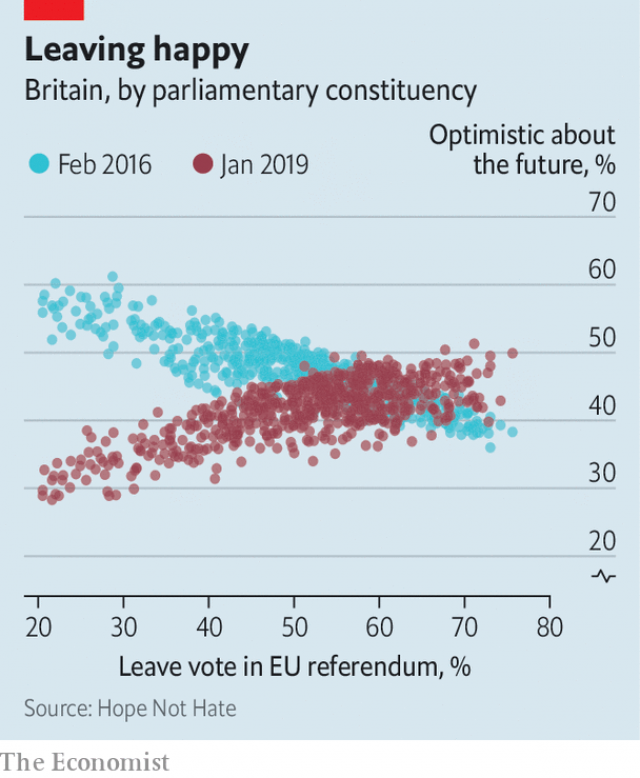

###### The new tribes

# How Brexit made Britain a country of Remainers and Leavers 

 

> print-edition iconPrint edition | Briefing | Jun 20th 2019 

MOST PEOPLE have never heard of Steve Bray. But they might recognise his face or booming voice, which intrude on millions of British homes each week. On every day that Parliament sits, Mr Bray arrives at 7.30am in a star-spangled cape at nearby College Green. His aim is to get into the background of television interviews with politicians, brandishing pro-Europe placards or to roar: “Stop Brexit!” Mr Bray has come to know his prey so well that he can recognise ministers by their cars (the home secretary has just got a new Range Rover, he reports). He will be in action on his 50th birthday at the end of the month, just after the anniversary on June 23rd of the referendum in which voters opted to leave the European Union. 

Three years after the vote, Britain has been driven slightly crackers by Brexit. The government’s website hosts some 2,700 petitions on the matter, one with 6m signatories. An anti-Brexit demonstration in March was the biggest protest since the Iraq war. Poundland sells rival passport covers in old-fashioned blue (for Leavers) and EU maroon (for Remainers). 

Plenty of attention has been paid to how Brexit is driving apart the countries that make up the United Kingdom; Scotland and Northern Ireland both backed Remain and bitterly resent being dragged out of the EU by the English. Less consideration has been given to what divides the two tribes of Remainers and Leavers. Even among the moderate middle, Brexit has become the biggest ideological split. Half the population identifies with a religion. Just under two-thirds feels attachment to a political party. Yet 87% identify as a Remainer or Leaver—15 percentage points more than turned out to vote in the referendum. 

The curious thing is that until recently the British didn’t care much about Europe. Take Mr Bray. Before he became the caped crusader of College Green, he was politically inactive. In polls before the referendum was called, only one person in ten considered Europe an important subject. Nor was Europe a big part of the national myth. The opening ceremony of the London Olympics in 2012 featured the Industrial Revolution, two world wars, the National Health Service, Commonwealth immigration and the Spice Girls—but not a peep about the EU. Four in ten people made up their mind about whether to back Leave or Remain only after the referendum was called. 

The past three years are the story of how these attitudes towards Europe—agnostic, unemotional and in many cases only recently formed—hardened into Britain’s principal social division. How did people come to define themselves by something they had cared so little about? And what has it done to them? 

In his counselling room in west London, Gurpreet Singh, a psychotherapist, hears a lot about Brexit. There are the couples who are anxious about their citizenship or job security, the elderly who feel resented by their children and a lot of people who have fallen out with their in-laws. January is busy, says Mr Singh: “You’re sitting around the Christmas table and this comes up, and one can’t stay quiet.” 

Political bickering isn’t new. But it is bigger over Brexit than conventional politics. A study by NatCen Social Research found that 71% of young people living at home backed the same side as their parents in the referendum. By comparison, in the general election of 2015, 86% voted the same way. (The researchers included only those who voted for the two main parties, for a fair comparison with the binary referendum.) Brexit is dividing couples, too. In the election 89% backed the same side as their live-in partner; only 79% did in the referendum. A fifth of counsellors at Relate, which helps couples on the rocks, say Brexit has contributed to bust-ups. 

Prejudice over Brexit is now as strong as that over race. And, perhaps surprisingly, it is the side that talks most about “openness” that is least open to mixing with the other lot. A YouGov/Times poll in January found that whereas only 9% of Leavers would mind if a close relative married a strong Remainer, 37% of Remainers would be bothered if their nearest and dearest hooked up with a Brexiteer. Remainers were also more likely to live in a bubble. Some 62% said all or most of their friends voted the same way, whereas only 51% of Leavers did. 

 

This may be because, in the words of Nigel Farage, leader of the insurgent Brexit Party, Remainers think “we’re thick, we’re stupid, we’re ignorant, we’re racist”. But a stronger reason concerns where the two tribes live. The Remain vote in England was concentrated in cities, where it piled up huge majorities (see map). The Leave vote was more evenly spread. Sixteen parliamentary constituencies voted by over 75% for Remain. Only one (Boston and Skegness) voted that strongly for Leave. James Kanagasooriam, a former Tory strategist, estimates that 500,000 people live in postcodes where more than 90% plumped for Remain, whereas only 57,000 live in ones which voted that strongly for Leave. Remainers are thus more likely than Leavers to live in real-world echo-chambers. 

The uneven distribution of the vote also means that, whereas the overall result was 52:48, the median postcode backed Leave by about 59:41, according to Mr Kanagasooriam. Middle England is substantially more Brexity than Remainers may realise. 

What does a 59% constituency look like? Take Meriden, a middling place in every way. A 500-year-old stone pillar on the village green marks the geographical centre of England. Incomes are almost bang on the national average of £29,000 ($37,000) a year. Like Britain as a whole, it is at once hyper-globalised—the biggest employer is Jaguar Land Rover, which exports most of its cars—and enduringly traditional. By Meriden green, people polish their Jags in the sun outside thatched cottages. 

Meridians show how attitudes have hardened since the vote. “We need to get on with getting out,” says Malcolm Howell. The 54-year-old retail manager is a middle-of-the-road voter, who backed Labour during the Tony Blair years before switching to the Tories and later voting Leave. He now backs what was once considered an extreme position: leaving with no deal. “There’ll be some disturbance,” he admits, but “at least we’re as well prepared as we can be.” In last month’s European elections he switched to the Brexit Party, which came first with its promise to leave with no deal. 

Remainers, too, have toughened their line. “Initially I thought, well, we’ve got to work for the least-worst option here,” says Iain Roxburgh, who among other things worries about the Portuguese carer of his 103-year-old mother-in-law. But “Theresa May hasn’t dealt with her party, she’s been led by the nose by them.” What now? “I think we should revoke Article 50 and have done with it,” he says of the legal means by which a country quits the EU. 

Even in a balanced place like Meriden, the Leave and Remain tribes live separate lives. St Alphege, a ward on the western edge of the constituency in Solihull, a prosperous town with a Tesla showroom and John Lewis department store, was 57% for Remain. Five miles away Chelmsley Wood, whose tower blocks absorbed Birmingham’s post-war slum clearances, was 72% for Leave. Mr Roxburgh describes how his own social circle is somewhat segregated: at the golf club, most are for Leave. At the theatre group, nearly all are for Remain. 

 

Despite Brexit’s slow progress, not everyone is down in the dumps. The referendum gave a lasting shot of confidence to many Leave-voting places. Previously, Remainer constituencies had been far likelier to feel optimistic. Since the referendum that has been inverted (see chart). There is “a sense of ‘we weren’t allowed to break it, and we broke it’,” says Sunder Katwala, head of British Future, a think-tank. Leavers’ glee is reflected in their wallets. The Bank of England found that after the vote they increased their spending plans, while Remainers reined theirs in. 

The referendum provoked an ugly spike of 50% or so in racial and religious hate crimes. But by the end of 2016 the number had returned to its trend level. The public is less hostile to immigration than before the vote, partly because inflows from the EU have drastically reduced. 

Yet there is deep frustration with how things are going. The British Election Study found that 38% thought the referendum had been conducted unfairly. This is not an ordinary case of sore losers. Half as many thought the previous general election unfair. The gridlock in Parliament, where MPs have been caught between loyalty to their constituents, their party and the instruction of the referendum, has undermined faith in politics. The Hansard Society, a research body, finds that 37% believe the system needs a “great deal” of change—ten points more than the previous record, in 2010, when MPs were mired in an expenses scandal. Willingness to contact an MP has fallen; willingness to march or join a picket has risen. More than half agree that “Britain needs a strong leader who is willing to break the rules.” 

Caroline Spelman, Meriden’s Conservative MP, has felt this anger. Since January she and her staff have carried panic buttons. Ms Spelman, who campaigned to remain but accepts the decision to leave, sponsored an amendment to a parliamentary motion in January designed to block a no-deal exit. A ��tsunami” of emails and phone calls followed. “‘You deserve a bullet in the head,’ ‘You should hang.’ It’s not pleasant,” she says. They have referred to her children by name. “It does make you feel afraid, and that does affect what you do,” she admits. “There were definitely a couple of votes where I struggled with the dilemma of, if I vote this way, it’s going to bring more abuse down on my head and on my family and on my staff.” 

The fury is an extraordinary reaction to the dry matters on which Brexit has foundered. Most voters (and many MPs) would struggle to define a customs union, yet some denounce remaining part of the EU’s trading arrangement as “treachery”. Mr Singh offers a diagnosis from the psychotherapist’s couch. When his clients argue about Brexit often they are really arguing about other things. “They could be doing the dishes, and suddenly it’s: ‘Why did you vote that way?’” Britain’s equivalent of the dirty dishes—what the country is really fighting about when it rages over the Irish backstop, Malthouse compromise or any arcane sticking point—is a broader cultural fissure, widening for decades, which the referendum suddenly exposed. 

For most of Britain’s democratic history, social class was the main determinant of which political tribe people joined. In the election of October 1974 (almost a dead heat between Labour and the Conservatives in terms of vote share), posher “ABC1” voters were three times likelier to vote Tory than Labour, while working-class “DE” voters favoured Labour by nearly the same ratio. Since then the link between class and party has vanished. In 2017 (another close-run election) ABC1s were nearly as likely to vote Labour as Tory, and DEs likewise. 

 

As economic ties have frayed, cultural ones have replaced them. The clearest reflection of this is age. Until the turn of the 21st century, a 70-year-old was about as likely as a 30-year-old to vote Labour. By 2017, 30-year-olds were twice as likely as 70-year-olds to do so according to the Resolution Foundation, a think-tank. The cultural gap also shows up in a growing divide between town and country. As cities have sucked in more graduates and immigrants, they have become more strongly Labour. 

The EU, which began as a coal- and steel-trading community, is not an obvious cultural battleground. Britain’s first referendum on membership, in 1975, was all about economics, with the free-market Tories piling in behind Remain while protectionist Labour backed Leave. Cultural matters took a back seat: those who thought Britain had “too many immigrants” were less likely to vote Leave than those who were pro-immigration, as Geoff Evans of Oxford University has shown. But a steep rise in immigration after eight eastern European countries joined the EU in 2004 changed the debate. Immigration became the main driver of views on Europe. At the 2016 referendum, cultural liberals on both left and right supported Remain, while cultural conservatives backed Leave. 

The vote was a “moment of illumination”, says Mr Katwala. A cultural divide had been growing for decades, disguised by a party system that had not moved far from its roots in social class. The referendum did not create the new tribes, he says, but it gave them an identity. Brexit “happens to be the occasion of our culture war”. 

This is having weird effects on politics. Take Kensington, where the average house costs £1.5m and Whole Foods Market sells peaches for £1.39 apiece, to customers who look as if they urgently need a McDonald’s. This corner of London was always safely Conservative. But its cosmopolitan residents voted 70:30 to remain—unlike their MP, Victoria Borwick, who strongly backed Leave. Fed up, a group of local Tories contacted a Labour councillor, Emma Dent Coad, and said they would back her if she ran. She agreed, “to give the Tories a scare”. In 2017 she won, by 20 votes. 

Ms Dent Coad is an unlikely MP for Kensington. She once branded as “disgusting” the purchase of a sweater for £150 (“a food bill for a family of four!”) by the Duchess of Cambridge, who is now her constituent. Her party plans higher taxes for the rich but its softer position on Brexit has persuaded enough Kensington millionaires to put aside misgivings about its economics. Ms Dent Coad is fighting to convert them to the party’s broader cause. A recent interview with her in the Morning Star was entitled “What’s so scary about socialism?”. She admits that Britain’s communist daily is not stocked in many local newsagents. 

As Brexit has helped Labour conquer liberal Tory territory, it has weakened its grip on culturally conservative places. In Mansfield Ben Bradley, a 27-year-old Conservative, toppled Sir Alan Meale, who had held the seat since before Mr Bradley was born. The former coal and textiles town is as naturally Labour as Kensington is Tory. It has never quite found an industry to replace the pits that were shut under Margaret Thatcher; several handsome Georgian buildings on its market square are now bars or loan shops. But the town’s 70:30 vote for Leave was enough to persuade it to switch to the Brexit-backing Tories in 2017. 

Mr Bradley thinks his party could win many more seats like his if it embraced working-class voters who feel abandoned by liberal Labour. Although Brexit was a “huge, huge factor” in his election, he says long-term changes have made places like Mansfield more winnable for the Tories. The history of the pits is fading. Unionised industries that linked people to Labour have declined. “If you talk to people, the vast majority are socially conservative,” he says. A “Blue Collar Conservatism” movement, of which he is part, proposes policies such as cutting the aid budget in order to spend more at home. 

The Brexit Party’s success has strengthened the case for courting cultural conservatives for many Tories. Boris Johnson, the front-runner in the party’s leadership contest, is doing his best to outflank Mr Farage, threatening a no-deal Brexit and comparing burqa-wearing women to “letterboxes”. This may alienate liberals who had backed the party for its pro-business policies. But as Mr Johnson reportedly said last year, “fuck business.” Similarly, a surge by the Liberal Democrats, who promise to stop Brexit, is making many in Labour argue for an explicitly pro-Remain position. 

Still, there is immense caution in both parties about regrouping along cultural lines. The European election, with its turnout of 37%, is a poor guide to how a general election might go. Labour’s fudged position on Brexit has just about held up, helping it to win a by-election in Peterborough earlier this month. Jeremy Corbyn, its leader, is so obviously a cultural liberal—with his allotment, vegetarianism and endless pledges of “solidarity” with oppressed people—that the tribe may forgive his feebleness on Brexit. Moderate Tories, meanwhile, point out that their party embraced cultural conservatism in the 2017 election, and flopped. After Brexit, some believe, the country will go back to normal. 

That is doubtful. For one thing, being outside the club means endlessly talking about your relationship with it, as Switzerland has found. More important, the two tribes are united by more than Brexit. The emergence of a coalition of young, urban, university-educated liberals, and an opposing group of older, rural, school-leaver conservatives, began long before the vote. The referendum simply gave them an identity. There is no reason to think that when Brexit is over the tribes will disband. ◼ 

