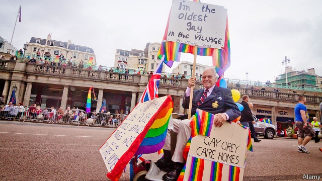

###### A pinker shade of grey

# Britain’s first retirement homes for LGBT OAPs 

 

> print-edition iconPrint edition | Britain | Jun 22nd 2019 

WITH ITS mini-allotments, bicycle club and lively restaurant, the plan outlined by Tonic Living looks like the blueprint of any other retirement community. The difference is that most of the residents of Tonic’s proposed development would be lesbian, gay, bisexual or transgender. The organisation, founded in 2014, is hoping to find a site within a year for what would be Britain’s first retirement home for LGBT people. 

The thinking behind it is that for the million or so gay over-60s in Britain, the path towards assisted living can be especially tricky. They are likelier than other pensioners to live alone. Fewer than half have children. And almost three-quarters say they would worry about disclosing their sexuality to carers. Anna Kear, Tonic’s boss, says many old folk “go back into the closet” once they are dependent on care. 

Hers is not the only organisation planning homes for LGBT OAPs. Another group, London Older Lesbians Co-housing (LOLC), is also on the lookout for a site in the capital. Founded three years ago, it has about 35 women aged over 50 on its waiting list. It hopes to build a base and move in within five years. Both it and Tonic are supported by the Greater London Authority. The law allows groups with “protected characteristics”, including LGBT folk, to discriminate in their admissions (Tonic nonetheless accepts applications from all). 

The projects are partly inspired by organisations like the rainbow-adorned LebensortVielfalt in Berlin and Triangle Square in Los Angeles, which house elderly gay people. They also have a model in groups like Older Women’s Co-Housing (OWCH), a development in London for women over 50 (straight and gay alike) which opened in 2016. The 26 residents wanted to preserve their independence in old age. “We decided we would not be done unto,” says Maria Brenton, the project manager. OWCH receives dozens of inquiries a week. 

Group living offers camaraderie as well as a spirit of radicalism that appeals to some activists. “We’re used to a combination of autonomy and collectivity as part of our lesbian feminism,” says Liz Kelly, 67, who co-founded LOLC. “Why would we want to conform to convention now, just because we’re older?” 

Social opportunities for older gay folk are improving in other ways, too. Opening Doors London organises walks, film nights and a befriending scheme for over-50s. Sally Knocker, who runs the charity’s Rainbow Memory Café, says people are finding innovative ways to combat isolation. As Ms Kear puts it, “We have to get it across to them that it’s OK to be old and out and proud.” 

