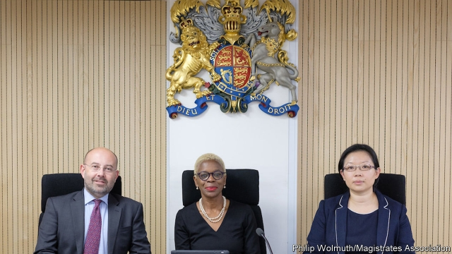

###### Bench pressed

# Britain’s magistrates are in a funk. The time is right for reform 

 

> print-edition iconPrint edition | Britain | Jun 22nd 2019 

IT IS TRICKY to decide whom the comic novelist P.G. Wodehouse most enjoyed mocking: cops or magistrates. Bertie Wooster, the buffoonish aristocrat whose japes he charted, seems forever to be pinching policemen’s helmets, then being rapped across the knuckles by a beak for the cheek of it. These volunteer do-gooders are interfering “asses” who revel in passing down unduly punitive sentences. They are, writes Wodehouse, “the lowest form of pond life. When a fellow hasn’t got the brains and initiative to sell jellied eels, they make him a magistrate.” 

Like the Jeeves novels, the magistracy is distinctly English. Its supporters are proud of its long history: the role was set out by statute in 1361. Applicants must demonstrate “sound judgment” and “sound temperament”. Knowledge of the law, however, is not required. A handful of other countries have lay justices, but magistrates in English and Welsh courts have greater powers than in most jurisdictions. At least nine in ten criminal cases end up before a magistrates’ bench. The rest go to crown courts, where salaried judges alone have the right to sentence defendants to more than a year behind bars. 

But the system is now in trouble. The number of magistrates has roughly halved in the past decade, to about 15,000, partly because of recruitment freezes. The shortfall means that about 15% of cases are now heard by two rather than three magistrates. When they disagree with each other, the case goes to another bench. Cases are heard in tatty courtrooms with computer systems that often fail. Unsurprisingly, magistrates feel unloved. In one survey, 54% said they felt undervalued. Politicians have taken note. On June 18th the Commons justice committee published a report rebuking the government for these shortcomings. 

Many of its recommendations are sensible. It suggests a national recruitment campaign to plug the shortfall and encourage greater diversity among applicants. The current pool broadly reflects the country’s gender and racial make-up, but is overwhelmingly elderly and middle-class. The average magistrate is 59. Only 4% are younger than 40. The committee wants a kitemark scheme to recognise employers who give their staff time off to volunteer in court. About 8,000 magistrates are due to retire in the next decade (they cannot serve beyond the age of 70), providing an opportunity to shake up the bench. 

Some favour more radical change. It is not obvious that amateurs should have such strong powers, even though they are assisted by a legal adviser in each court. Andrea Coomber of Justice, a charity, reckons the system is “really peculiar”. Many lawyers agree. They are particularly sceptical about the role of magistrates in family courts, where they sometimes decide how much contact warring parents should have with their children or whether a neglected child should be put into care. They are not necessarily qualified to balance the risks involved in such cases, says one barrister. “Magistrates are well-meaning volunteers,” he says. “[But] this is a nuanced and forensic job.” 

In criminal courts, they deal with high-volume but relatively low-harm cases, such as driving offences and some burglaries. “There’s an ideology that things are trivial and therefore can be processed quite quickly,” says Lucy Welsh of Sussex University. In a courtroom in Luton, magistrates take 80 seconds to determine a sentence for a man who pleads guilty to drink-driving. Later, they exchange whispers for 43 seconds before fining a young man for heroin possession. (In another case, a defendant is charged with throwing toilet water over a policeman, as if to prove that Wodehouse is still relevant.) Ms Welsh worries that such speedy justice gives little chance for the court to take account of a defendant’s individual circumstances. 

Yet magistrates retain two big advantages over the professional judiciary. They are cheap, and, like juries, they involve the community in passing sentence on its peers. A hybrid model could keep these benefits while checking magistrates’ powers. Penelope Gibbs, an ex-magistrate, suggests that a judge could chair a panel of two magistrates. Another option would be to beef up the role of the panels’ chairmen, giving them tastier expenses in return for more training. Either way, magistrates should not resist reform, or they might end up looking as archaic as Wooster. ◼ 

