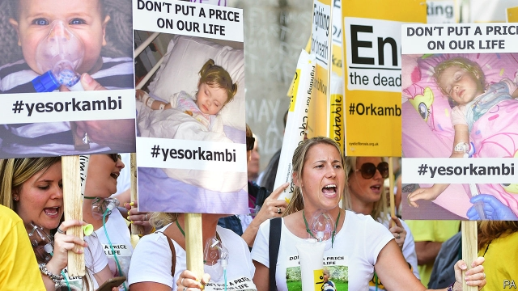

###### Drug imports

# Desperate patients turn to buyers clubs 

 

> print-edition iconPrint edition | Britain | Jun 22nd 2019 

FOR THE PAST three-and-a-half years the government has been in a stand-off with Vertex, a pharmaceutical firm, over the price of Orkambi, a drug for cystic fibrosis. The manufacturer typically charges £104,000 ($130,000) for a year’s treatment. The government has not been able to negotiate enough of a discount. The result has been an impasse. NHS England has called the firm an extreme outlier in both pricing and behaviour. Vertex says the government was offered the best price of any country in the world. 

Those affected have despaired. But they have also got to work, lobbying the government and the firm. Recently they have come across a new way to ramp up the pressure: a buyers club. Vertex has an exclusive patent covering the drug in most, but not all, of the world. Since patients are allowed to import three months’ supply for personal use, a group of those who have, or whose family member has, cystic fibrosis have got together to fly in a generic version of the medicine from Argentina for less than a quarter of the price of Orkambi. The first imports will arrive soon. 

The buyers club is following the example of people with HIV and hepatitis C, says Diarmaid McDonald, the lead organiser at Just Treatment, a campaign group supporting the buyers. When access to sofosbuvir (for hepatitis C) was rationed by the NHS, patients turned to a buyers club in Australia, which in turn bought from India, where the manufacturer had waived its patent. Last year a survey by the Terrence Higgins Trust, a charity, found that 34% of those using PrEP, which stops HIV transmission, import the drug. (Access in England otherwise requires admission to an NHS trial.) Patients have also used clubs to buy drugs for cancer and pulmonary fibrosis. 

In all cases, the priority is to access treatment. Nina White, whose seven-year-old daughter has cystic fibrosis and is a member of the buyers club, currently pays Vertex’s list price. The treatment has made a big difference. Her daughter has more of an appetite and is no longer so tired that she has to skip friends’ parties. “If I had to sell my house [to buy the drug], I would sell my house,” she says. Those with hepatitis C would sometimes travel to India to get access to sofosbuvir before it became more readily available on the NHS. “People are creative, aren’t they?” says Rachel Halford of the Hepatitis C Trust. “You could get your assessment done and have a mini break.” 

Pharmaceutical firms have warned that the trend weakens the incentive to invest in research; Vertex says it has invested $7bn in developing medicines for cystic fibrosis. Just Treatment is now urging the government to use a “crown use” licence to override Vertex’s patent. The government has so far resisted, partly because of the signal it would send about the security of patents in Britain. There would also be practical issues which could slow the roll-out, such as the likelihood of litigation, says Charles Clift of Chatham House, a think-tank. 

But in a debate in Parliament on June 10th Seema Kennedy, a health minister, said that because of the length of negotiations she had a “moral obligation” to consider such a move. “Vertex has had a strong negotiating position precisely because of their monopoly,” notes Suerie Moon of the Graduate Institute of Geneva, meaning the firm now has a much greater incentive to cut its price. Thanks to the buyers club the cost of treatment has already fallen significantly. With any luck, it will now drop further still. ◼ 

