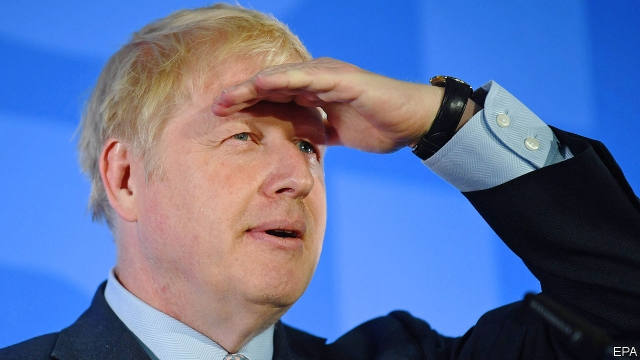

###### The Tory leadership race

# The Boris bubble that threatens Britain’s Conservatives 

 

> print-edition iconPrint edition | Britain | Jun 20th 2019 

BORIS JOHNSON has been seducing people again. For months he has methodically worked his way down a list of fellow Conservative MPs, sweet-talking them to back his campaign to be leader. Phone calls with potential conquests have been set up. Drinks parties are arranged for others who want to experience Mr Johnson’s charms in person. If that is not enough, a dinner might persuade a reluctant MP. Former sceptics have been swept off their feet. One recent convert explained his shift: “Desperate times, desperate measures.” 

The contest to become the next leader of the Conservative Party—and thus prime minister—risks becoming a coronation. As we went to press on June 20th, Tory MPs were expected to put Mr Johnson on a shortlist along with one other candidate, for a vote by the party’s 160,000 members. These are an unpredictable bunch, but surveys suggest that they strongly prefer Mr Johnson to any challenger. Short of a spectacular collapse, he will be named the next prime minister on July 22nd. 

MPs have flocked to Mr Johnson for three reasons. One group believe he has the charisma and campaigning clout to help them keep their seats in the next election. Nigel Farage’s Brexit Party leads the polls after hoovering up millions of Tory voters. Mr Johnson is seen as the candidate most capable of winning them back. 

A second group see Mr Johnson as a means for their own rehabilitation. Many of the people running his operation have seen their political careers blown off course in recent years. James Wharton, Mr Johnson’s “No” man, in charge of batting away distractions, lost his seat in the snap election of 2017. Gavin Williamson, the campaign’s de facto chief whip, was sacked as defence secretary last month for leaking details of a confidential security briefing (he denies this). Totting up the numbers is Grant Shapps, a former party chairman who found himself on the backbenches in 2015 after a bullying scandal on his watch. 

A third group of supportive MPs are there only because they think Mr Johnson will win the contest. “If he is going to win then you have to be inside the tent,” says one aide to a converted MP. If moderate MPs do not rein in Mr Johnson, he will be guided solely by the right of the party, goes their thinking. Best to get on board sooner rather than later. 

This alliance of true believers and cynics makes for a shaky foundation. It is made wobblier still by the fact that Mr Johnson’s team seems to have promised wholly contradictory things to MPs to win their support. A proposed high-speed railway between London and Birmingham will be built or cancelled; today’s cabinet ministers will be retained or sacked en masse: it all depends on whom Mr Johnson’s camp is speaking to. 

The biggest contradiction concerns Brexit. Mr Johnson has brought on board the hardest of hard Brexiteers, including Steve Baker, the ringleader of the Tory holdouts who want Theresa May’s deal torn up. His popularity with party members is in large part due to his promise to take Britain out of the European Union on October 31st, with or without a deal. (More than half of members would proceed with Brexit even if it meant “significant damage” to the economy, losing Scotland or Northern Ireland, or even “destroying” the Tory party, according to a YouGov poll this week.) Yet Mr Johnson has also attracted Remainer MPs. Last month Matt Hancock launched his own leadership campaign with an attack on Mr Johnson for dismissing businesses’ concerns about Brexit, while decrying no-deal as not credible. This week he joined the Johnson campaign. 

Doubts about Mr Johnson’s sincerity have in the past been allayed by his reputation as a Heineken politician: one who, to adapt the beer’s slogan, gets to parts of the electorate that others can’t reach. During the leadership campaign he has repeatedly brought up his two terms as mayor of London, a left-leaning city that backed Remain, as proof that he can win votes from across the spectrum. But Mr Johnson’s last victory in London was seven years ago, against a tired opponent. Turnout was 38%. His support was particularly strong in Leave-voting suburbs. The slogan is old—Heineken stopped using it in 2003—and so is the analysis. 

Now Mr Johnson’s appeal is more akin to Marmite, a love-it-or-hate-it breakfast spread. His leading role in the Brexit campaign has made him a polarising figure. Leave voters may like him, but Remainers detest him. When asked in May whether Mr Johnson would be a good prime minister, 28% of voters said yes—higher than all his rivals. But 54% thought he would be a bad one—again, higher than the rest. Young voters have a problem with Mr Johnson, as do women, points out Ben Page, head of Ipsos MORI, a pollster: “He’s basically not refreshing the parts other Tories do not reach any more.” 

If this is true it represents a big problem for the Conservatives, because without his purported election-winning powers Mr Johnson has little going for him. As mayor he did a reasonable job in a limited role that was mainly about drumming up enthusiasm for the capital. But as foreign secretary he blundered. A careless remark about a British-Iranian imprisoned in Iran was seized on by Tehran and used against her in court. When London hosted a Balkans summit, Mr Johnson bunked off to be photographed drafting his resignation letter over Mrs May’s Brexit deal. 

Although the team around him has been hyperactive, Mr Johnson himself has sat out most of the chances to debate or be interviewed. His is “the success of someone who avoids car crashes by sitting in a parked car”, according to Stewart Wood, a Labour peer. All of this means there is a danger that Boris-mania could end as quickly as it began. “The bubble is going to burst at some point,” says a member of one rival camp. “We do not know if it will burst tomorrow or before the contest is finished, or if it bursts in Number 10.” ◼ 

