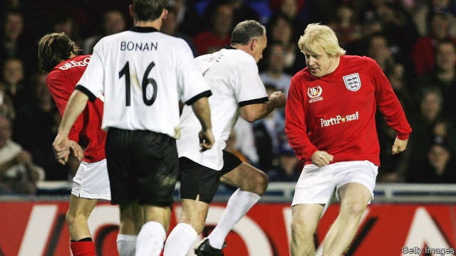

###### Rosbif with cake

# What Europe thinks of Boris Johnson 

 

> print-edition iconPrint edition | Britain | Jun 22nd 2019 

THE FAVOURITE to be Britain’s next prime minister is not a favourite in the rest of Europe. Newspapers have called his potential arrival calamitous. An editorial in France’s Le Monde accuses him of a string of deceits, blunders, failures and lies. Germany’s Handelsblatt has said he would be fatal for Britain. Several commentators draw grim analogies with the arrival of Donald Trump in the White House. 

Boris Johnson is, unsurprisingly, blamed for Brexit. As the highest-profile Leave campaigner, he draws flak for having lied to win the referendum in June 2016. He was also considered a terrible foreign secretary from July 2016 until he resigned two years later. His lack of diplomatic skill was evident in his talk of having his cake and eating it and his claim that the EU wanted to give Britain “punishment beatings…in the manner of some sort of world-war-two movie”. He upset Italians by saying he was “pro-secco but by no means anti-pasto”. And he annoyed Brussels by inviting it to “go whistle” for its Brexit bill. 

In many ways his reputation originates from his time as a Daily Telegraph correspondent in Brussels in the early 1990s. His colleagues remember him as a cynic and a clown, with a cultivated look of neglect, untucked shirt and famously messy hair. “He would make you laugh because he was so boisterous,” recalls Maria Laura Franciosi, an Italian reporter and chair of the Brussels press club, adding that he was at least simpatico. 

Yet as with his later diplomacy, his journalism was fundamentally unserious. Most of his stories, on his own admission, were partly or entirely false. He likes to claim that one, headlined “Delors plan to rule Europe”, led Danish voters to say no to the Maastricht treaty in June 1992. Jean Quatremer, a French journalist, recalls challenging Mr Johnson on the truth of another piece, only to be told never to let the facts get in the way of a good story. “For Boris, everything is a joke,” says Mr Quatremer. “He does not believe in anything. Today he is for Brexit, but tomorrow?” 

The question now is whether he believes enough to meet the Brexit deadline. He talks blithely of renegotiating Theresa May’s withdrawal agreement, which Parliament has rejected three times, to take out the Irish backstop to avert a border in Ireland. He has promised that Britain will leave, deal or no deal, on October 31st, though in a debate this week he just called the deadline “eminently achievable”. He insists, against most evidence, that a no-deal Brexit is nothing to worry about. And he says that, with no deal, Britain would save its £39bn ($50bn) Brexit bill. 

Yet diplomats on the continent say the EU cannot possibly betray Ireland by allowing Mr Johnson to ditch the backstop. This would set a dreadful example to other small EU members. It would also be damaging to offer concessions that were refused for Mrs May to an aggressive bargainer, who is threatening to renege on his debts. They add that, when the deadline was extended to October 31st, a condition was that the withdrawal agreement could not be reopened. The notion of adding soothing sentences to the political declaration about the future relationship is fine, but many doubt this would be enough to secure parliamentary approval. 

How firm is the deadline? On the one hand, it has already been extended twice because nobody wanted no-deal, so the same could presumably happen again. On the other, there is growing exasperation all round the EU. Enrico Letta, a former Italian prime minister now at Sciences-Po in Paris, says several countries now see Brexit as a virus that could infect the entire system unless it is brought to an end. Several diplomats say a further extension would only be agreed for a specific event such as an election or another referendum. 

Mr Johnson has in the past ruled out seeking another extension. But the EU knows a majority of MPs are against no-deal. And time is extremely short, since nothing serious will be done before the Tory party conference in early October, just four weeks before the deadline. The autumn promises to be extremely busy. ◼ 

