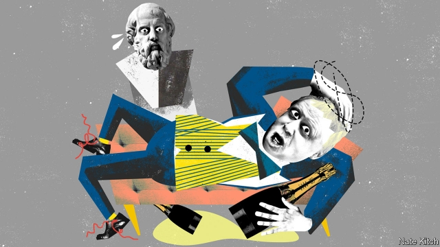

###### Bagehot

# What would Plato make of Boris Johnson? 

 

> print-edition iconPrint edition | Britain | Jun 22nd 2019 

IN THE SUMMER of 1987 a crestfallen Boris Johnson went to call on Anthony Kenny, the master of his college, Balliol, and a distinguished philosopher and classicist. Mr Johnson had learned that he had been summoned for a “viva”—he was on the borderline between a first- and second-class degree—and wanted some extra coaching. The master devoted a day to going through likely questions, but even his expert assistance couldn’t make up for the fact that his pupil had spent much of his time as an undergraduate carousing with fellow members of the Bullingdon Club and scheming, successfully, to become president of the Oxford Union. 

Mr Johnson’s failure to get a first continues to annoy him intensely—and to delight many of his rivals. But in truth it doesn’t matter a jot: the world is full of failures who got firsts, and successes who missed out. The really interesting question is not whether Mr Johnson’s results reveal some great intellectual weakness. It is what light the subject of his studies can throw on his qualifications to be prime minister. The classics corpus is full of meditations on the qualities that make for a good leader. And no classical author thought more profoundly about the subject than Plato, the philosopher who was put at the heart of Oxford’s classics syllabus by Balliol’s greatest master, Benjamin Jowett. What would Plato have made of the classicist who appears destined to be Balliol’s fourth prime minister since 1900? 

In “The Republic”, Plato argued that the most important qualities in a statesman were truthfulness and expertise. A good statesman will “never willingly tolerate an untruth”. (“Is it possible to combine in the same character a love of wisdom and a love of falsehood?” one of Plato’s characters asks. “Quite impossible,” comes the reply.) He will spend his life studying everything that he needs to make him a good captain of the ship of state—“the seasons of the year, the sky, the stars, the winds and other professional subjects”. Mr Johnson has spent his life dealing in untruths. He was sacked from his first job in journalism, on the Times, for making up a quote from Sir Colin Lucas, Mr Kenny’s successor as master of Balliol, who also happened to be Mr Johnson’s godfather. He has accumulated all sorts of expertise in the art of seizing power in a modern democracy—particularly media-management—but he is not bothered with the more mundane skills required to run the country, such as managing government departments (he was a disaster as foreign secretary) or keeping the economy on an even keel (his main domestic policy is to reduce tax on the rich). 

By contrast, Plato argued, the surest signs of a bad leader are narcissism and self-indulgence. The poor statesman is an eloquent flatterer, who relies on his ability to entertain the masses with speeches and comic turns, but doesn’t bother to develop a coherent view of the world. Plato was particularly vitriolic about the scions of the upper classes who are offered the opportunity to study philosophy while young but don’t apply themselves, because they think they are so talented that they needn’t earn their place at the top table. Mr Johnson’s greatest talent is as an entertainer. His newspaper columns are exercises in verbal pyrotechnics: the Daily Telegraph even defended one of his columns against a complaint to the press regulator by arguing that it was “clearly comically polemical, and could not be reasonably read as a serious, empirical, in-depth analysis of hard factual matters”. He owes his breakthrough as a public figure to appearances on satirical television shows such as “Have I Got News for You”. He is now running a leadership campaign that reeks of entitlement, expecting party members to vote for him despite his refusal to appear in the first televised debate and his reluctance to give interviews. 

“The Republic” is haunted by the fear that democracies eventually degenerate into tyrannies. Democracy is the most alluring form of government: “the diversity of its characters, like the different colours in a patterned dress, make it look very attractive.” But it is inherently unstable. Citizens are so consumed by pleasure-seeking that they beggar the economy; so hostile to authority that they ignore the advice of experts; and so committed to liberty that they lose any common purpose. 

As democracies collapse under the pressure of their contradictions, panicked citizens look for salvation in a demagogue. These are men who love power, but cannot control their own desires for “holidays and dinners and parties and girlfriends and so on”. Plato calls them the “most wretched of men because of the disorder raging within them”. Citizens are so consumed by fear that they think these wretches have magical abilities to solve the country’s problems and restore proper order. Demagogues get their start by “taking over a particularly obedient mob”, before seizing control of the country. But the more power they acquire the worse things become, “for the doctor removes the poison and leaves the healthy elements in the body, while the tyrant does the opposite.” 

Democracies have proved more durable than Plato imagined. And his cure for the problems of democracy—the rule of philosopher-kings, who are expected to hold their wives and children in common—is eccentric to put it mildly. But he is right that character matters. Politicians can change their advisers or their policies, but character is sticky. He is also right that democracies can suddenly give way to populist authoritarianism. Most have taken the precaution of constructing constitutional protections to save themselves from Plato’s nightmare (America has been shielded from President Donald Trump’s wilder ideas by the Bill of Rights and the separation of powers). Britain is unusual in relying on the good character of its leaders—Lord Hailsham worried in 1976 that constitutional protections were so minimal that the government is an “elective dictatorship”. The best way to prepare for a Johnson premiership is to re-read “The Republic”, hoping Plato is wrong but preparing for the fact that he may be right. ◼ 

