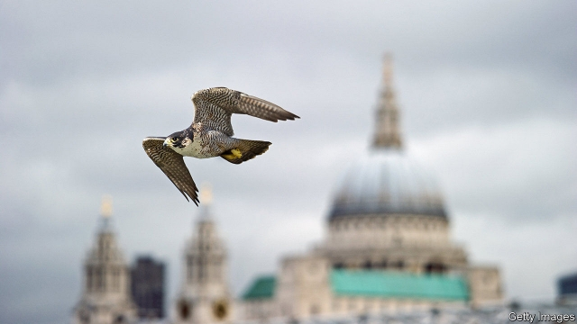
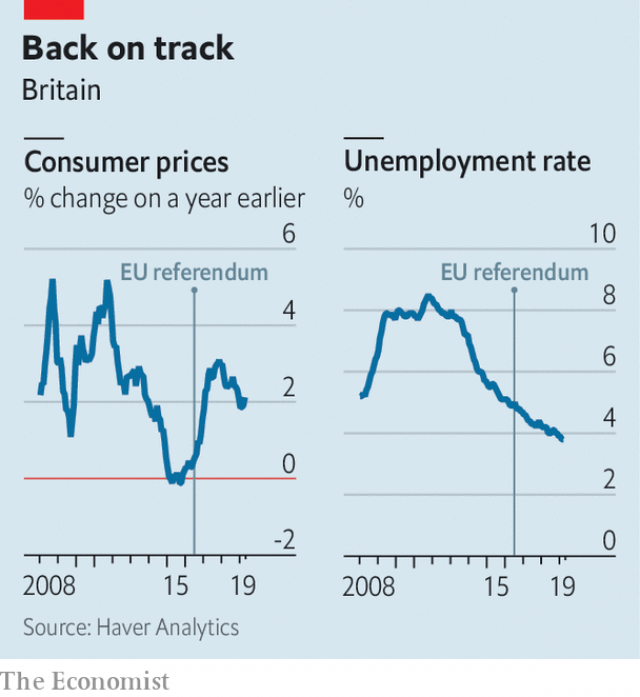

###### Hawks take flight

# Why interest rates in Britain are likelier to fall than rise 

 

> print-edition iconPrint edition | Britain | Jun 20th 2019 

IT WAS A turning point in Britain’s recovery from the financial crisis of 2008-09. In November 2017 the monetary policy committee (MPC) of the Bank of England raised the base rate of interest from 0.25% to 0.5%, the first increase in over a decade. Nine months later came a further rise of equal size—and traders priced in another one shortly thereafter. But then the mood music changed. No further rises materialised (as we went to press on June 20th the MPC was expected to leave interest rates on hold for the tenth month running). Financial markets have come to take the view that the next move in rates is more likely to be down than up. 

The bank turned hawkish in 2017 because it feared that consumer-price inflation would settle above its 2% target. A 10% depreciation of sterling against other currencies after the Brexit referendum of 2016 made imports pricier. At the same time the unemployment rate continued to fall (see chart), forcing employers to compete harder for workers by offering them better pay. With weak productivity growth, the MPC feared that employers would be forced to pass on rising wage costs to their customers. For a while these fears looked founded: inflation hit 3.1% in late 2017. 

 

Yet since then inflation has fallen a lot further than the MPC had believed it would. Data released on June 19th put the inflation rate in May at 2% on the nose. Companies may be doing a better job than expected at raising productivity, which allows them to absorb higher wage costs. The impact of sterling’s depreciation may also be fading faster than expected, suggested Michael Saunders, a member of the MPC, in a speech on June 10th. Companies may have passed on higher import prices to consumers in one go, rather than phasing them in slowly. 

Lower-than-expected inflation also owes something to the level of demand in the economy. A trade war between America and China is causing global economic growth to slow (the Federal Reserve and the European Central Bank are expected to cut interest rates before long). Britain’s economy, highly exposed to trade, moves in tandem with world trends. Brexit is another drag. Postponing it from March 29th to October 31st headed off the calamity of a no-deal exit, but the delay has prompted some companies to hold off on investment until the outlook is clearer. In the past year capital spending by businesses has fallen in real terms. Consumer confidence remains low. The data released so far point to zero GDP growth in the second quarter of 2019, compared with an earlier forecast by the bank of 0.2%. 

Some members of the MPC, including Mr Saunders and Andy Haldane, the bank’s chief economist, continue to insist that rate rises are around the corner. If Britain pulls off a smooth exit from the European Union by the end of October, business investment could bounce back. Another extension would prolong the uncertainty, however; and a no-deal Brexit would almost certainly force the bank to loosen monetary policy to gee up the economy, even as sterling depreciated again. The case for doveishness is strengthening. ◼ 

