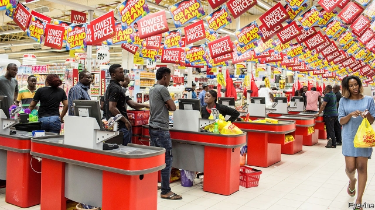
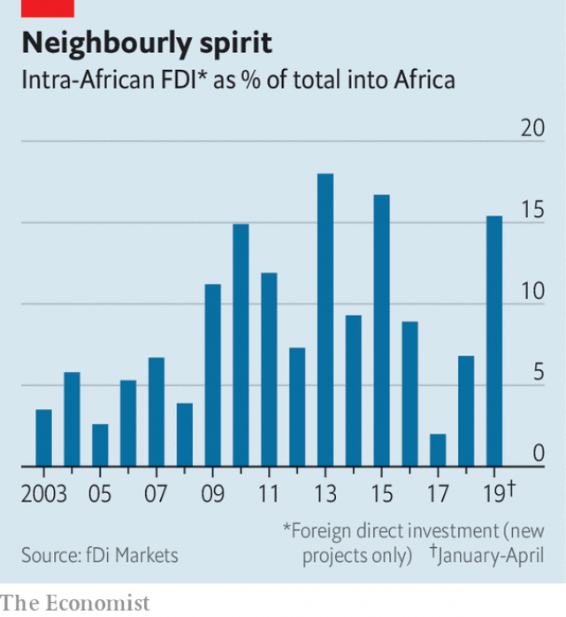

###### Local heroes

# African companies are expanding across the continent 

 

> print-edition iconPrint edition | Business | Jun 22nd 2019 

TWENTY YEARS ago Patrick Bitature, a Ugandan tycoon, took his mobile-phone business to Nigeria. At first the cash was piling up so fast that it would not fit in the safe. But he found the business culture more cut-throat and less trusting than back home. Money started going missing. Eventually he retreated to the east African markets he knows best. “I was going to go to every country in Africa at the time,” he recalls, smiling at his naivety. “I was lucky not to lose my shirt.” 

Plenty of African businesses have tried to conquer new markets over the years, only to return home sartorially compromised. Colonialism fragmented the continent and linked its economies to imperial capitals rather than to each other. That legacy locked many businesses into national silos. Today big European and American multinationals still dominate markets from logistics to soft drinks. African firms have announced $72bn of foreign direct investments in new projects on the continent this decade, according to fDi Markets, a data provider. Companies from the rest of the world have made nearly nine times as much. 

But the pan-African dream lives on. Two-thirds of African firms surveyed by McKinsey, a consultancy, in 2017, planned to enter new countries in the region in the next five years, compared with half of foreign multinationals in Africa. According to the Boston Consulting Group, the 30 biggest African companies operated in an average of 16 of the continent’s countries last year, twice as many as in 2008. 

Leading African businesses are stitching the region together, making it easier for others to follow suit. Banks serve their corporate clients across multiple countries. Business leaders flit between megacities aboard Ethiopian Airlines, which flies to 36 African states. 

 

The largest firms already have the scale to take on multinational incumbents. Aliko Dangote, a Nigerian cement baron, has ventured into ten countries. Dangote Group has overtaken LafargeHolcim, a Swiss behemoth, as the largest cement producer in sub-Saharan Africa. Mr Dangote’s plants, built by a Chinese contractor to two standard designs, are bigger, newer and more efficient than most others. He has the ear of presidents. 

Intra-continental expansion is a response to two challenges. The first is finding customers. The combined economy of Africa’s 54 countries is smaller than that of France. As they grow richer, individuals or businesses switch from informal purveyors to formal markets where big firms operate. But these customers are concentrated in pockets across a vast land mass. 

To reach as many as possible, Shoprite, a South African retailer, has opened supermarkets in 15 countries. A similar logic drove OCP Group, a Moroccan phosphate producer, to create a sub-Saharan subsidiary in 2016. By investing in soil research, microcredit and logistics, it hopes to turn subsistence farmers into commercial growers—and buyers of its phosphate fertiliser. Other firms are taking similar steps. 

The second challenge is uncertainty. Africa’s weak supply chains, volatile currencies and fickle regulators with a fondness for expropriation or capital controls, which make repatriating profits difficult, render the future blurrier than in mature economies. Businesses focused on a single country (or industry) face greater risks, notes Kartik Jayaram of McKinsey. Firms with a toehold in many places and sectors, like Dangote Group or Shoprite, are less exposed to a setback in any one of them. 

As Mr Bitature’s experience reveals, crossing borders can backfire. Policymakers in other countries are prone to sudden “somersaults”, cautions Abdul Samad Rabiu, whose BUA Group sells everything from cement to sugar but has stuck to native Nigeria. Foreign soil can be inhospitable even in the absence of political flips. Tiger Brands, a South African foodmaker, sold its stake in its Nigerian flour division to Mr Dangote for $1 in 2015, three years after buying it from him for nearly $200m. A depreciating naira hit Nigerians’ pockets, dampening demand, and drove up the cost of imports like wheat, which Tiger could not pass onto consumers because of stiff competition. 

The strongest firms are those which are choosy. MTN, a large South African telecoms company, is pulling back from some smaller countries. But it is toughing it out in Nigeria, despite endless battles with regulators; it is a vast market, and gross operating margins of 44% stiffen the spine. OCP set out to deepen its presence in 15 African countries. It has winnowed the list down to five—including the regional giants, Nigeria and Ethiopia—where policies are most business-friendly.◼ 

