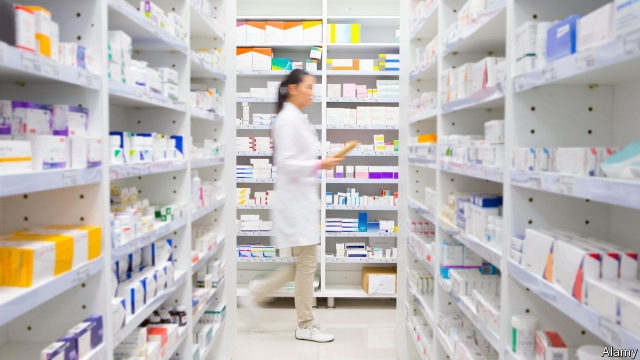
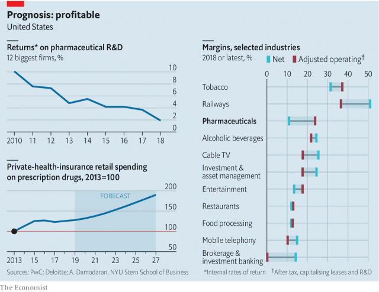

###### Profit warning

# American drugmakers are raising prices. Again 

 

> print-edition iconPrint edition | Business | Jun 22nd 2019 

“IF YOU THINK the cost of your drug will scare people from buying your drugs, then lower your prices.” That blunt warning was issued recently by Alex Azar, America’s health secretary, to global pharmaceutical giants. A new report by UBS, an investment bank, finds that Americans spent nearly two-thirds of all money spent globally on new drugs from 2012 to 2017. On June 14th Bluebird Bio unveiled a gene therapy to treat an inherited blood disorder that will cost nearly $1.8m per treatment. Shortly before, Novartis, a Swiss giant, priced its gene therapy for spinal muscular atrophy at $2.1m, making it the world’s most expensive medication. 

Outrage over such headlines is a rare thing to unite President Donald Trump and his Democratic detractors. Many cheered the administration’s latest effort to force drugmakers to disclose the list price of drugs in television advertisements. 

On June 14th Big Pharma struck back. Amgen, Merck and Eli Lilly sued Mr Azar (who used to work at Eli Lilly) and his department in order to block the rule. They argue that buyers seldom pay the full list price, since insurers and other middlemen wrest hefty (and often secret) discounts. 

Working out how profitable drug firms are is not a simple matter. Their net margins of 11%, less than restaurants and one-fifth those of railways, do not exactly scream price gouging. But a fairer picture can be reached by adding back interest costs, adjusting for leases and, crucially, by also treating research and development expenses as an investment that is depreciated gradually over time. According to a recent study by Aswath Damodaran of New York University’s Stern School of Business, on this basis drug firms’ margins are 24%, higher than most other sectors (see chart). 

 

Drug firms retort that the returns on that R&D investment will not be as good as they used to be. They have to spend ever more prospecting for blockbuster molecules. The alternative is to pay top dollar to acquire biotechnology firms which have already identified them. On June 17th Pfizer said it would pay $11.4bn for Array BioPharma, which has developed therapies for cancer. In April Bristol-Myers Squibb approved a $74bn purchase of Celgene. 

Whatever the true level of pharmaceutical firms’ financial returns, they could become juicier again. Although in the past four years spending on drugs by patients and private insurers has barely budged, an annual report published on June 20th by PwC, a consultancy, forecasts that it is about to rise again. Most of the increase will be the result of higher prices. 

Peter Bach of Memorial Sloan Kettering, a leading cancer hospital in New York, thinks the million-dollar price tags are unjustified. Novartis, he argues, cherry-picked health-economic studies that supported its pricing. In 2012, his hospital refused to offer patients a new cancer drug from Sanofi after his analysis showed its high price was not justified by better outcomes. The French firm reduced it—just as Mr Azar would counsel. ◼ 

