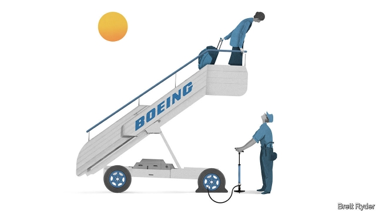

###### Schumpeter

# Boeing’s boss wins a reprieve, not redemption 

 

> print-edition iconPrint edition | Business | Jun 22nd 2019 

FEAR OF FLYING is a strange thing. In the early days of flight, those who wanted to be airborne were considered crazy. These days, those who don’t are seen as odd. Even habitual flyers engage in reassurance rituals: from prayers and hand-holding to pills and alcohol. That people get on aeroplanes at all is a matter of trust. They believe they are well made, that pilots are well trained and the industry well regulated. In its 103-year history, Boeing, the world’s largest aircraft manufacturer, has sought to build that trust with a safety-first culture. This has been thrown into disarray since two of its 737 MAX passenger jets crashed in Indonesia in October and Ethiopia in March, killing all 346 passengers and crew on board. 

Dennis Muilenburg, Boeing’s boss, is a Bible-reading company lifer who looks the part, from the cut of his jaw to the azure of his eyes. Yet to many his metronomic, defensive response to the disasters has compounded the mistrust in Boeing. On June 18th, just as questions about his future were percolating at the Paris Air Show, he won a reprieve. IAG, the parent company of British Airways and Iberia, said it would buy 200 new 737 MAX aircraft, the first order for the jet since it was grounded over three months ago. Although IAG will receive big discounts and the planes will only be delivered between 2023 and 2027, it was a vote of confidence in the MAX’s rejigged safety system. 

The big challenge for Mr Muilenburg is to convince the flying public at large to renew their faith in Boeing. His job hangs on it. 

Boeing’s top brass has belatedly used the Paris show to offer full apologies for the crashes. The crisis, as well as being devastating for the families of those killed, has hit morale among the planemakers’ employees. But amid civil lawsuits on victims’ behalf, and potential criminal investigations by the Department of Justice and the FBI, Boeing’s army of lawyers still appear to vet every word that emerges from Mr Muilenburg’s mouth. That has made a bad situation worse—not least because many countries where Boeing operates do not appreciate its buttoned-down, legalistic approach to crisis management. His relentless efforts to portray the disasters as just a blip in Boeing’s sterling safety record suggest a man eager to get back to business as usual. In civil aerospace Boeing is a business-to-business company. Its customers are airlines and leasing firms, not passengers. It shows. 

The troubles Mr Muilenburg still faces are threefold. The first comes from downplaying the 737 MAX’s problems, which carries legal risks. Shortly after the crash in Indonesia, Boeing hinted at maintenance and pilot problems at Lion Air, even though it soon discovered that its engineers had known 13 months before about a flaw in a cockpit warning system. The issue had not been reported to Boeing’s senior executives, regulators or customers. The company has insisted that its anti-stall software, known as MCAS, did not compromise safety, even after investigators found that it overwhelmed pilots in both disasters, and has since been fixed. The firm has set up a committee to review the certification process of the MAX, even though it and the Federal Aviation Administration (FAA) maintain that the MCAS was designed in an orthodox way. Mr Muilenburg has admitted that self-certification, in which Boeing examines itself under FAA oversight, may need improvement. 

The second problem is global regulation. After the Ethiopian tragedy, Mr Muilenburg called President Donald Trump to try to stop the FAA from grounding the plane. That set the tone for his tin-eared handling of the crisis. Since the groundings, he has repeated that the MAX will soon be back in business, once the FAA approves the MCAS software fix, as it is soon expected to. His apparent confidence in the FAA’s authorisation raises further questions about its relationship with Boeing. It highlights a wider problem. After the Ethiopian disaster, the FAA was slower than its counterparts to ground the MAX. Other regulators, such as those in China, may be hesitant to follow the FAA’s leadin approving the fix. Given a majority of Boeing’s business is outside America, that matters. 

The biggest danger is to Boeing’s brand. Though the firm is part of a civil-aviation duopoly with Airbus, competition between the two is fierce. Reputation is vital. In the months following the Ethiopian disaster, a narrative has taken root that Boeing cut corners in bringing the 737 MAX into service in order to keep up with Airbus’s popular A320neo. Some say this is unfair. But Boeing’s reluctance to take its share of the blame may have lost it what Dómhnal Slattery, boss of Avolon, a large aeroplane-leasing firm, calls the “communications battle”. As he told the Seattle Times during the Paris Air Show, Boeing appears to have forgotten about its biggest constituency: passengers. “What if the aeroplane gets back into the air and no one wants to fly it for 12 or 24 months?” Mr Slattery asked. “Every airline in the world will want to cancel or defer.” The risks to Boeing’s 737 MAX order backlog—of 4,550 jets at the end of May—remain huge, in other words. It was dealt a further blow in Paris when Airbus announced first orders for a long-range, narrow-body jet, the A321XLR, that will compete with a new midsized aircraft that Boeing will not launch for years. 

The share price of the $210bn company suggests investors are supportive of Mr Muilenburg. The IAG deal has bought time. Yet it would be a grave mistake to imagine that Boeing’s main task is to get the 737 MAX back in the sky fast. Instead it has to deal with the aura of incompetence and evasion surrounding the firm. To do that, Boeing’s board should strip Mr Muilenburg of his dual chairman/chief executive role and appoint an independent chairman, who sets three tests. First, Boeing must publish an independent investigation into what went wrong. Second, it has to rebuild relations with foreign regulators who now matter more than the discredited FAA. Last, it has to establish that flyers believe the 737 MAX is safe. If Boeing cannot pass those tests by the end of the year, its board should ask Mr Muilenburg to leave.◼ 

