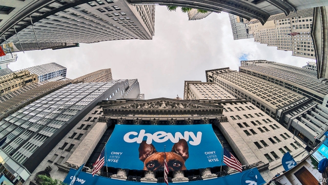
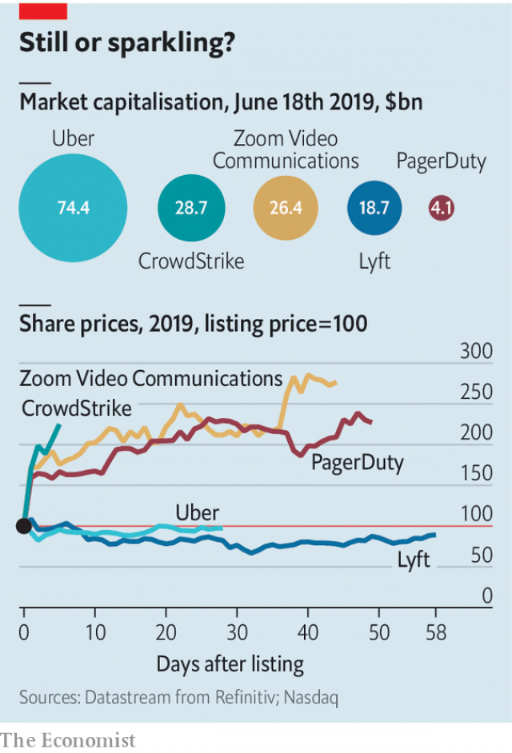
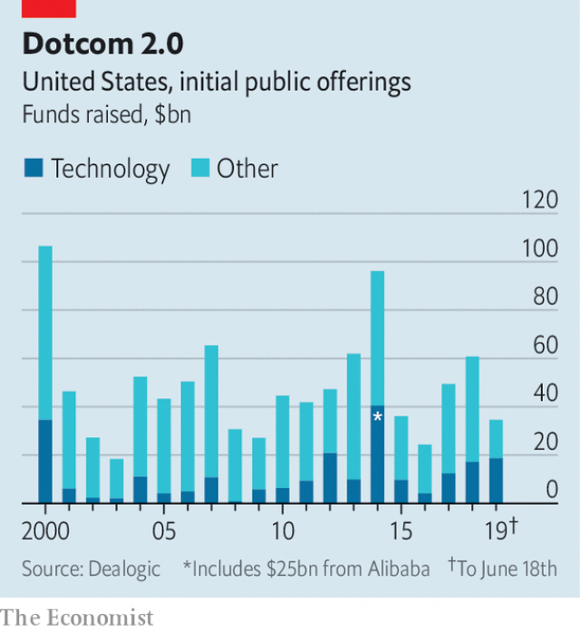

###### Let’s try this again

# Business services like Zoom and Slack make for better listings 

 

> print-edition iconPrint edition | Business | Jun 22nd 2019 

IN TECHNOLOGY, AS  in life, history doesn’t repeat itself. But it does rhyme. The share price of Chewy, an online pet-food retailer which has just listed in New York, shot up by more than 50% on June 14th, its first day of trading. To seasoned investors it brought back memories of Pets.com, Chewy’s ill-fated predecessor, which collapsed nine months after it debuted on the Nasdaq exchange in February 2000. It became emblematic of the first dotcom bubble, when loss-making startups fetched stratospheric valuations—until they didn’t. 

Today the tech listings are fewer, startups’ losses bigger and investors a bit more cautious than 20 years ago. True, technology firms have raised a total of $19bn through initial public offerings this year, the most since 2000 for the same period, and gained roughly 30% in value on average, according to Dealogic, a data-provider. The tech-heavy Nasdaq has risen by just 19%. But several big initial public offerings, notably of ride-hailing giants, have flopped. Lyft’s share price languishes 12% below its opening price and Uber’s fell by nearly 20% before recovering. 

The sparky overall performance owes a lot to a bevy of lower-profile IPOs. CrowdStrike, a cyber-security firm which went public on June 12th, has seen its share price double. So has PagerDuty, which helps clients deal with disruptions in their computer systems and listed in April. Shares in Zoom, a video-conferencing service, have gained 176% since its IPO two months ago. Analysts predict another hit in the much-anticipated listing on June 20th, after The Economist went to press, of Slack, a corporate-messaging service. 

Make no mistake: these companies aren’t lucrative. The best of the lot, Zoom, eked out earnings of three cents per share in the first quarter. But in contrast to Lyft or Uber, it is easier to see how they may one day turn a profit. Rather than peddling cheap rides or pet food to millions of fickle individuals, the likes of Zoom, PagerDuty and Slack sell higher-margin subscriptions to tens of thousands of business customers. Revenues of all three are growing in the high double digits or more, year on year. 

 

Corporate software did not feature prominently in the original dotcom mania. Before the advent of cloud computing, selling and installing such programs was tedious and labour-intensive. Big firms like Oracle and SAP dominated the market with bundled products which had to be customised to meet a customer’s needs. Today cloud-based “software-as-a-service” (SaaS) lets business-to-business startups focus on doing one thing well. They can lure clients with free trials that, since adding an extra customer requires little more than a tweak to a database, is near costless. And they don’t sell “vapourware”, says Jennifer Tejada, boss of PagerDuty, referring to programs, common during the internet bubble, which existed only in press releases. 

Slack stands to benefit doubly from this trend. It is a poster child for SaaS, as well as a venue where other such services come together. Few speak the same digital language; Slack provides translation and integration. Investors love such “platforms”, which explains its juicy valuation of $16bn or so, not far off Lyft’s market value. 

 

Admittedly, Slack and the others have so far had an easy ride. They have, in effect, outsourced marketing and sales to tech-obsessed early adopters who proselytise in their workplace until management too becomes a convert and signs a deal. That explains why Slack is hugely popular among startups but not yet among bigger firms. Attracting them requires costly investment in marketing and a proper sales force. The company lost $32m in the first quarter, 28% more than the year before, mainly trying to do just that. 

To be sure, business-facing startups are less prone than an Uber to burn cash in a single-minded quest for scale. But if investors see hints of Uberification in Slack’s earnings reports, its listing too could disappoint. That in turn may give pause to other startups preparing to go public, including WeWork, an office-rental company seeking a $47bn valuation despite recently posting a quarterly loss of $264m. Today’s dotcom boom may fizzle before it bursts.◼ 

