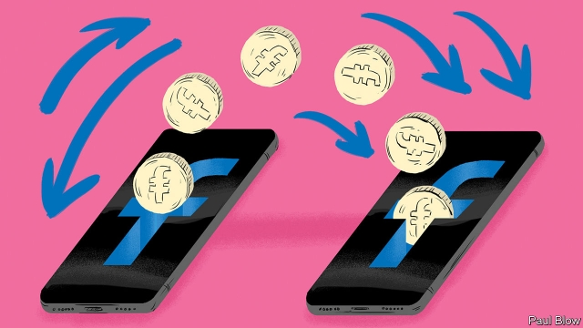

###### Coin flip

# Facebook wants to create a worldwide digital currency 

 

> print-edition iconPrint edition | Business | Jun 20th 2019 

A GLOBAL DIGITAL currency would make sending money across the world as easy as texting. It would do away with fees, delays and other barriers to the flow of cash. It might give those in less developed countries access to the financial system and a means to protect hard-earned wages against runaway inflation. It could trigger a wave of innovation in finance, much as the internet did in online services. 

That, in a nutshell, is what Facebook promised on June 18th. Within a year, the social network will launch a new currency to be known as Libra, in honour of an ancient Roman unit of mass—it is also the word for “pound” in many romance languages. Inevitably, Facebook dished out a generous helping of trendy words like crypto and blockchain. Unable to contain its appetite for Silicon Valley platitudes, Facebook claimed that its mission was to “empower billions of people”. Making money or strengthening its market power are, apparently, a sideshow. 

Notwithstanding the guff, the commercial potential is indeed significant—as are the potential problems. If each of Facebook’s 2.4bn users converted a slice of their savings into Libras, it could become a widely circulated currency. It could also, if broadly adopted, vest unprecedented power in the hands of its issuer. In a tacit acknowledgment that its mishandling of user data, tolerance of the spread of misinformation and other sins have devalued its stock with policymakers, users and potential partners—though not investors—Facebook wants to outsource the running of Libra to a consortium of worthies recruited from the world of finance, technology and NGOs. The consequences for the global financial system could be significant (see article). So could the impact on Facebook’s business. 

If the project lives up to the mock-ups, buying, selling, holding, sending and receiving Libras will become a doddle. It can be done in Facebook’s Messenger app or WhatsApp, another messaging-service-cum-social-network it owns—and, later next year, in a stand-alone app. 

So far, so familiar. Messenger already offers payments to Americans. WhatsApp is testing a similar function in India. But these services do not cross borders, and require users to have a bank account. Fintech firms like TransferWise, which offer international transfers, take a 4-5% cut to wire $200, a third less than Western Union. But Libra will be much cheaper, and require no bank accounts: more Bitcoin than Venmo. 

Except that, unlike Bitcoins and other cryptocurrencies, Libras will change hands in seconds, not minutes, for next to nothing, not a few dollars. The system should handle 1,000 transactions a second at its launch, and more later, compared with no more than seven a second for Bitcoin. The virtual coins will be bought with real money, which will top up the reserve backing the currency. This should prevent wild price swings from speculation. 

If it works, Libra could be a money-spinner for Facebook, albeit not directly. Notional transaction fees would not generate much revenue. But Libras should allow Facebook to charge more for online ads, by making purchases of advertised products quicker and simpler. It could furnish a new source of data to target adverts, making up for user information Facebook will forgo with the “pivot to privacy”, which Mark Zuckerberg, its boss, proclaimed in March in respect of messaging. Facebook may catch up with WeChat, a Chinese super-app which offers payments and other services, and whose foreign ambitions are on hold as the Sino-American trade war rages on. 

Technically and financially, Facebook could probably pull off such an ambitious undertaking on its own. But not politically. Its culture is less amoral than it was in its youth, when it aspired to “move fast and break things”—but only a bit. Chary consumers may choose not to entrust their money to a social network which has, until recently, leaked their personal data left and right. Unless users are on board, merchants may be reluctant to embrace the currency, however hassle-free. 

Enter the Libra consortium. The association, to be based in Geneva, will take over from Facebook before the first Libra has been spent, and manage the hard-currency reserves. Facebook has enlisted 28 other prospective founding members out of an envisaged 100, each with equal voting rights and operating a node in a decentralised system which issues coins. They include financial firms (Visa, Stripe), online services (Spotify, Uber), cryptocurrency wallets (Anchorage, Coinbase), venture capitalists (Andreessen Horowitz, Union Square Ventures) and charities (Kiva, Mercy Corps)—though, for the time being, no banks. Not a libertarian alternative to the existing financial system, in other words, but a complement. 

To add credibility to its promise, broken in the past, to keep social and financial data separate, Facebook has created a subsidiary, Calibra, to run Libra services within its apps. It is unlikely to face hurdles to uptake from Apple or Google. It is impossible to imagine them expelling Messenger and WhatsApp—and later other providers Facebook is inviting to the open-source project—from their app stores, as they have done with other cryptocurrency offerings, many of which were scams. 

To get Libra going, the consortium will pay merchants to offer discounts to customers who use the new currency, financed by a $10m one-off fee each member pays for a seat at the table. Eventually, Facebook would like anybody, not just the consortium, to be able to generate the currency, transfer it and offer services on top of its “blockchain” (crypto-speak for the database that keeps track of who owns what). At that point, Libra would turn into Bitcoin, minus the kinks and the libertarianism. 

In a project with so many moving parts, much can go wrong. Although Facebook says it has a working prototype, the technology is untested; sceptics doubt that a 100-node system, let alone a bigger one, could process thousands of transactions per second. Hackers are doubtless champing at the bit. 

Then there are consortium dynamics. Facebook will have to prove to the other 99 Libra members that it is truly prepared to give up control. At the same time, because important decisions need a two-thirds majority, someone has to knock heads together. The history of information technology is littered with initiatives that collapsed under the weight of internal conflict. 

The biggest barrier may be political. Facebook has apparently consulted many regulators. The providers of digital wallets will have to comply with national rules, such as those against money-laundering. Calibra, whose integration into Messenger and WhatsApp will initially make it the dominant wallet, is bound to stoke competition concerns. These may recede as the currency grows bigger and more decentralised, only to be replaced by worries about financial stability. 

Libra’s success, then, is far from assured. But it could prove useful even if it flops, for it offers a blueprint for how Facebook itself could one day be governed. The Libra Association’s main task is to oversee the blockchain, ensuring, for instance, that Calibra does not enjoy privileged access to it. An equivalent Facebook Association, some observers have ventured, could be composed of representatives of users, advertisers, data-protection authorities and so on. Their job could be to oversee the “social graph”, another database, which lists all of Facebook’s users and the links between them—and to guarantee that Facebook users can post to another social network, and vice versa. 

Calls for a Facebook constitution along these lines have grown louder as the social network’s influence on world affairs, from election-meddling in America to genocide in Myanmar, has become apparent. Mr Zuckerberg is no stranger to such thinking. In 2009 Facebook let users vote on big changes in its privacy policies but abandoned the experiment with global democracy a few years later. Last year Mr Zuckerberg announced that Facebook wanted to set up a “content review board” of independent experts—a kind of “Supreme Court”, in his words, which would make “the final judgment call on what should be acceptable speech”. 

Asked whether Libra could serve as a model for Facebook, David Marcus, who is in charge of the project, replies that it marks “a coming of age, the moment we recognise that there are some things that we shouldn’t control—and a radical departure from the traditional way of operating things”. Perhaps. But checks and balances would almost certainly make Facebook less profitable. It would be ironic if a new digital currency marked the beginning of the end of Facebook’s money-minting days.◼ 

