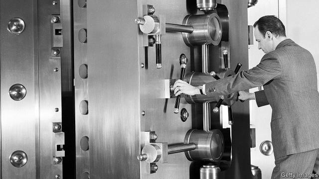

###### Libralised finance

# What Facebook’s new currency means for the banking system 

 

> print-edition iconPrint edition | Business | Jun 20th 2019 

CONSUMERS WILL probably view holding Facebook’s new currency, Libra, as an alternative to putting money in the bank. If they see it as an attractive alternative, Libras could proliferate. If every Westerner held in Libra an amount equal to one-tenth of their bank deposits today, the new currency outstanding would be worth over $2trn. How worried should banks be? 

At first pass, Libra looks like a banking system of sorts. The “Libra Reserve” will hold enough liquid safe assets to back every Libra it issues. A staunch minority of economists has for decades called for this sort of arrangement—dubbed “narrow banking”—to replace the existing “fractional reserve” model, under which deposits at banks are backed by mortgages and other illiquid loans. Narrow banks, they argue, would not suffer runs. On the surface, the only obvious difference between the Libra Reserve and a narrow bank is that the former will hold assets denominated in a variety of (still-to-be-specified) currencies. 

Yet look closer and the Libra Reserve will not be a bank, narrow or otherwise. Some of the safe assets it holds will themselves be deposits in fractional-reserve banks. It will not have access to central-bank money, which is used to clear transactions between banks. 

Buying Libras will not shrink the volume of deposits in the banking system. Suppose a Briton uses money in his bank account to buy Libras. He would transfer pounds to the Libra Reserve or another seller, who would need a sterling bank account to receive payment. The deposit would live on in that account. In modern banking systems deposits can pass between accounts, be converted into cash, or be used to repay bank loans or buy assets from banks. They cannot simply disappear into non-banks. 

Does that mean banks can relax? Hardly. First, Libra could cause bank balance-sheets to shrink, should the Libra Reserve use customers’ funds to buy securities like government debt from banks. Second, Libra could crimp juicy bank revenues from cross-border payments, which Facebook wants to cost virtually nothing. 

Third, Facebook could yet decide to become a fully fledged bank itself. The firm says this is not in its plans, but the temptation will surely grow if Libra takes off. Facebook’s data already have immense potential to help with lending decisions. Although the Libra Reserve will be mostly independent of Facebook, the firm will offer its own digital wallet, Calibra, for consumers who want to hand over the key to their digital currency for safekeeping—and with it, their personal financial data. 

Individual Libra-holders face other risks. One is currency fluctuations. If, say, the yen rises against the basket to which Libra is pegged, Japanese holders of Libra will lose out. The new currency will not yield interest (though neither do many bank deposits nowadays). Shops may welcome a shift away from card payments, which often levy high fees on transactions. Consumers, who enjoy perks that often come with credit cards, may not. There will be no government-provided deposit insurance for Libra. Lastly, the public might shun Libra for non-financial reasons such as privacy, which Facebook has repeatedly failed to safeguard. 

Still, the strength of Facebook’s existing platform, and the incentives that will be on offer to encourage Libra’s use, could be enough for the currency to thrive. If it does, banks might eventually want to hold Libras themselves, and perhaps to run digital wallets to compete with Calibra. In any case, Facebook is likely to develop a suite of financial services, much as WeChat and Alibaba, two Chinese internet giants, have done in China. Both banks and regulators had better watch closely. ◼ 

