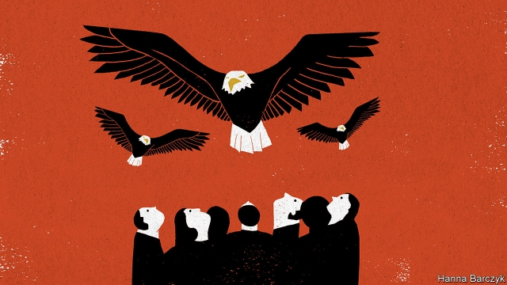

###### Chaguan

# A fly-on-the-wall account of what China tells American bigwigs 

 

> print-edition iconPrint edition | China | Jun 22nd 2019 

A BIT LATE, China’s leaders are starting to accept that their trade war with President Donald Trump is only one element of a larger crisis in relations with America—and not the most dangerous one. The leaders understand that their critics within America’s foreign-policy and national-security machine—meaning aides to Mr Trump, members of both parties in Congress and officers in the State Department, Pentagon, spy agencies and beyond—want China to change its ways. They also believe (or hope) that Mr Trump wants something different, and perhaps less painful for them: to show voters the spectacle of China losing a trade fight with him. 

China’s rulers now accept that they face more than a Trump problem. They concede that bipartisan suspicion of China in America will intensify in the run-up to the elections of November 2020, and will continue afterwards, whoever wins. They absorbed that message during visits by high-ranking Americans, including Mr Trump’s officials, business bosses and veterans of Republican and Democratic governments. Dismayingly, they show no sign of accepting that China’s own actions are in any way to blame. 

Chinese leaders believe that America’s policy machine wants them to change principles that have guided China’s rise for 20 years. They protest that these demands cut to the heart of China’s model of development. They are not entirely wrong. Such figures as the United States Trade Representative, Robert Lighthizer, have drawn up a charge sheet of Chinese norms and practices deemed intolerable now that China is so large, and so competitive in so many fields. Mr Lighthizer has allies in Congress, from both parties. They want China to abandon its model of state capitalism, with its subsidies for local champions, arm-twisting transfers of technology, curbs on market access and politicised regulation. Mr Lighthizer has proposed enforcement and verification mechanisms that Chinese figures indignantly compare to the inspections that underpinned cold-war arms-control agreements. No Chinese leader, it is said, could accept such a humiliation—any more than they will tolerate American moves to strangle Huawei, a telecommunications giant that is central to China’s plans to become a standard-setting tech superpower. 

There is much Chinese grumbling about security hawks working for Mr Trump, from his national security adviser, John Bolton, to military commanders. The hawks are accused of breaking understandings about support for Taiwan, the democratic island that China claims as its own. The Chinese side thinks that Mr Trump was bullied by hawks into walking out on North Korea’s leader, Kim Jong Un, at their summit in Hanoi in February. It is no accident that China’s president, Xi Jinping, decided to pay a state visit to North Korea, shortly before attending a G20 summit in Japan which Mr Trump will also join. Chinese officials gasped when Mr Trump threatened to slap extra tariffs on China if Mr Xi did not agree to meet him on the G20’s sidelines. Japan’s prime minister might swallow an American insult like that, growl Chinese sources, but not us. By visiting Pyongyang first (he arrived on June 20th), Mr Xi reminded Mr Trump that China’s leader is an indispensable diplomatic actor, not a junior partner in a trade dispute. 

Chinese policy types obsess over the idea that Team Trump is not engaged in a sincere negotiation, but is seeking to contain a rising China. They complain about shifting American demands. At first China was told that the problem was the trade balance, and offered to buy American goods. Then economic rules and norms were called the crux of the dispute. So China prepared to negotiate, drawing up a 150-page draft agreement. Then, as the Chinese side tells it, Mr Xi realised that America’s plan amounted to an assault on Chinese sovereignty, rejected it and has since been cheered within his own system for his stand. There is muttering, in contrast, about Mr Xi’s chief economic aide and trade envoy, Liu He. Mr Liu, a deputy prime minister, is accused of lacking political sense. 

Mr Trump is not a leader in thrall to principles. That is why the Chinese side hopes, in essence, that he could accept a trade deal which breaks Mr Lighthizer’s heart, and a North Korean pact that leaves Mr Bolton miserable, as long as those deals bring him applause from voters. Mr Xi, it is said, believes that Mr Trump does not want to decouple America’s economy from China’s—except in the production of some sensitive technology. But Mr Xi does worry that America’s president could be hijacked by hardline advisers. If no reasonable deal can be struck, Chinese hosts tell Americans, Mr Xi will wait for the election in November 2020 to produce a different president. They express confidence that relief will come sooner, because Mr Trump needs votes from farm states hurt by the tariff wars, and is desperate to keep the stockmarket roaring. 

Doubts lurk amid the bluster. In public Chinese officials say that Mr Trump needs a deal to win in 2020. In private they ask whether, perhaps, American voters might prefer to see him fight on. They admit to bafflement over some of Mr Trump’s sallies, such as when he told Fox News that he could not accept a “50-50 deal” with China, but had to come out ahead. To Chinese ears, that was fantastically unhelpful. It recalled the “unequal treaties” imposed by 19th-century powers which every Chinese schoolchild is taught to hate. Mr Trump has said that he will not let China become the world’s largest economy in his lifetime. Does he mean these things, Chinese hosts ask, or is this all domestic politics? 

Doubts have consequences. To prepare Chinese public opinion for a long trade stand-off, propaganda chiefs have abandoned months of restraint and told state media to start thundering about American bullying. Stoking nationalism is a familiar Chinese ploy. But it has real-world effects, too. As China reduces its own room for manoeuvre, it risks forcing Mr Trump to concede ground to China to secure a deal. Meanwhile his chaotic style is straining China’s system to its limits. The mood in Beijing is anxious, with reason. ◼ 

