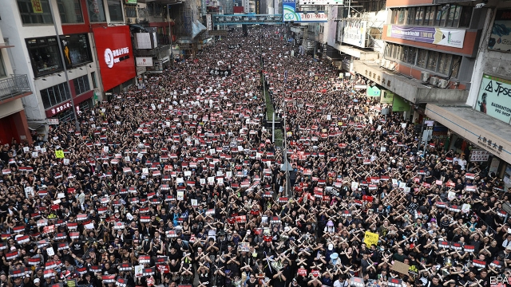
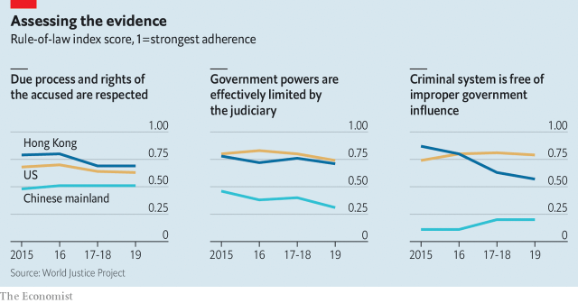
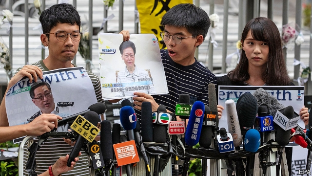

###### Carrie on, for now

# A policy U-turn puts Hong Kong’s leader in a precarious position 

 

> print-edition iconPrint edition | China | Jun 20th 2019 

JUST AS HONG KONG was digesting the impact of what may well have been its biggest street protest since China took over the territory in 1997, another far bigger one happened. Organisers said 1.9m people joined the second of these demonstrations—a turnout that was all the more remarkable given that the government, less than a day earlier, had made a humiliating U-turn to placate the protesters. Critics of the Communist Party’s tightening grip on Hong Kong feel they have gained a rare advantage. The leadership in Beijing has suffered an embarrassing blow. 

Hong Kong’s embattled chief executive, Carrie Lam, says she will give up—at least until next year—her efforts to secure the passage of legislation that triggered the unrest: a bill to allow criminal suspects to be extradited to the Chinese mainland. But the scale of the second massive protest, on June 16th, showed that many Hong Kongers deeply distrust both her and the regime that pulls her strings. 

There will be more unrest. As The Economist went to press, a deadline passed for the government to respond to demands made by student unions. They had asked Mrs Lam to scrap the bill and make it clearer that a smaller protest on June 12th that escalated into violence, with police firing tear gas and rubber bullets, was not, as the police called it, a riot. They had also insisted that charges be dropped against those arrested during the confrontation. The students had threatened to march to the government’s offices on June 21st if their demands were not met. That protest now looks likely. The group behind the bigger demonstrations, the Civil Human Rights Front, has called for another large one on July 1st, the anniversary of China’s resumption of sovereignty over Hong Kong. 

This is the most sustained outbreak of unrest in Hong Kong since the “Umbrella Movement” of 2014, when protesters staged weeks of sit-ins to push for free and fair elections for the post of chief executive. The government made no concessions that time because China’s leaders fear that allowing full democracy in Hong Kong might weaken their grip on the territory. On this occasion Hong Kong’s officials are prepared to retreat, at least partially, because the extradition bill is not so vital to the Communist Party’s interests. At a press conference on June 18th Mrs Lam offered what she called a “most sincere apology” to Hong Kongers, who, she acknowledged, had expressed their concerns about the proposed law in a “peaceful and rational manner” during the two largest protests. On the next day the government delayed the passage of a controversial bill that would punish people for deliberately insulting China’s national anthem. 

Central-government officials insist they did not ask Hong Kong’s government to draft the extradition bill. Mrs Lam concurs, and says the need for it became urgent only as a result of a murder case in Taiwan. A man wanted for that crime is in prison in Hong Kong for money-laundering and could be released in October. Officials in Hong Kong worry he will go free unless they can revise the territory’s current law, which does not allow suspects to be sent to other parts of China. Hong Kong treats Taiwan as if it were Chinese territory. 

But it is likely that Mrs Lam knew that China’s leaders would be keen on her proposed amendment bill. They worry about the use of Hong Kong as a refuge by people wanted for crimes on the mainland. Since he took over as China’s leader in 2012, Xi Jinping has been battling corruption. This has involved trying to secure the return of suspects from other jurisdictions—an operation China calls “Fox Hunt”. Agents have been sent undercover to press suspects to go back to China. The fight against corruption often relates to political struggles. Although the proposed bill does not cover political crimes, Hong Kongers fear that people sought for extradition under the proposed law might include people who have offended the party politically. 

The party also cares about face. The reason why current legislation bars the sending of suspects to other parts of China is that Hong Kong’s colonial government drafted it that way to protect people from China’s arbitrary use of law. In recent weeks the party’s supporters in Hong Kong have been infuriated by allegations that China’s legal system is untrustworthy. It is possible that Mrs Lam introduced the bill earlier this year on the advice of her secretary for security, John Lee, says Johannes Chan of the University of Hong Kong. Mr Lee may have thought the case in Taiwan offered a chance to please the party by revising a legal anomaly, Mr Chan speculates. 

Central government representatives strongly backed the bill after it was introduced. They lobbied legislators to support it. They even invited foreign journalists in Hong Kong to tea to suggest they “inject positivity” into their coverage of it. But they are likely to be relieved by Mrs Lam’s willingness to take the blame for the crisis that has ensued. This year is one of huge symbolic importance for the party; it took over exactly 70 years ago. China’s leaders would not want the build-up to the anniversary on October 1st to be marred by unrest blamed on their own misjudgment. 

The party has continued to express support for Mrs Lam. At her news conference on June 18th she deflected repeated questions about whether she would step down, as protesters have demanded. It is possible that the party has not identified someone who it believes would do a better job than Mrs Lam, who has three more years to serve of her five-year term. 

If the party wants her to go, it may wait until her term ends, and then insist that she not stand again. To change Hong Kong’s leader now would be risky. It would re-open questions about how Hong Kong’s leaders are chosen. Public anger over the process, which is conducted by a committee dominated by party loyalists in Hong Kong, sparked the Umbrella Movement. 

Nonetheless, Mrs Lam will remain under considerable political pressure. The campaign to scrap the extradition bill has involved not only the party’s usual critics, but also businessmen who do not normally defy the establishment. Concerns expressed by the latter have often focused on a part of the proposed legislation that would allow the freezing or seizure of assets in Hong Kong in connection with crimes allegedly committed on the Chinese mainland. The American Chamber of Commerce expressed “serious” reservations about the bill. It said Hong Kong could lose its appeal as a base of operations for foreign companies if businessfolk living in the city, or passing through it, had to fret about arrest and rendition to the mainland. The chamber also worried about the abuse of the mainland’s courts by local firms seeking to settle commercial scores with foreign rivals. 

 

Hong Kong’s government did not ignore these worries. It removed nine, largely financial, crimes from the bill and raised the threshold for an offence to seven years. But what it could not excise was the less tangible fear that Hong Kong’s rule of law (currently in decent shape, see chart) was being eroded and its judicial independence put at risk. The chances of a foreign businessman being surrendered to the mainland might be remote. But “the perception is enough,” says one longtime resident. As the bill was debated, some tycoons reportedly began withdrawing their money from the city and moving it elsewhere. 

Mrs Lam also faces a backlash from politicians in Hong Kong who are loyal to the party. They had been dutifully trying to drum up support for the bill when Mrs Lam, to the surprise of many observers, announced her U-turn on June 15th. Now they face retribution from voters in District Council elections in November and polls for the Legislative Council in September 2020. Many questions are being asked about why it took Mrs Lam so long to announce her change of heart. She said one reason for it was that Taiwan would not accept the extradition of the murder suspect under the terms of the proposed law. That had been known for months. 

The scale of the recent unrest, and the political blow that Mrs Lam has suffered because of it, will complicate the party’s strategy in Hong Kong. It had been hoping that the territory would pass an anti-sedition bill, as required by the territory’s post-colonial constitution, the Basic Law. Efforts to do so in 2003 triggered a protest by hundreds of thousands of people, prompting the government to withdraw it and leading to the eventual resignation of the then chief executive, Tung Chee-hwa. 

 

The party’s interest in reviving the bill grew after the Umbrella Movement because of the support that campaign fuelled for “localists” calling for much greater autonomy for the territory. Officials in Beijing saw this as nascent separatism, and hoped that an anti-sedition law would help to curb the tendency. It is now evident that any attempt to revive such a bill could trigger more massive demonstrations. 

The party’s frustrations are evident. Newspapers it controls in Hong Kong are full of conspiracy theories about alleged efforts by America to foment unrest in the territory as part of a cold-war strategy to “contain” China. The party will not be pleased that Joshua Wong, a 22-year-old activist who was a prominent leader of the Umbrella Movement, was freed from jail on June 17th after serving half of a two-month sentence for contempt of court. Mr Wong (pictured, holding a photo of Mrs Lam) is very popular; his return to the streets could energise protesters. 

Calls for Mrs Lam to step down will persist. But there are some who see such demands as futile: her successor will be chosen by the same party-controlled method and will be of the same pro-party stripe. “That is why we need democracy,” says Martin Lee, a veteran of the pro-democracy cause. “Otherwise, whoever is chief executive, they will come across the same thing again and again and again.” ◼ 

