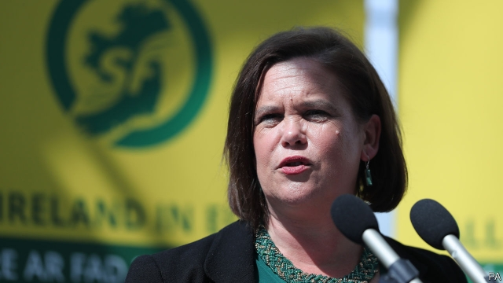

###### Sinn Fein’s long march

# A former voice of violence hopes to enter Ireland’s government 

 

> print-edition iconPrint edition | Europe | Jun 22nd 2019 

FOR THE leaders of Sinn Fein, the political wing of the Irish Republican Army (IRA), the route to power was smooth in the end. All they had to do was give up the armed struggle, tack left of centre and exploit popular resentment of fiscal austerity after the biggest crash in history. 

That, at any rate, is what happened in the late 1920s, when Eamon de Valera split from the hardline factions of Sinn Fein and its military wing, which he had previously led in a losing civil war. Having initially rejected the partition of Ireland after independence from Britain, de Valera grudgingly accepted the legitimacy of the new Irish Free State, to the rage of all-Ireland purists. His pragmatic new Fianna Fail party, which took many of Sinn Fein’s MPs with it, won power in 1932, and ruled what is now the Republic of Ireland for 61 of the next 78 years. 

For modern Sinn Fein, which has abandoned a more recent armed struggle in Northern Ireland, embraced centre-left policies and offers itself to voters both south and north of Ireland’s border, the parallels are obvious. But they are also unhelpful. Despite the collapse of Fianna Fail’s vote after it presided over the disastrous property crash of 2008, Sinn Fein has failed to replace its old rival as the main alternative to Ireland’s other main party of government, the prime minister, Leo Varadkar’s Fine Gael (descended from the winning side in that long-ago civil war). 

Instead, local elections held last month delivered a stinging rebuke to Sinn Fein, which lost 78 seats on county and city councils, nearly half of its total. It had hoped to get a bounce by selecting as leader last year Mary Lou McDonald, a personable and youngish Dubliner, to replace the ageing, Belfast-born Gerry Adams, once a full-throated apologist for violence. That did not work. 

Still, the party’s rise in the southern Republic has been steady and impressive, from no parliamentary seats in 1987, just after it stopped boycotting the Dublin parliament, to 14 seats in 2011 and 23 (of 158) in 2016. But Noel Whelan, a pundit, believes that Sinn Fein should have been able to pick up more seats from the post-crash collapse of Fianna Fail. 

With an impressive front bench, a strong spread of candidates, youthful support and a good ground game, Sinn Fein is formidable on paper, yet a number of factors seem to be holding it back. Leo Varadkar’s government faces mounting disquiet over domestic issues from which Sinn Fein would normally make hay—a collapsing health service and a crisis in housing—but it is partially shielded, says Jennifer Todd, a political scientist at University College Dublin, by the Brexit stand-off with Britain: the government is reckoned to be playing its hand well. 

Most observers agree that the legacy of the Troubles, in which Sinn Fein’s armed alter ego was the bloodiest participant, still haunts the party, 21 years after the IRA signed up for peace. William Murphy, a historian at Dublin City University, says that voters old enough to remember the Troubles are still wary of Sinn Fein. But he believes that this stigma, too, will pass if the party can prove itself in government, as it did for de Valera. Both Fianna Fail and Fine Gael insist they will not go into coalition with Sinn Fein, but few expect these promises to be kept if the arithmetic after the next election suggests otherwise. ◼ 

