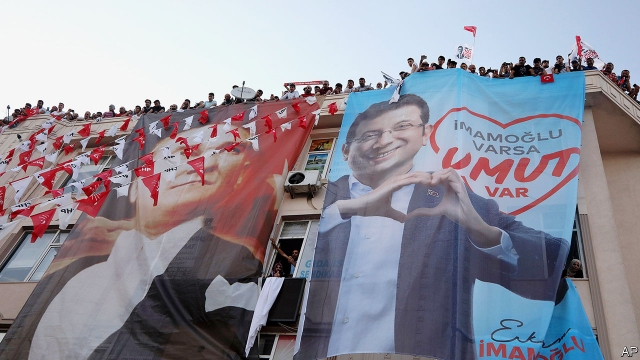

###### Round two

# A re-election in Istanbul tests President Erdogan’s power 

 

> print-edition iconPrint edition | Europe | Jun 22nd 2019 

ON MARCH 31ST Ekrem Imamoglu, a previously obscure opposition figure, pulled off a remarkable upset by winning the Istanbul mayoral race. Ever since, Turkey’s president, Recep Tayyip Erdogan, has gone to great lengths to undo his success. Eventually, Mr Erdogan got what he wanted. Citing mistakes in the appointment of polling station officials, Turkey’s election authority overturned the results, booted Mr Imamoglu out of his office and ordered a re-run. On June 23rd the residents of Turkey’s biggest city will be tramping to the polls all over again. 

For Mr Erdogan, however, things have not gone according to plan. The indefensible decision to order a re-run has done yet more damage to the strongman’s reputation abroad. It has also galvanised his opponents and disappointed even some of his own voters. Clumsy attempts by his ruling Justice and Development (AK) party to weaken Mr Imamoglu, including suggestions that he is secretly Greek, seem to have backfired. The former district mayor has successfully campaigned as both victor and victim, picking up a head of steam in the process. Having won in March by a mere 0.2%, he has widened his lead in the polls. In a recent debate against his opponent, Binali Yildirim, a former AK prime minister, Mr Imamoglu did not land any big punches, but still outshone his rival. Lamentably, theirs was the first televised election debate in Turkey in 17 years. 

Still, Mr Imamoglu and his Republican People’s Party (CHP) can hardly sleep easy. On paper the mayoral hopeful is running against Mr Yildirim. In practice his main opponent has always been Mr Erdogan. When Mr Imamoglu won, it was Turkey’s leader who accused the opposition of stealing the vote, called for a recount and exhorted the election board to scrap the results. Ahead of the re-run, he has placed the state news agency, responsible for providing live election results, under the authority of his own communications directorate. On June 17th he suggested that Mr Imamoglu would not become mayor unless he apologised to a local governor with whom he quarrelled during a visit to a Black Sea province. Over the ensuing couple of days, Mr Erdogan accused his opponent of terrorist links and compared him to Egyptian dictator Abdel-Fattah al-Sisi. “On Sunday, are we going to say yes to Binali Yildirim,” he asked a crowd, “or are we going to say yes to Sisi?” 

The reason why Mr Erdogan has resorted to such antics, and why some observers fear he may do so again, is that losing Istanbul today could mean losing the country tomorrow. Home to 16m people, the city is Turkey’s most important political stage, its economic centre of gravity and a key hub in Mr Erdogan’s own patronage network. 

Istanbul is where political careers are made, cemented and squandered. As mayor in the 1990s, Mr Erdogan cleaned up the city, helped tackle corruption, improved public transport and earned a reputation as a hard worker. As president, he turned Istanbul into a massive construction site and a showcase for his controversial projects, including a third bridge over the Bosphorus, Turkey’s biggest mosque and a colossal new airport. Mr Erdogan now fears that the city that propelled him to high office could do the same for Mr Imamoglu. “He always says the CHP are out of touch, that they know nothing of ordinary people, that they talk, while AK delivers,” says Gonul Tol, of the Middle East Institute, a Washington think-tank. “Were Imamoglu to build a successful track record, he would shatter that image.” 

 

In a few months, Mr Imamoglu has already become the face of a more open, inclusive Turkey, a far cry from Mr Erdogan’s vision of a country beset by outside enemies, including Europe and America, and divided between patriots and traitors. Winning in March transformed him into the opposition’s star. Winning in June would turn him into a presidential contender. 

Istanbul, which boasts a GDP bigger than Portugal’s and a budget of just over $4bn, has also become a cash cow for companies close to the ruling party. Amid a building frenzy that has consumed the city over the past couple of decades, developers have raked in billions of dollars. Successive AK administrations have helped transform Istanbul into a rentier economy. “The rent provides profit for business”, says Selva Demiralp, a Koc University academic, “and opportunities for the government to bond with the businessmen.” Some of the key players in construction also run some of Turkey’s biggest media groups. For Mr Erdogan, controlling them means controlling the press. 

Losing the city would also spell trouble for a number of foundations that are close to Mr Erdogan and his party. According to a recent report, foundations managed by the president’s children and friends, as well as a range of Islamic groups, received nearly $100m in subsidies from the municipality between 2014 and 2018. TURGEV, whose board includes Mr Erdogan’s daughter, the wife of his communications director and a former AK mayor of Istanbul, collected nearly 51.6m lira ($8.8m). An archery club headed by one of the president’s sons got 16.6m lira. Such foundations are also known to benefit from largesse from abroad. As a former deputy prime minister revealed a few years ago, TURGEV received $100m from unspecified foreign donors between 2008 and 2012. Mr Imamoglu has pledged to cut off municipal funding to such groups. Cigdem Toker, a journalist who documented the subsidies earlier this year, was promptly sued by one of the foundations. In today’s Turkey, that is par for the course. On June 14th, an Istanbul court accepted an indictment seeking prison terms of up to five years against a pair of Bloomberg reporters, a popular economist, and dozens of others for journalism and social media posts “targeting Turkey’s stability and economic order.” 

Despite earlier speculation that he would stump tirelessly on Mr Yildirim’s behalf, Mr Erdogan has largely stayed off the campaign trail over the past month, possibly to avoid being associated with another defeat. But make no mistake. Turkey’s leader has plenty of skin in the game. ◼ 

