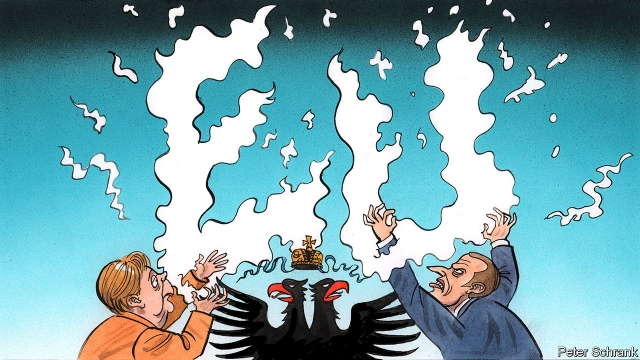

###### Charlemagne

# Europe’s gaseous political alliances 

 

> print-edition iconPrint edition | Europe | Jun 22nd 2019 

“SCHMIDT AND Giscard supported each other on every point which came up during this European Council,” scribbled Roy Jenkins in his diary in 1977. The former British home secretary had just become president of the European Commission, the EU’s executive. He was struck by the extent to which West Germany (led by by Helmut Schmidt) and France (led by Valéry Giscard d’Estaing) looked out for each other. Back in those days Europe’s two central powers sorted out their differences in private, and then used their combined weight to set the agenda for the entire club. 

Today things work differently. On many policy subjects, France and Germany are now openly divided. The former wants to cut short the endless Brexit negotiations; the latter is willing to prolong them. France backs the European Intervention Initiative, a European military force willing to act even when some EU states disagree; Germany is keener on Permanent Structured Co-operation, a broader but less dynamic forum for EU security co-ordination. France wants to integrate the euro zone further, to prepare it for the next crisis; Germany frets about moral hazard. 

The more the EU gains members, shrinks in relative global weight and faces ever-tougher circumstances, the more it struggles to present a common front. The EU summit starting on June 20th, which will focus on allocating the union’s big jobs, will illustrate that truth. The choice of president for the next European Commission will be the main bone of contention. Angela Merkel is supporting Manfred Weber, a Bavarian candidate whom her European People’s Party (EPP), the main centre-right grouping, backs. Emmanuel Macron, France’s liberal president, wants to block him and appoint instead Michel Barnier, a Frenchman and the lead Brexit negotiator, who is also in the EPP, or perhaps Margrethe Vestager, the EU’s formidable Danish competition commissioner who hails from his own liberal group. 

The geometry of European power is becoming messy. For one thing there are more splits: the old centre-right and centre-left families no longer span Europe. At the European Parliament election in May the conservatives were most successful in central and south-eastern Europe (eight of the nine centre-right governments are now from east of the Rhine). The social democrats are rooted in Iberia and Scandinavia. Meanwhile, the newly powerful liberal and green groupings in the parliament are strongest in Europe’s north and west while its right-wing populists are most successful in its east and south. In these circumstances, and with the Franco-German engine stalling, three smaller countries are becoming more influential: Spain, the Netherlands and Austria. 

Spain under Pedro Sánchez, the recently elected centre-left prime minister, is a natural ally to Emmanuel Macron’s France. He hopes to make Spain a new third partner in the Franco-German alliance. Madrid has particularly good relations with other southern European countries like Italy and Greece, but also makes a good interlocutor for Germany. “Merkel was quite happy when she realised she could speak to a Spanish prime minister directly,” says Miguel Otero-Iglesias, a Spanish foreign policy analyst, of Mr Sánchez’s European focus and fluent English. The Netherlands under Mark Rutte, meanwhile, has close links with both Mrs Merkel (as fellow supporters of hawkish euro-zone policies) and with Mr Macron (like Mr Rutte a liberal committed to speedy action on climate change). The Netherlands has made itself influential by marshalling a “Hanseatic” alliance against the fiscal integration that the likes of Mr Macron and Mr Sánchez want. In this it has allies across Scandinavian and Baltic Europe. Lastly there is Austria. The government in Vienna recently collapsed over a corruption scandal but the ousted chancellor, Sebastian Kurz, has emerged relatively unscathed and looks likely to win power again in new elections in September. Under his leadership, the small Alpine republic has become a potent voice in European debates on immigration and a broker of compromises between the EU’s liberal western states and its conservative-dominated eastern ones. 

The three countries have similarities. All have close links with France and Germany; all can marshal coalitions of like-minded states in their parts of Europe: all have modernising leaders with experiences of arduous coalition-building at home. One could call them “the Habsburgs”, as all were at one time controlled by that dynasty which, like its successors in Madrid, The Hague and Vienna, played off other powers at Europe’s core against each another. 

One illustration of the new mechanics came with the recent debate in the EU about cutting carbon emissions to zero by 2050. Germany was at first unwilling, but the Netherlands and Spain formed an alliance with France. That pushed Germany towards the goal. Austria then swung in, followed by some central European states like Slovenia. Together, the Habsburg states spread a measure initially backed by just eight EU states to at least 18 of them. 

Spain, the Netherlands and Austria are too disparate to act as a bloc. Instead, individually or in various combinations, they can help the French and the Germans build new coalitions. Such is today’s fluid European politics, where coalitions coalesce, take effect, then dissolve again. Whether or not the three will remain influential is uncertain. Others, for instance a potentially more pro-European Poland, could take their place. But the old world of a dominant Franco-German bloc is certainly over. A political scientist, Gilles Finchelstein, has a term for this. Once, he argues, European politics was made up of “solid” power blocs. Then after the fall of the Berlin Wall they became “liquid” with the rise of the swing voter and a less predictable European political landscape. Today, he concludes, is the “gaseous era” in which political coalitions come together for brief periods like clouds of smoke, then are blown apart again. In the years to come, such gaseous constellations will define Europe’s politics in the coming years. ◼ 

