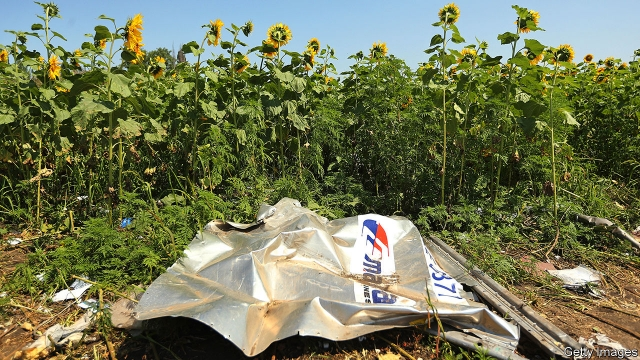

###### Accusing the absent

# Investigators indict the suspected killers of 298 people on flight MH17 

 

> print-edition iconPrint edition | Europe | Jun 20th 2019 

BODIES RAINED down from the sky on July 17th 2014, landing in the sunflower fields of eastern Ukraine. Limbs littered the gardens in the village of Grabovo, and travel books lay along the roads. The 298 people who took off aboard Malaysia Airlines Flight 17 in Amsterdam expected to land in Kuala Lumpur. Instead, a surface-to-air missile cut short their lives. 

The destruction of the aircraft became one of the bloodiest episodes in a war that has killed more than 13,000 people since 2014. The tragedy also served as a breaking point in Russia’s relations with the West, galvanising international opinion against the Kremlin’s shadowy war in eastern Ukraine. Russia has denied any involvement in the incident, choosing instead to spread clumsily constructed theories pointing the finger at Ukrainian forces. On June 19th an international investigative team announced that it had enough evidence to charge four people—three Russian citizens and one Ukrainian—in a Dutch court. They are Igor Girkin, Sergey Dubinskiy, Oleg Pulatov and Leonid Kharchenko. 

The charges mark the latest step in a sprawling years-long effort to establish the truth behind the 298 innocent deaths. Following the incident, Western governments, citing satellite data and other intelligence, quickly pointed the finger at Russia, which had been supplying and supporting the separatist forces fighting the Ukrainian army in the Donbas region. In 2015 the Dutch Safety Board concluded that a Buk missile of Russian provenance had shot down the plane. Open-source investigators and journalists soon assembled images and videos from social media to trace the missile’s path from Russia to Ukraine. The Joint Investigation Team (JIT)—composed of officials from Australia, Belgium, Malaysia, the Netherlands and Ukraine—has spent the past several years methodically adding detail. Last year, the team announced its own conclusion that the Buk came from a launcher belonging to Russia’s 53rd anti-aircraft brigade based in the city of Kursk; the launcher, they demonstrated, came to Ukraine from Russia, and returned across the border after the crash. 

The JIT’s identification of the four men introduces a new level of detail and culpability. Mr Girkin, a well-known commander of the separatist forces, is a former officer of the Russian security services. Mr Dubinsky has been named as the head of the separatists’ military intelligence, with Mr Pulatov head of a department; investigators say both earlier served in the Russian armed forces. Mr Kharchenko, in turn, was a local field commander. The four are not believed to have been the operators of the Buk system, but higher level figures who conspired to put the anti-missile system in place that fateful day. 

The JIT has no illusions about Russia’s willingness to extradite the suspects. Calls for the defendants to appear before the court when hearings begin next March are procedural, rather than aspirational. Yet even if none of them ever appear in court, the slow creep of justice will help to lay Russia’s lies around MH17 to rest, and to offer the victims’ relatives a small measure of the closure they deserve. ◼ 

