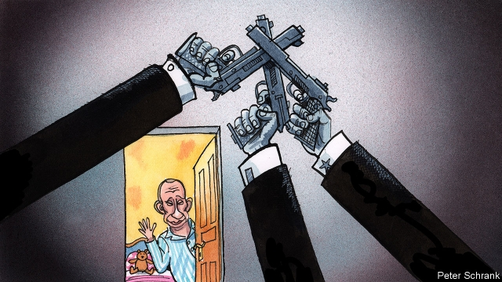

###### The new musketeers

# The improbable careers of Vladimir Putin’s bodyguards 

 

> print-edition iconPrint edition | Europe | Jun 22nd 2019 

VLADIMIR PUTIN was asleep upstairs when the bear arrived. The Russian president’s bodyguard, Alexey Dyumin, stared at the creature through the glass doors of the mountain home. “It was quite large,” Mr Dyumin later recalled. “I opened the door and emptied my pistol at his legs.” The bear wisely turned and ran. 

Politicians often develop special relationships with those assigned to protect them. Mr Putin has become closer than most to the men of Russia’s Federal Protective Service (FSO). Since 2016, four FSO officers from his personal guard have been appointed regional governors, making the unusual leap from the shadows into public life. A fifth became head of the newly formed National Guard. Mr Dyumin was elevated in 2013 to a post in the defence ministry, where he commanded special forces and reportedly oversaw the operation to annex Crimea in 2014. In 2016 he became governor of the Tula region, an arms-industry centre south of Moscow. “It was a little bit like the butler was suddenly made a duke,” says Mark Galeotti, an expert on the Russian security services. 

The bodyguards’ rise reflects a broader shift in the Kremlin’s priorities: from protecting Mr Putin himself to ensuring the longevity of the system he has built. With the president in his last constitutionally permitted term, the spectre of a post-Putin era looms. Hoping to manage the generational shift, Mr Putin has sought fresh cadres to replace ageing loyalists. Nationwide leadership contests have been launched to identify talent in a system that lacks mechanisms for elevating personnel, a role that the Soviet-era Communist Party and its youth league, the Komsomol, once played. One group of new reinforcements has become known as the “technocrats”—bespectacled experts who have been elevated to run regions and ministries. Yet those Mr Putin trusts most are still those he knows best; and after nearly two decades in power, those he knows best are often the men beside him on a daily basis. 

In the shadowy world of the Russian security services, the FSO occupies a rarefied position. Though lacking the investigative firepower of the Federal Security Service (FSB) or the cloak-and-dagger cachet of the foreign intelligence services, the FSO possesses an invaluable resource in Russia’s Byzantine system: dostup k telu, or closeness to the body. As Konstantin Gaaze, an analyst, puts it: “Proximity is power.” 

FSO agents are Mr Putin’s travelling companions on the road and his chefs at home. This lets them into the Russian elite. Mr Dyumin, for example, became a fixture in the president’s evening hockey league, an important informal meeting ground, long before he stepped onto the public stage. A sense of superiority is bred into the FSO’s culture. Some call them a Praetorian guard. Evgeny Minchenko, a consultant close to the Kremlin, says they prefer the label “Musketeers”. 

The FSO’s remit stretches far beyond the traditional bullet-stopping and gun-wielding into public-opinion polling, political analysis and the management of vast swathes of federal property. They are meant to protect government communications, but this means they also have access to them, says Andrei Soldatov, an author. The FSO produces intelligence reports for the president and operates the government’s Situation Centres. Last year Mr Putin charged the FSO with developing “information-warfare measures, detections, warnings and consequence-management of computer attacks on Russian information resources”. He also told them to track the implementation of his latest social and economic policies. 

Guards have long played key roles in Russia’s political architecture. The FSO traces its modern history back to 1881. That was when Tsar Alexander III created a special guard service in the wake of his father’s assassination. “They have always protected the authorities from the people,” says Gennady Gudkov, a former KGB general. During the early Soviet era, Stalin’s bodyguard, Nikolai Vlasik, had a hand in everything from state policy to raising Stalin’s children (he was ultimately rewarded with a Gulag sentence). The guard service was later rolled into the KGB, where it became the Ninth Directorate. After the collapse of the Soviet Union, Alexander Korzhakov, Boris Yeltsin’s bodyguard, confidant and drinking buddy, built a new guard service on its ashes. He became one of the most powerful men in Moscow. “He would say: ‘Work is done for the day’,” Mr Korzhakov recalls, “and there would be a bottle of cognac for two.” 

When Mr Putin came to power, he installed an old associate, Evgeny Murov, at the helm of the FSO. Under Mr Murov, the FSO took on a role of “watching over the innermost elite”, says Mr Galeotti. The agency’s leaders have done well: an investigation by the Organised Crime and Corruption Reporting Project and Novaya Gazeta, an independent Russian newspaper, claimed that a small coterie of FSO men have acquired oodles of prime real estate for a pittance. Though the FSO is said to have become less powerful since Mr Murov left his post in 2016, the rise of its alumni attests to its enduring influence. Some analysts even see Mr Dyumin as a candidate to succeed Mr Putin. 

Yet whether the Musketeers can adjust to public roles remains to be seen. Few have demonstrated much aptitude as politicians. One ex-bodyguard became an internet meme last year after posting a bizarre video address challenging Alexei Navalny, Russia’s leading opposition politician, to a duel. Another flamed out as governor of Kaliningrad after just two months and was moved to become minister for emergency services. Earlier this month a third unexpectedly stepped down as governor of the Astrakhan region after less than ten months in the job. One thing, though, seems certain: whatever the order, Mr Putin’s Musketeers will heed his call. As Mr Dyumin himself put it, “there’s never been a time when he’s given me a task and I’ve said ‘no’.”◼ 

