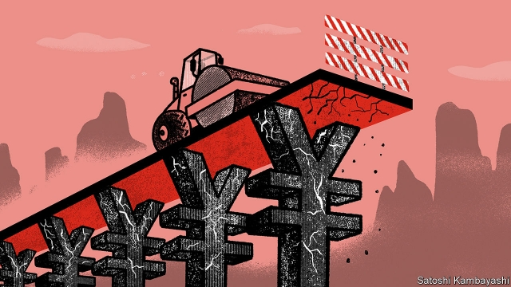

###### Deeper in the red

# As growth slows, the spectre of local-government debt looms once more 

 

> print-edition iconPrint edition | Finance and economics | Jun 22nd 2019 

A STATUE OF a golden bull, poised to charge, stands outside the headquarters of Xiangtan Jiuhua, a government-owned company that funds much of Xiangtan’s infrastructure investment. It has seen better days: the gold paint is flaking and the torso is cracked. That makes it a fitting symbol for public finances in the sprawling prefecture of 3m people in central China, and scores of similar cities across the country, where the ambitions of local officials have collided with heavy debt loads. 

Concerns about local balance-sheets in China have recurred over the past decade. Recently they have come into sharp focus again. Attempts to clean up local debts have not worked. And borrowing looks set to rise as the trade war rumbles on: China wants its provinces and cities to prop up growth by building roads and railways. 

At just 38% of GDP, less than half the average in advanced economies, government debt in China might seem under control. But that misses much of what is happening. Local governments have long relied on off-balance-sheet debt to solve a perennial policy quandary. They are responsible for about 85% of public expenditures, yet command only 50% of revenues. Moreover, central authorities make it hard for them to borrow formally, hoping to limit their profligacy. So they have created entities such as Xiangtan Jiuhua, referred to as “local-government financing vehicles” (LGFVs). These are registered as companies. But creditors know—or, rather, assume—that the state stands behind them. 

At last count China had 11,566 LGFVs. According to the IMF, when they are factored in, government debt rises to about 70% of GDP. This is worrying for three reasons. The first is the trajectory, with LGFV debts more than tripling over the past decade. The second is their opacity. Banks and bond investors think they must be safe, but even government auditors struggle to get a full picture of what is owed and where the money is going. Third, it is China’s poorer inland provinces that are most reliant on LGFVs. China International Capital Corp (CICC), a big domestic brokerage, has referred to them as a “grey rhino”: a risk that, unlike a “black-swan” event, is obvious but easily ignored. 

The government, to be fair, does not have its eyes closed. It has been trying to limit LGFV borrowing since 2010. Regulators have also sought to ease financial constraints on local governments, most notably through a giant debt swap in which local governments exchanged trillions of yuan in LGFV bonds for official bonds charging lower interest. 

But big risks remain. LGFVs are becoming less able to pay back their debts. Their operating incomes cover only about 40% of their obligations due within one year, according to CICC. For a normal company, that would spell trouble. Moreover, local governments remain addicted to them. Stripping out the bond swap, LGFV borrowing rose at 20% annually over the past five years, far outpacing overall debt growth. 

Last year China seemed to be getting serious about crimping off-balance-sheet borrowing. It wielded its most potent weapon: permitting defaults. On 15 occasions LGFVs failed to repay loans on schedule, according to Fitch, a ratings agency. That spooked markets. LGFVs’ interest rates went up, and their bond sales slowed. 

The impact was palpable. Local governments had less cash to spend, and Xiangtan was one of the casualties. It was forced to halt work on a highway around the city, which now stops abruptly at hoardings plastered in yellowing propaganda posters. A dirt track takes the place of an on-ramp. Zhou Juzhen, a retiree, has planted a small garden of chili peppers and green beans at its edge. “I wish the construction would resume,” she says. “It would be much more convenient living next to a big road.” 

The slowdown in building has played out on a national level. Infrastructure investment was just 1.6% higher in May than a year earlier, a big comedown from the previous double-digit norm. Worried about slowing GDP growth, on June 10th the central government opened the door for provinces and cities to increase spending. It urged them to issue special bonds for big projects such as modernising power grids. Many think local governments will again turn to a familiar friend. “Faith in LGFVs is seemingly on the rise again!” exclaimed analysts with ICBC, a major Chinese bank. 

But the government may find that last year’s stringent debt-control campaign has made provinces and cities more reluctant to open their wallets. Local officials know that once growth stabilises, they are likely to face pressure to deleverage again, says Houze Song of the Paulson Institute, a think-tank in Chicago. There is a more radical option: the central government could in effect fund LGFVs directly. China Development Bank, a giant state-owned lender, has started to offer long-term loans to LGFVs to replace their short-term debts. This is similar to the bond swap, but allows LGFVs to get cheaper funding without testing the market. 

Yet there are obvious drawbacks. For one thing, it puts the central government on the hook for LGFV liabilities. And if the programme is rolled out nationwide, efforts to get them to operate more responsibly would come to naught. So far the government has reportedly tested swaps in a few places. Xiangtan is one, not least because the prefecture includes the birthplace of Mao Zedong. China’s leaders do not want to see defaults here, of all places. 

At a river that bisects Xiangtan, giant pilings have been sunk to support a bridge. But the site has been abandoned, another victim of the local cash crunch. Fu Weijun, who works in a nearby steel mill, walks along its banks before his shift begins. It is just a matter of time before the bridge is completed, he says. “Western countries change too often. We can stick to the same path, no matter what.” That confidence might be shaken in the coming years. ◼ 

