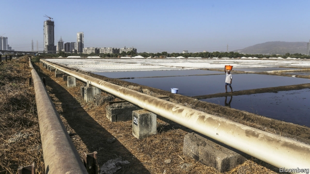
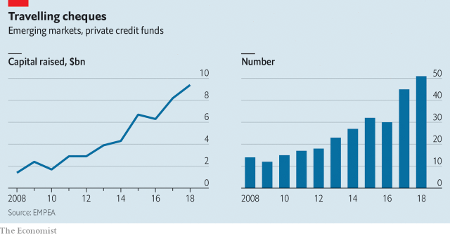

###### Loan away from home

# Buy-out firms are the new banks in emerging markets 

 

> print-edition iconPrint edition | Finance and economics | Jun 22nd 2019 

ENERGY PRODUCERS have long had India over a barrel. It is the world’s third-largest oil importer, yet its pipeline density is a quarter of the global average. It aims to add 15,000km by 2022, awarding projects through strict online tenders. The few groups able to qualify can hope for sweet profits—if they can first find financing. 

This is at last becoming easier. In emerging markets, a new breed of lenders has begun acting as credit supermarkets, offering anything from working capital to multi-year debt. They look and quack like banks, but are in fact buy-out firms investing mostly rich-world money. As demand for financing surges in fast-growing countries, they will proliferate, says Kanchan Jain of Baring Private Equity Asia. Her firm is nearing a four-year debt investment in a business that lays pipes in India. 

The surge reflects investors’ continuing hunt for yield. Ultra-low interest rates since the financial crisis have depressed returns in the West, nudging them towards economies with more alluring prospects. After stocks, bonds and private equity, private credit is their latest target. Last year over 50 emerging-market private-debt funds closed, having reached their funding target, up from 14 a decade ago. They raised $9.4bn in total, a sevenfold rise since 2008. Michael Casey of Portico, an advisory firm, says fundraising volumes could easily double again without flooding the market. 

Funds are filling a void left by Western banks, which have shunned faraway borrowers since post-crisis regulators asked for more capital to be held against exotic bets. Local rivals can lack firepower: the top 20 sub-Saharan banks together have less capital than one of Europe’s big lenders. 

 

Investors are also seeking pastures new to evade fierce competition in developed markets, where buy-out firms’ efforts to take over from banks have already reached a peak. They now manage $770bn in “alternative” debt assets. But credit supply is running ahead of demand: over $300bn raised by funds in recent years has yet to be spent. Competition for deals has crushed margins and caused a decline in “covenants”—clauses requiring borrowers to keep overall debt levels under control. Less mature markets, oddly, are starting to look safer: taking no chances, funds lending there insist on robust covenants. Borrowers also tend to be half as leveraged, and funds themselves seldom carry any debt (many do in the West). 

The asset class is also winning converts away from private equity. Finding acquisition targets can be tough in emerging markets, as owners of growing businesses, often families, are loth to give up control. Exiting them is even trickier. Prospective buyers are rare and thin capital markets complicate IPOs. All this hard work erodes returns to investors, says Holger Rothenbusch of CDC Group, the British government’s overseas-investment arm. By contrast, debt investments, which rarely dilute shareholders, tend to be self-liquidating. Most also produce regular cash flows. That pleases liability-driven investors like insurers. Returns can be juicy: low teens for senior loans, higher for distressed debt. 

There are pitfalls. Lending to a company rarely gives firms a board seat, making it harder to spot problems and scold management than if funds held an equity stake. And when things do go wrong, creditors’ ability to enforce agreements or seize collateral can be weak. “I’ve had to try to bring things to an Indian court,” says a former fund manager. “It’s basically impossible.” Some try to protect themselves by booking capital offshore; others limit themselves to high-quality borrowers and sponsors. 

Another issue is currency risk. With liabilities in dollars, most funds want to be paid in the same currency. But few companies earning in an emerging-market currency can afford to buy multi-year dollar hedges. That often restricts funds’ investable market to infrastructure projects backed by government guarantees, or companies pricing their wares in dollars, such as exporters or oil producers. To fuel a real investor frenzy, the asset class needs a stronger pipeline of deals. ◼ 

