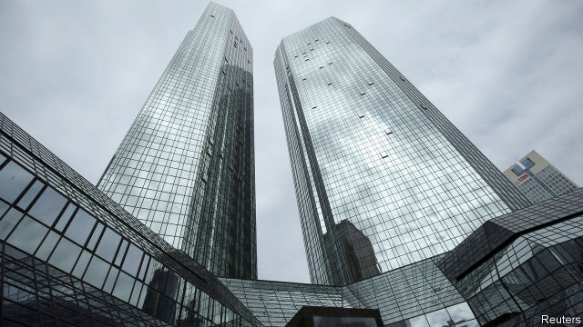
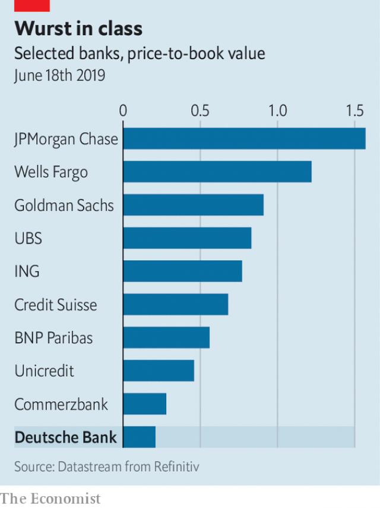

###### Slasher flick

# Can Germany’s biggest lender survive on its own? 

 

> print-edition iconPrint edition | Finance and economics | Jun 22nd 2019 

EARLIER THIS month, following the collapse of merger talks with Commerzbank in April, Deutsche Bank’s share price hit the lowest point of its 149-year history. Fitch, a credit-rating agency, cut the bank’s rating to two notches above junk. In May Christian Sewing, its chief executive, promised “tough cutbacks” in the ailing investment-banking business, with plans to be laid out alongside half-year results on July 24th. But on June 16th a leak in the Financial Times revealed the outlines. 

The cuts (which Deutsche has not confirmed) go well beyond its investment-banking arm. Its rates and equities trading business outside Europe will be trimmed, and a “bad bank” created to hold non-core assets that generate little or no revenue. At up to €50bn ($56bn), that is a sizeable chunk of Deutsche’s risk-weighted assets. Cuts to the underperforming trading operations had been expected, but the idea of a non-core unit is new. Like several other big banks, Deutsche had shoved €128bn of debts into a bad bank in the wake of the financial crisis. After years of restructuring, it is hard to see how on earth it still has dud assets on its books. But apparently so. 

Can the moribund Teutonic giant be shaken back into life? After the leak its share price rose 2%, only swiftly to sink again. Investors fear the changes are too little, too late. Deutsche’s biggest problems are a failing investment-banking arm, high funding costs and the lack of a reliable profit generator, such as the private-wealth management units that keep Swiss banks going through lean years. Mr Sewing’s restructuring plan does little to address any of these except the first. 

Moreover, they are harder without profits. The firm cannot take big upfront losses. “Deutsche Bank cannot afford radical change,” says Daniele Brupbacher at UBS, a Swiss bank (and rival to Deutsche). Under Germany’s strong labour laws, slashing headcount would mean stiff social-insurance payments. Offloading dud assets is expensive, too. Deutsche’s post-crisis bad bank made losses of €14bn. 

 

The retrenchment marks a definitive end to Deutsche’s aspirations to become Europe’s Goldman Sachs. Now it would settle for being a German version of BNP Paribas, a French universal bank with most of its activities in Europe. As well as a slimmed-down corporate and investment bank, Deutsche will still have Germany’s biggest retail bank (plus retail operations in Italy and Spain) and DWS, a solidly performing asset manager. But it is quite a comedown from the 1990s, when it took on Wall Street and, for a short time, became a big player in global investment banking. 

Many in Germany see the plans as a last-gasp effort to remain independent. UBSand ING of the Netherlands have already signalled their interest in merging with Deutsche. A takeover by a foreigner would be a big blow to German pride. 

A lot will depend on how fast Mr Sewing can put his proposals into action. The leak is likely to force him to come clean about the details earlier than he had planned. They will probably include yet another purge of senior managers. According to the Frankfurter Allgemeine Zeitung, a daily, he might start by firing Garth Ritchie, the boss of Deutsche’s investment-banking unit. In the new cost-conscious era Mr Sewing could take over—and run the sickliest division of an ailing bank. That may be an even more difficult task than it sounds. ◼ 

