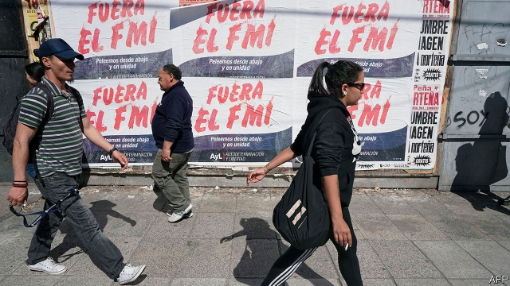
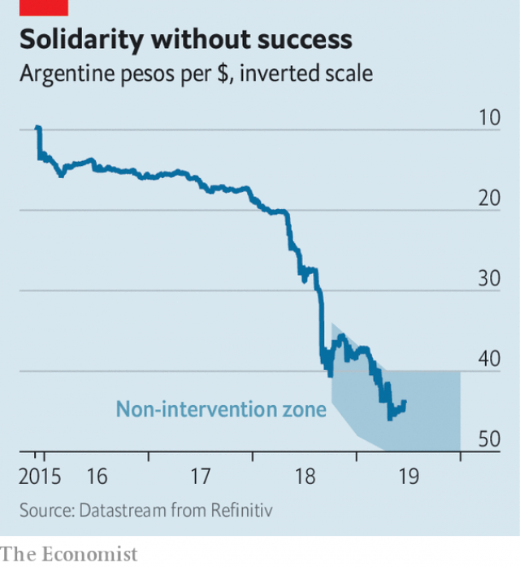

###### Repeat business

# In Argentina, the IMF has been neither toxic nor triumphant 

 

> print-edition iconPrint edition | Finance and economics | Jun 22nd 2019 

“WHAT GOOD is it to throw a man ten feet of rope if he is drowning in 20 feet of water?” asked Kenneth Rogoff, former chief economist of the IMF, in this newspaper 15 years ago. His question still bothers the institution he used to advise. Last June the fund uncoiled its biggest-ever loan: $50bn for Argentina. Four months later it added $6bn more. It hoped its generosity would rescue Argentina and salvage its reputation in a country that regards it as complicit in the economic disasters of 2001-02. But a year later, Argentina’s economy is still far from safety. Will more rope be needed? 

The first thing a drowning man should do is jettison excess weight. Argentina’s government, led by Mauricio Macri, has slashed its fiscal deficit, aiming to balance the budget this year, excluding interest payments and some capital and social spending approved by the IMF. That austerity has helped squeeze imports, turning the trade deficit into a surplus. 

But such fiscal rigour will be hard to sustain. And imports are not the only claim on Argentina’s dollars. It must make substantial payments on foreign debt in 2020, when the inflow of dollars from the IMF’s three-year loan will slow dramatically. Many analysts think it will eventually need a new, longer IMF loan to help it pay back the existing one. 

Investors also fear a resumption of capital flight by residents, especially if Mr Macri looks likely to lose the October election to his populist opponents, led by Alberto Fernández and Cristina Fernández de Kirchner, a former president. Mr Macri’s government is in a bind. Tougher measures to appease creditors will anger voters—and angry voters will alarm creditors, who fear Ms Fernández’s return. 

 

That return is possible because growth has been slow to recover (the economy has shrunk for five quarters in a row) and inflation hard to repress: consumer prices rose by over 57% in the year to May. High inflation has put downward pressure on the peso (see chart). The peso’s falls have, in turn, put upward pressure on prices. Argentines are quick to convert their deposits into foreign currency, and many wages and prices are set with an eye on the dollar. It is thus hard to stabilise prices without also stabilising the exchange rate. 

Despite this, the IMF has discouraged the central bank from intervening directly in the currency markets to prop up the peso. In September it asked that the currency be allowed to float freely within a wide “non-intervention zone”. But in April it had to change course. After a bad opinion poll for the Macri government sent the peso tumbling, the central bank said it would intervene within the zone if necessary. That announcement, as well as a good harvest, seem to have worked for now. The peso is up 5% against the dollar since its April low. 

Some in Argentina think the size and speed of the IMF’s loan meant it could not be tailored to the country’s idiosyncrasies. Though Argentina might have liked a large, fast, customised loan, it had to settle for two out of the three. That said, the IMF has been remarkably willing to refit the agreement as circumstances require, expanding its size, speeding up disbursements and even endorsing the central bank’s new intervention policy in April. 

The fund, and its biggest shareholder, America, seem eager to give this government the benefit of the doubt. For its part, the government has not blamed the fundfor its predicament. Even the opposition, which defied the IMF when Néstor Kirchner, Ms Fernández’s husband, was president in 2005, has said it will not walk away from the programme if it wins the election, though it will seek to renegotiate the terms. 

The IMF has become more palatable, say some officials, because it has become less intrusive, leaving countries to decide how best to meet the macroeconomic targets it sets. But the fund itself is keen to highlight one conspicuous intrusion in Argentina’s affairs: it has set a floor under social spending, requiring the government to devote at least 1.3% of GDP to cash-transfer schemes and other social safety nets. This is not only a “moral imperative”, argues Roberto Cardarelli, the IMF’s mission chief for Argentina, but a practical one too. Preserving social spending is necessary to limit the plan’s unpopularity, and the less the plan is hated, the better its chances of success. What good is it to throw a man a rope if he sees it as a noose?◼ 

