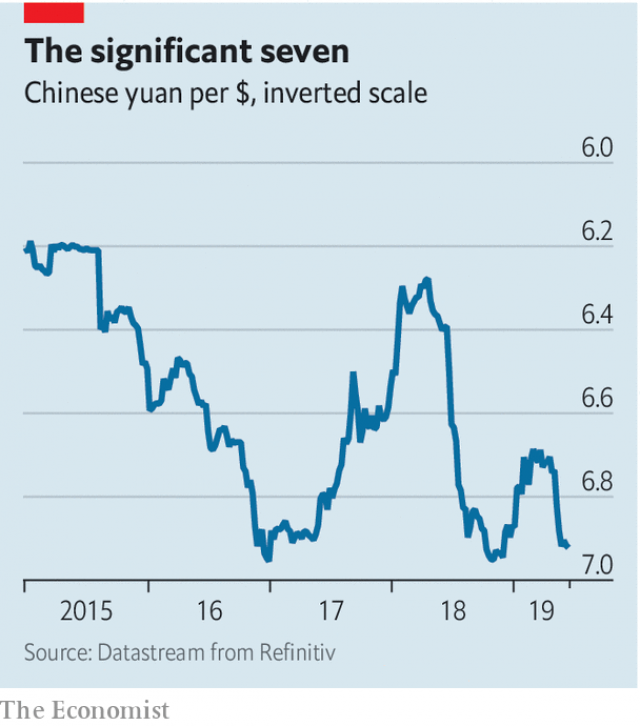

###### Buttonwood

# Low interest rates and sluggish growth may lead to currency wars 

> print-edition iconPrint edition | Finance and economics | Jun 22nd 2019 

IN 2010, AS the euro zone’s sovereign-debt crisis escalated, the euro fell sharply, from $1.45 to $1.19. Soon the talk in America was of a second round of quantitative easing by the Federal Reserve. Was this a coincidence? Many in euro land thought not. QE2, as it came to be known, seemed to them to be mostly a means to a weaker dollar. The grumbles went beyond Europe. That September Guido Mantega, Brazil’s finance minister, said his country was under fire in an international currency war. 

Now the bellyaching comes from America. On June 18th Mario Draghi, the president of the European Central Bank (ECB), said at a conference in Sintra, Portugal, that the bank stood ready to relax its monetary policy further if the euro-zone economy did not improve. Bond yields fell. So did the euro. President Donald Trump took to Twitter to denounce Mr Draghi for “unfair” currency manipulation. Earlier this month Steven Mnuchin, Mr Trump’s Treasury secretary, had fired a warning shot in the direction of Beijing on currency policy. If China stopped trying to support the yuan, he seemed to suggest, that could be understood as an effort to weaken it. 

The guns have been holstered again. The prospect of a pow-wow between Mr Trump and Xi Jinping, China’s president, at a G20 summit in Osaka later this month has raised hopes that, at the very least, the trade war between their two countries does not escalate. A trade truce ought to cool the war of words over exchange rates, too—but not for long. Interest rates are low. The use of fiscal policy is constrained by either politics or debt burdens. A cheaper currency is one of the few ways left to gin up an economy. A world of sluggish GDP growth is one that is primed for a currency war. 

 

Despite Mr Draghi’s best efforts, the exchange rate to watch is dollar-yuan, not euro-dollar. The yuan increasingly sets the tone for global currencies—and, by extension, for financial markets. China has allowed its currency to respond somewhat to market pressures since August 2015. But it has been kept in a fairly tight trading range against the dollar (see chart). These small changes matter. The currencies of China’s big trading partners, such as the euro, have got caught up in the yuan’s shifting tides, rising and falling in sympathy. Seven yuan to the dollar has been seen as an important threshold. Should the yuan ever breach that level, it would surely drag other currencies down with it. 

Any hints that Beijing may be prepared to let the yuan go beyond seven are thus significant. Simon Derrick of BNY Mellon points to two developments in this regard. The first is the publication in late May of a seemingly well-sourced article in the South China Morning Post on trade negotiations with America. A sticking point, it said, was the yuan. China favours currency “flexibility”—not for an export advantage but to ensure stability. America is unsympathetic. Then, on June 7th, the governor of China’s central bank, Yi Gang, told Bloomberg that a flexible currency was to be desired as it “provides an automatic stabiliser for the economy”. He also hinted that there was no red line at seven. 

There is a topsy-turvy logic to currency wars. The winners are the currencies that fall in value. In such a race to the bottom, investors seek to back the losers. In times of trouble they will go for the usual boltholes: the yen, the Swiss franc and gold, all of which have been lifted by trade-war anxiety. The dollar stays strong because America has high interest rates, by rich-world standards, and a strong economy. But when growth slows and interest rates fall, says Kit Juckes of Société Générale, a French bank, other factors come into play. These include trade balances and valuation. 

The yen stands out. Japan runs a current-account surplus. And the yen is cheap based on measures of purchasing-power parity, including rough-and-ready gauges, such as The Economist’s Big Mac Index. The Swiss franc is also backed by a hefty current-account surplus, even if it looks expensive. Gold gets a look-in mainly because there are so few good alternatives to holding dollars. 

In 2010 the cheap dollar irked everyone outside America. Now the dear dollar bothers America, or at least its president. In the slow-brewing currency war, America is both victim and perpetrator. “If you start a trade war with your biggest trading partners, they get a weak currency and you get a strong one,” says Mr Juckes. If Mr Trump wants a cheaper dollar, declaring trade peace might be the best way to get it. Otherwise, America risks waging a currency war on itself. 

