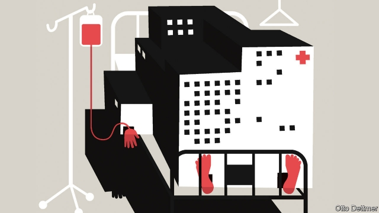

###### Free exchange

# The rising cost of education and health care is less troubling than believed 

 

> print-edition iconPrint edition | Finance and economics | Jun 20th 2019 

AMONG THE compensations of ageing is the right to bore youngsters with stories of the prices of yesteryear. Once upon a time a ticket to the cinema cost just five quid, and a hogshead of mead but a farthing. Of course, savvier youths know how to debunk such tales. Adjust for inflation and many things are cheaper than ever. Since 1950 the real cost of new vehicles has fallen by half, that of new clothing by 75% and that of household appliances by 90%, even as quality has got better. Tumbling prices reflect decades of improvements in technology and productivity. But the effect is not economy-wide. Cars are cheaper, but car maintenance is more expensive, and costs in education and health care have risen roughly fivefold since 1950. Though no mystery, this rise is often misunderstood, with serious economic consequences. 

There are as many explanations for the ballooning cost of such services as there are politicians. But as a newly published analysis argues, many common scapegoats simply cannot explain the steady, long-run rise in such prices relative to those elsewhere in the economy. In “Why are the prices so damn high?” Eric Helland of Claremont McKenna College and Alex Tabarrok of George Mason University write that quality has improved far too little to account for it. Administrative bloat is not the answer either. In America the share of all education spending that goes on administration has been roughly steady for decades. Health-care spending has risen faster than GDP in rich countries, despite vast differences in the structure of their health-care systems. 

The real culprit, the authors write, is a steady increase in the cost of labour—of teachers and doctors. That in turn reflects the relentless logic of Baumol’s cost disease, named after the late William Baumol, who first described the phenomenon. Productivity grows at different rates in different sectors. It takes far fewer people to make a car than it used to—where thousands of workers once filled plants, highly paid engineers now oversee factories full of robots—but roughly the same number of teachers to instruct a schoolful of children. Economists reckon that workers’ wages should vary with their productivity. But real pay has grown in high- and low-productivity industries alike. That, Baumol pointed out, is because teachers and engineers compete in the same labour market. As salaries for automotive engineers rise, more students study engineering and fewer become teachers, unless teachers’ pay also goes up. The cost of education has thus risen because of the rising pay needed to fill teaching posts. Other factors matter too, and can explain, for instance, why Americans pay more than Europeans for health care and higher education. But across countries, none is as important as the toll exacted by cost disease. 

Baumol’s earliest work on the subject, written with William Bowen, was published in 1965. Analyses like that of Messrs Helland and Tabarrok nonetheless feel novel, because the implications of cost disease remain so underappreciated in policy circles. For instance, the steadily rising expense of education and health care is almost universally deplored as an economic scourge, despite being caused by something indubitably good: rapid, if unevenly spread, productivity growth. Higher prices, if driven by cost disease, need not mean reduced affordability, since they reflect greater productive capacity elsewhere in the economy. The authors use an analogy: as a person’s salary increases, the cost of doing things other than work—like gardening, for example—rises, since each hour off the job means more forgone income. But that does not mean that time spent gardening has become less affordable. 

Neither do high prices necessarily need fixing. Many proposed solutions would be good for growth but would not solve the cost-disease problem. Boosting the supply of labour by increasing immigration could depress costs in both high-productivity sectors and low-productivity ones. But the price of a college education in terms of sedans would remain eye-watering. Innovation in stagnant sectors, while welcome, would shift the problem of cost disease elsewhere. A burst of productivity growth in education—because of improved online instruction, say—should contribute to a decline in the price of education per student. But because a given instructor could serve many more students than before, teachers’ potential income would rise, luring some would-be doctors away from the study of medicine and exacerbating the problem of cost disease in health care. A productivity boom in health care might shunt the cost disease to dentistry, or child care, or veterinary medicine. 

The only true solution to cost disease is an economy-wide productivity slowdown—and one may be in the offing. Technological progress pushes employment into the sectors most resistant to productivity growth. Eventually, nearly everyone may have jobs that are valued for their inefficiency: as concert musicians, or artisanal cheesemakers, or members of the household staff of the very rich. If there is no high-productivity sector to lure such workers away, then the problem does not arise. 

These possibilities reveal the real threat from Baumol’s disease: not that work will flow toward less-productive industries, which is inevitable, but that gains from rising productivity are unevenly shared. When firms in highly productive industries crave highly credentialed workers, it is the pay of similar workers elsewhere in the economy—of doctors, say—that rises in response. That worsens inequality, as low-income workers must still pay higher prices for essential services like health care. Even so, the productivity growth that drives cost disease could make everyone better off. But governments often do too little to tax the winners and compensate the losers. And politicians who do not understand the Baumol effect sometimes cap spending on education and health. Unsurprisingly, since they misunderstand the diagnosis, the treatment they prescribe makes the ailment worse. ◼ 

