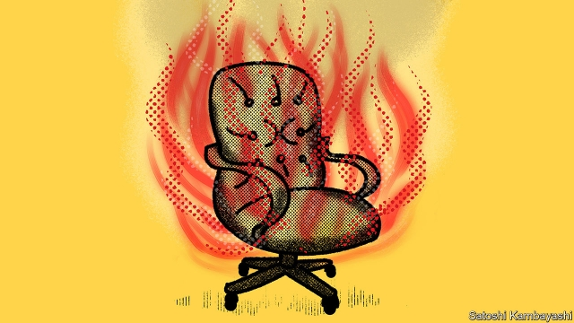

###### The hottest seat in banking

# Who would be mad enough to take the top job at Wells Fargo? 

 

> print-edition iconPrint edition | Finance and economics | Jun 22nd 2019 

IT IS WITH relief—oops, I mean “regret”—that I must turn down your offer of the role of chief executive at Wells Fargo. Had you asked me four years ago I would have accepted. Back then Wells looked like a model bank, having come through the financial crisis unscathed by trading accidents or losses on toxic mortgages. Its retail arm was purring along—thanks, it seemed, to your employees’ brilliance in persuading people to open accounts. That brilliance turned out to be in fraudulently opening millions of spoof accounts, partly in order to shine in internal reports known as “Motivators”. I like a lively sales force, but Wells took it too far—and, more to the point, got caught. 

Although the scandal broke back in 2016, the mess will still dominate the life of your next CEO. It is not the threat of litigation that worries me—with $20bn of annual profits the firm can easily absorb the worst that America’s lawyers can throw at it. Far scarier are regulation and politics. 

Federal supervisors have imposed more than a dozen restrictions on Wells until it shows it has better safeguards in place. These include capping assets at their 2017 level of $1.95trn. This has hobbled the firm. Since then it has shrunk by 3% even as JPMorgan Chase’s assets have grown by 8%. Although the cap may be lifted in 2020, relations with regulators are still tense. All this when banks need scale and nimbleness to cope with technological change. 

And then there is the political climate. Wells has come to symbolise all that is wrong with corporate America. It is an easy target: not just a bank, but one that set out to con the little guy. As the Democratic Party has tilted left, barely a day passes without one of its presidential candidates taking a pop at the moneymen. And Wells is often first in their sights. 

Your next CEO will therefore have to do plenty of pandering to Congress. The House financial-services committee loved dragging in your previous chief executive, Timothy Sloan, for a kicking. How many days was it between the last of those ritualistic humiliations and his leaving—16? His predecessor, John Stumpf, kept his job for only 13 days after he was hauled in. Trips to Capitol Hill do not seem compatible with career longevity. I would hate to crash and burn live on C-Span. 

I confess I sometimes indulge in daydreams about being feted for turning a banking behemoth around—who in finance doesn’t want to be on the cover of Fortune, or seen as a contender to usurp Jamie Dimon as the industry’s king? And I know a thing or two about mucking out stables. But this looks like a tougher gig than becoming Harvey Weinstein’s PR guru. 

And frankly, I worry that you wouldn’t offer enough to make the risks worthwhile. The $30m-odd I deserve would be far too contentious. What if I ended up in the same boat as Andrea Orcel, who quit UBS to join Santander which then dumped him after criticism of his lavish package? If I’d wanted to suck up to politicians for no money I would have become a journalist. 

If I may, a word of advice. You should broaden your search beyond banking. That said, I’d steer clear of tech people at present—they are even less popular than us. Perhaps an accountant would do the trick, though not one from PwC—they messed up the Oscars, for goodness’ sake! 

Your best-known shareholder, Warren Buffett, recently admitted that Wells did “crazy things”. I struggle to think of anything crazier right now than agreeing to take its reins while faced with a demoralised workforce, mistrustful regulators and a hostile Congress. Whomever you decide to approach next, I wish them the best of luck. They’ll need it. 

Yours sincerely, 

[REDACTED] 

