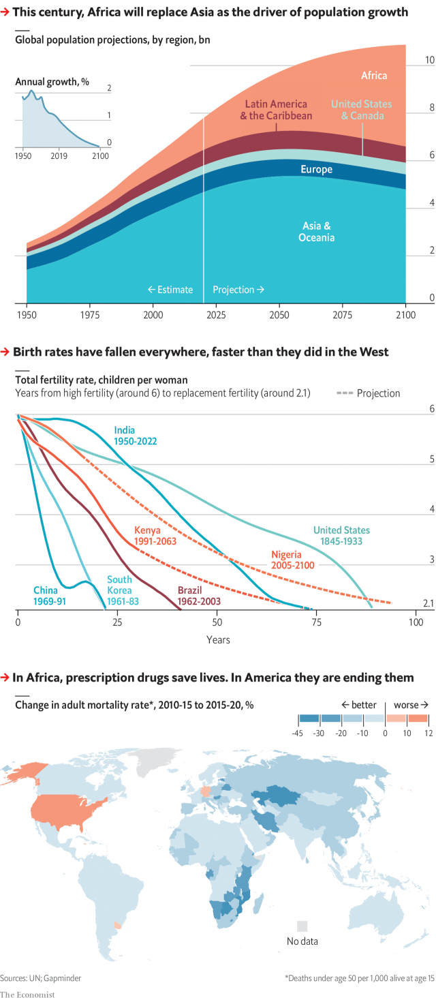

###### Demography

# The UN revises down its population forecasts 

 

> print-edition iconPrint edition | Graphic detail | Jun 22nd 2019 

THE UNITED NATIONS is the world’s most important watcher of human tides. Its demographers have a good record of predicting global population change, although they have made mistakes about individual countries. So it is worth paying attention when the UN revises its figures, as it does every few years. The latest bulletin is especially surprising. 

Recent revisions have sent the projected global population upwards. The one released on June 17th cuts it back. The UN now thinks the world will contain a little over 9.7bn people in 2050 and just under 10.9bn in 2100. The first figure is 37m lower than the UN forecast two years ago. The latter is 309m lower—almost an America’s worth of people revised away. 

Birth rates are falling faster than expected in some developing countries. In the late 1980s Kenya had a fertility rate of 6.5, implying a woman could expect to have that many children. Two years ago the UN reckoned Kenya’s fertility rate would drop to 2.1 (the point at which the population sustains itself naturally) only in the late 2070s. Because of new data, it now thinks Kenya will reach that point a decade earlier. Uganda also looks less fecund. A smaller cut to India’s fertility rate has a big effect on the global population forecasts because India has so many people. 

The UN’s population model assumes that countries with fertility rates well below two will bounce back a little. Even in countries where babies have become rare, most people continue to believe that the ideal family contains two or even three kids. But the recovery keeps failing to happen in some places, so the demographers have changed their forecasts in a second way. They now expect some countries with extremely low birth rates, such as Italy, Japan and South Korea, to stay that way for years. Korea, which has a fertility rate of just 1.1, is now expected to have 30m people in 2100—down from 51m today. 

Another change has to do with death. Most people are living longer. The biggest improvement is in east and southern Africa, where HIV is being treated better. In America, however, the opioid epidemic has pushed up the death rate, especially for men. The chance of a 15-year-old boy dying by the age of 50 is now higher in America than in Bangladesh. It would be nice if the American forecast, at least, proved to be too pessimistic. ◼ 

Sources: UN; Gapminder 

