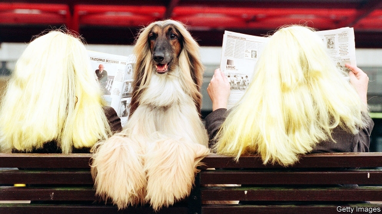
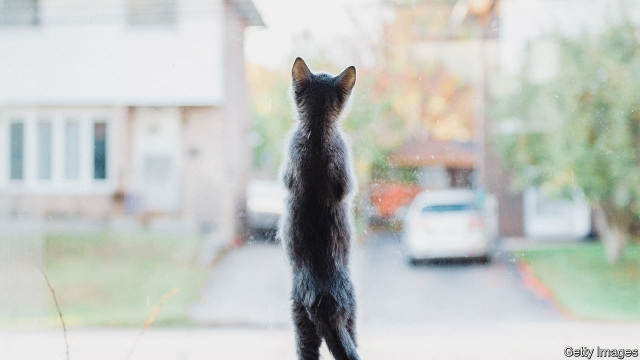

###### Dogged pursuit

# Pet-ownership is booming across the world 

 

> print-edition iconPrint edition | International | Jun 22nd 2019 

MARTIN SALOMÓN has brought his dog, Manolo, to the “canine area” of a public park in Condesa, a wealthy district of Mexico City. As he watches the happy, free-running animals, he reflects on how dogs’ lives have changed. Mr Salomón, who was born in the northern state of Sonora, recalls that his grandmother had two dogs—a black one called Negro and a white one called Güero, meaning pale. They were seldom allowed in the house. And today? Recently he attended a birthday party for a friend’s dog, with a cake, candles and a party hat for the pooch. 

In South Korea, some people who keep cats refer to themselves not as “owners” or even “parents”—a more condescending term that appeared in America in the 1990s and has spread. Instead they are “butlers”. Some take their feline masters to a cat hotel in the Gangnam district of Seoul. It resembles a beauty studio, with plump cushions and pastel colours. The rooms and suites, costing $35-50 for a day, are equipped with ridges and tunnels for the cats to play in, as well as cameras and microphones. “It’s so the cats can hear their butlers’ voices,” explains the owner, Cho Hanna. 

Keeping pets is hardly novel; nor is pampering them. Archaeologists have discovered graves from more than 10,000 years ago containing the skeletons of humans and dogs. Some of the dogs suffered from diseases, and were presumably cared for by their owners. Eighteenth-century portraits are full of well-groomed animals. But never have so many people kept pets, nor have they fawned over them as much as they do now. For better or worse, an almost global pet culture is emerging. 

Some parts of the world are keener than others on pets. Argentines are much more likely to keep animals than are Japanese people; in mostly Muslim countries people tend not to have dogs. But in general, the wealthier a country is, the more people have pets. As a rule of thumb, says Carlos Romano, the head of Nestlé’s pet-food operations in Latin America, the animal instinct kicks in when household incomes exceed about $5,000 a year. 

As people grow better-off, their attitudes to domestic animals change. Surveys by Euromonitor, a market-research firm, show that in emerging markets wealthy people are more likely than poorer people to describe pets as “beloved members of the family”, as opposed to merely well-treated animals. In 2015 a Harris poll of American pet owners found that 95% deemed their animals part of the family—up from 88% in 2007. Americans behave accordingly. More than two-thirds allow pets to sleep on their beds, and almost half have bought them birthday presents. 

People in the pet industry use the word “humanisation” to describe many of the changes they see. It does not imply that people think their pets are actually human (although sometimes you wonder: many cats and dogs have Instagram accounts, and a few people have symbolically married their pets). Rather, more pet owners have come to believe that their animals can do human-like things, such as understand them, calm them and love them. They have also come to believe that pets should be treated more like humans. 

In countries with long traditions of pet-keeping, these changes may be visible only with hindsight. Sami Tanner, the head of strategy at Musti Group, which owns almost 300 pet-supplies shops in Finland, Norway and Sweden, points to the Irish setters that his family has kept. In the late 1960s his mother’s dog, Cimi, was fed cheap dog food and table scraps, and had just two accoutrements: a blanket and a leash. In 2009 Mr Tanner’s dog Break became the first canine in the family to have his teeth brushed, and the first to acquire a raincoat and a bed. His current dog, Red, has several jackets, attends dog school, and is a model. 

Elsewhere, the changes are head-snappingly fast. In parts of East Asia, dogs have long been valued as food. Cats may be made into tonics. Western journalists in South Korea for the 2018 Winter Olympics went in search of dog meat; they found it, even though officials offered to pay restaurants to remove it while the visitors were around. As the culture of pet-keeping spreads, though, a domestic lobby has emerged. In 2017 the Korean president, Moon Jae-in, acquired a dog from a shelter; earlier this year the mayor of Seoul vowed to close all dog butchers. Chinese animal-lovers hound the dog-meat festival held each year in the province of Guangxi. 

Some animals are easier to see as family members than others. As the expectation that pets should provide companionship and emotional support has grown, the range of favoured species has narrowed. In 1949 Konrad Lorenz, an Austrian biologist, recommended fish, hamsters, bullfinches and starlings as excellent pets. Five years later, Marlon Brando’s character in “On the Waterfront” kept pigeons. Today just two species dominate: Canis familiaris and Felis catus. Sales of dog and cat food are rising in Britain. Rabbit, rodent, fish and bird food are all in decline, according to the Pet Food Manufacturers’ Association. 

Of the two privileged species, cats have a slight advantage. Euromonitor expects the number of pet cats worldwide to grow by 22% between 2018 and 2024, compared with 18% for dogs. Cats are better suited to apartment living than dogs, so they are more at home in the densely populated, fast-growing cities of Asia. They are also more tolerant of their owners’—sorry, butlers’—erratic working hours. 

Some of the most popular dogs are roughly cat-sized. Early last year the French bulldog overtook the Labrador retriever as Britain’s most popular pedigree dog; pugs were not far behind. In America, the French bulldog has risen from the 58th most popular pedigree dog to fourth since 2002, according to the American Kennel Club. French bulldogs and pugs have something in common besides size. If you ignore their ears, they look a little like human babies. Their eyes are large and their noses squashed—so much so that many of them suffer from breathing problems. 

It has even been suggested that young people are substituting pets for children. Millennials, who are getting around to having kids later than any generation before, reinforce that impression by doting on their “fur babies”. For all that, it is probably wrong. Birth rates plunged in countries like China and Korea long before the pet boom. In America, pet ownership is linked to having children (not a surprise to anyone who has been on the receiving end of a multi-year lobbying campaign to get one). And the things that pet parents claim to get from their furry charges, such as love, companionship and understanding, sound less like the things we expect from children and more what we want from a spouse or lover. 

Still, pets are undoubtedly treated better than they were. Mr Romano of Nestlé says that Latin American ones used to subsist largely on table scraps, but no longer. Across the continent, he says, dogs now get about 40% of their calories from pet food, whereas cats get a little more. And pet owners are buying posher nibbles. Euromonitor estimates that dog-food sales in Mexico have grown by 25% in real terms since 2013. Premium therapeutic foods, which are supposedly good for dogs and are definitely heavy on wallets, are selling especially well. 

Musti ja Mirri’s shop in Tammisto, a suburb of Helsinki, suggests how far this process can run. The shop not only sells a huge range of prepared pet foods, including ice cream for dogs, grain-free foods and foods for moggies with a wide variety of conditions including old age, urinary problems and “sensitive digestions”. It also has two large freezers of fresh meat. The assistants say that a growing number of dog owners add this meat to prepared food, believing it to be more natural and healthy. Elsewhere dog owners can order food tailored to their pets’ specific requirements, from outfits like Tails.com in Britain and Feed My Furbaby in New Zealand. 

 

It is unclear that pets are benefiting from the extra attention to their diets. Julie Churchill, a veterinary nutritionist at the University of Minnesota, says that some specialist pet foods are useful. Animals with diabetes need special diets, as do extremely large dogs. But the rapid growth of natural, unprocessed pet food strikes her as an example of people extrapolating from their own dietary concerns. Unlike its human equivalent, pet food is processed with the aim of creating a more balanced diet. As for grain-free food (another human fad that has transferred to pets), Ms Churchill suspects it could be linked to a kind of heart disease in dogs. 

A still trickier question is whether pets are good for people. John Bradshaw, the author of “The Animals Among Us”, argues that pets seem to calm people down and help them create bonds with other people. Only some people, though. Anecdotal evidence that some people are disposed to adore pets, whereas others fear or loathe them, has been borne out by studies. Statistical research on Swedish twins by Tove Fall of Uppsala University and others suggests that more than half of the propensity to own dogs is heritable. 

Pet-pushers have spent years trying to prove that animals improve human health, and have largely failed. The problem is the selection effect. Showing, as some studies have done, that dog owners get out more and visit the doctor less does not show that dogs are good for you. It could be that comparatively sociable, healthy people are more likely to acquire dogs. Certainly, pet owners are wealthier than average and more likely to own their homes. A study of California that tried to correct for social and economic influences concluded that having a pet is not associated with better general health (it is, however, correlated with having asthma). A recent randomised controlled trial of therapy dogs in juvenile cancer wards found almost no effect on children’s levels of stress or quality of life. 

Undoubtedly, however, one species of animal helps one kind of human. A decade ago researchers positioned a 20-year-old man in a park in Paris and had him repeat the same chat-up line to 240 young women. When the man lacked a dog, he obtained 9% of the women’s phone numbers. While holding a dog on a lead, however, his success rate rose to 28%. A more recent survey of users of Match.com, a dating website, confirms that many women are attracted to men with dogs. Fewer are attracted to men with cats, possibly because owning a cat is less convincing proof of domestic competence. (Men seem to mind less either way.) If there is a pet-loving gene, its prospects seem excellent.◼ 

