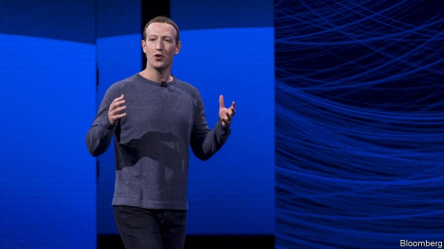

###### Weighing Libra in the balance

# Facebook wants to create a global currency 

 

> print-edition iconPrint edition | Leaders | Jun 22nd 2019 

FOR YEARS Wall Street’s magnates have worried that Silicon Valley’s giants will shake up finance. Facebook thinks it has found a way. It will launch a digital currency, the Libra, in 2020. Mark Zuckerberg’s firm has failed before to popularise a payments service. And it is an unlikely guardian of other peoples’ money, given its habit of privacy abuses and evasion. But like or loathe the company, its new scheme has legs. The Libra’s value will be pegged to a basket of major currencies, it will be able to handle large transaction volumes and 28 other big firms say they will join a consortium backing the currency. If Facebook’s 2.4bn users adopt Libra to shop and transfer money, it could become one of the world’s biggest financial entities. That would herald a consumer revolution—but could also make the financial system less stable and reduce governments’ economic sovereignty. 

Facebook’s interest is its own survival, since a new financial utility ties in its social-media and chat customers. Still, the digitisation of finance promises to make life easier and cheaper for billions of people. In China, where digital payments are ubiquitous, people transfer money to friends and firms within a chat app for almost nothing. In America 18bn cheques are signed every year. Fees eat up 5% of a typical cross-border transfer. And a threesome of credit-card giants skims about 0.25% from the global transactions they carry, which is worth over $30bn a year. 

Many existing efforts to redesign Western finance are unreliable. Cryptocurrencies such as Bitcoin have no intrinsic value or central oversight, are vulnerable to fraud and burn up electricity and computing power. Digital-payments systems such as PayPal and Apple Pay piggyback on the debit- and credit-card system rather than undercut it. Facebook’s experiment with payments, launched in 2015, was based on bank debit cards. It flopped. 

Libra is designed to avoid these pitfalls. It will be fully backed by a reserve fund which holds mainly government bonds, limiting its volatility. The currency will be administered by an independent body that will oversee a centralised database with an anonymised record of transactions. The system will be open, so that any firm is free to create digital wallets that allow customers to use Libras. Uber, Vodafone and Spotify are among the big firms that are keen to be anchor members. A kitty is being built up to offer incentives to shops and merchants to accept Libras. 

What’s not to like? Mr Zuckerberg’s initiative, which has been cooking in Menlo Park for 18 months, has two problems (see article). First, it could disturb the stability of the financial system. America’s biggest bank, JPMorgan Chase, has 50m digital clients. Libra could easily have ten times that number. Were every Western depositor to move a tenth of their bank savings into Libras, its reserve fund would be worth over $2trn, making it a big force in bond markets. Banks that suddenly saw lots of deposits leave for Libras would be vulnerable to a panic over their solvency; they would also have to shrink their lending. And the prospect of huge sums flowing across borders will worry emerging countries with a fragile balance of payments. 

That is where the second danger comes in: the Libra’s governance. It will be run by a Swiss association, initially controlled by the consortium, a bit like James Bond’s nemesis, SPECTRE. It will be independent of Facebook, though the social-media firm will supply lots of Libra users and could end up holding sway. Though Facebook says it is talking to regulators, the assumption seems to be that Libra can ultimately transcend governments and central banks. Facebook also promises that it will safeguard users’ data. Caveat emptor. 

Mr Zuckerberg used to move fast and break things. This time he is moving slowly and giving advance notice. But that cannot disguise how, though digital money has the potential to change the world for the better, it could also do a lot of harm. Governments let social media run riot. Facebook is about to discover that they will not make the same mistake with money.◼ 

