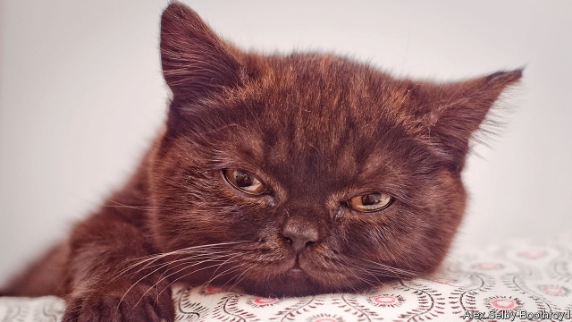

###### Canis sapiens

# Pets have gained the upper paw over their so-called owners 

 

> print-edition iconPrint edition | Leaders | Jun 22nd 2019 

THERE IS A range of theories about how Homo sapiens came to rule the planet. Opposable thumbs, cranial size, altruism and cooking all played a part, but central to the naked ape’s success was its ability to dominate other species. Bovids, equids and, in particular, canids, were put to work by H. sapiens; felids always took a slightly different view of the matter, but were indulged for their rodent-catching talents. 

As humanity has got richer, animals’ roles have changed. People need their services less than before. Fewer wolves and bandits meant less demand for dogs for protection; the internal-combustion engine made horses redundant; modern sanitation kept rats in check and made cats less useful. No longer necessities, domestic animals became luxuries. Pet-keeping seems to kick in en masse when household incomes rise above roughly $5,000. It is booming (see article). 

The trend is not a new one. Archaeologists have found 10,000-year-old graves in which dogs and people are buried together. Some cultures—such as in Scandinavia, where canines have long been both working dogs and companions—have kept pets for millennia. But these days the pet-keeping urge has spread even to parts of the world which have no tradition of snuggling up on a comfy chair with a furry creature. 

In parts of Asia where people used to regard the best place for man’s best friend as not the sofa but the stewing-pot, along with some onions and a pinch of seasoning, and where cats were made into tonics, norms are changing fast. The South Korean president, Moon Jae-in, has a rescue dog, and the mayor of Seoul has promised to shut down dog butchers. China, where dogs were once rounded up and slaughtered on the ground that keeping pets was bourgeois, has gone mad for cutesy breeds like Pomeranians, whose wolfish ancestors would have swallowed them whole for elevenses. Traditionalists attending the annual dog-meat festival in Guangxi now find themselves under attack by packs of snarling animal-lovers. 

The pet business is growing even faster than pet numbers, because people are spending more and more money on them. No longer are they food-waste-recyclers, fed with the scraps that fall from their masters’ tables. Pet-food shelves groan with delicacies crafted to satisfy a range of appetites, including ice cream for dogs and foods for pets that are old, diabetic or suffer from sensitive digestion; a number of internet services offer bespoke food, tailored to the pet’s individual tastes. 

In the business this is called “pet humanisation”—the tendency of pet owners to treat their pets as part of the family. This is evident in the names given to dogs, which have evolved from Fido, Rex and Spot to—in America—Bella, Lucy and Max. It is evident in the growing market for pet clothing, pet grooming and pet hotels. It is evident in the demand for breeds such as the French bulldog, which, tellingly, looks a bit like a human baby. 

People still assume that pets must be working for humanity in some way, perhaps making people healthier or less anxious. But the evidence for that is weak. Rather, new research suggests that canines have evolved those irresistible “puppy-dog eyes” precisely to manipulate human emotions. It has worked. The species that once enslaved others now toils to pay for the care of its pets, which lounge on the sofa waiting to be taken to the grooming salon. Sentimental Americans often refer to themselves not as cat-owners but as the cat’s “mommy” or “daddy”. South Koreans go one further, describing themselves as cat “butlers”, pandering to every feline whim. Watch a hapless dog-walker trailing “his” hound, plastic bag in hand to pick up its mess, and you have to wonder: who’s in charge now?◼ 

