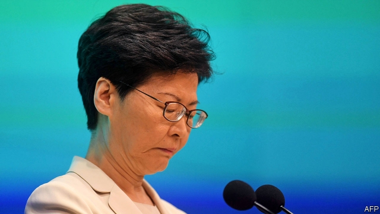

###### China’s chance

# To restore calm in Hong Kong, try democracy 

 

> print-edition iconPrint edition | Leaders | Jun 20th 2019 

IT WAS PROBABLY the largest political protest ever staged in Hong Kong. It may have been the biggest in China’s history. Organisers reckon that about 1.9m people joined the demonstration on June 16th. Even during the unrest in Tiananmen Square three decades ago, no single protest approached that scale. 

The estimate may not be reliable. But there is no disputing the impact of this display of discontent, and others leading up to it. It came only a week after another demonstration of jaw-dropping size and four days after one that escalated into Hong Kong’s most violent disorder since the 1960s. The territory’s government and its overlords in Beijing could not have received a clearer message that Hong Kongers distrust their own leaders, as well as the central government’s (see article). Protesters are demanding that Hong Kong’s chief executive, Carrie Lam, step down. Yet, even if she did, trust would still not be restored. 

The unrest was triggered by a proposed law that would allow the extradition of criminal suspects from Hong Kong (where the rule of law still more or less prevails) to the Chinese mainland (where those who displease the ruling party have little chance of a fair trial). The law would also let Hong Kong’s courts seize assets connected with crimes on the mainland. At a news conference on June 18th Mrs Lam apologised for her handling of the bill (but gave no indication that she would resign). Earlier, just before the latest record-breaking demonstration, she had announced that the bill would be shelved indefinitely. All this was welcome, but it is not enough. 

This crisis has vividly shown how disillusioned Hong Kongers have become. It was different in 2003, when hundreds of thousands of people took to the streets in protest against a proposed anti-sedition law. Then the Communist Party had reason to hope that it could defuse the problem by allowing Hong Kong to shelve the bill, and encouraging the unpopular chief executive, Tung Chee-hwa, to resign (he did so in 2005). At the time, many people in Hong Kong still thought that the party would eventually fulfil its pledge to give them more democracy. In the meantime they could grudgingly put up with the appointment system, which ensured that Mr Tung’s successor was loyal to the government in Beijing. For his first few months in office the new man, Donald Tsang, enjoyed strong public support. Some pro-democracy politicians even felt hopeful. 

Their optimism faded as the party’s intentions became clearer. During the “Umbrella Movement” of 2014, when protesters staged weeks of sit-ins to press for free and fair elections to the post of chief executive, China’s leaders dug in their heels. They made it plain that the “universal suffrage” Hong Kong had been promised would mean only the chance to vote for someone the party considers loyal. That is why Hong Kongers are without illusion today. They see Mrs Lam, who took over in 2017, as the party’s stooge—as they will see her successor, too. Without democracy, or a credible promise of it, no leaders in the territory will be seen as legitimate, severely limiting their ability to govern. 

China’s leader, Xi Jinping, therefore has a stark choice. He can keep Hong Kong’s political system as it is and carry on trying to stifle the freedoms that Hong Kongers otherwise enjoy. The result would be more protests and probably more violence. Businesspeople would become more jittery, and Hong Kong’s reputation as a safe base from which to trade with the mainland would be at risk. Or Mr Xi can offer Hong Kong hope again, by setting out a timetable for real democratic reform. “We have to have the confidence that Hong Kong people can manage Hong Kong well,” goes a mantra of China’s leaders. It is time to let its people try. ◼ 

