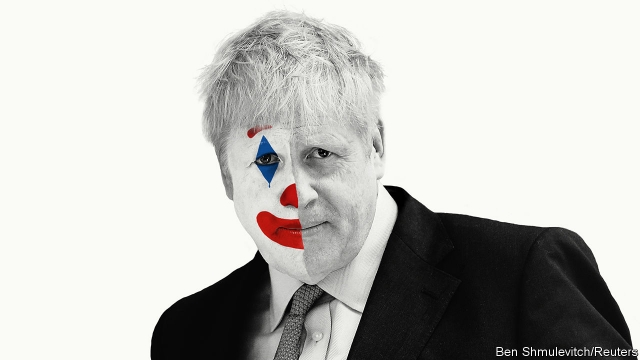

###### The Conservative leadership

# Which Boris would Britain get? 

 

> print-edition iconPrint edition | Leaders | Jun 20th 2019 

THE BREXIT monster unleashed three years ago this weekend has already devoured two British prime ministers. David Cameron surrendered hours after the referendum result was announced on June 24th 2016. Theresa May began confidently but soon found herself cornered. Conservative MPs have drawn up a shortlist of candidates to replace her as their leader and thus as prime minister; party members will make a decision by the end of July. The overwhelming favourite among both MPs and activists is Boris Johnson. 

But which Boris Johnson? The former foreign secretary, who is looked on with a mixture of amusement and contempt in European capitals, has assumed different guises at different times. As mayor of liberal, cosmopolitan London in 2008-16 he preached the virtues of immigration and the single market. As a leading light in the Leave campaign he effortlessly switched to criticising migration and warning of the dangers of Turkish membership of the European Union, which he had previously advocated. Now, in his bid for the votes of right-wing Tory party members, he talks up the prospect of leaving the EU with no deal—“fuck business” if it gets in the way—and joking that women in burkas “look like letterboxes”. 

Depressingly, the con trick is working. Despite valiant campaigns by more moderate candidates, Mr Johnson is the person to beat in the members’ vote. Much less clear is how he would behave in office. As the Brexit saga drags on, Britain is growing ever more polarised. In a starkly divided country, which gallery would Mr Johnson choose to play to? 

The way in which the next prime minister is being selected does not make it any easier to guess what is in store. Rather than face a general election, the leader is picked by 160,000 paid-up Tory activists, who long for Brexit more than almost anything else. A poll this week found that large majorities would leave the EU even if it did “significant damage” to the economy, broke apart the union with Scotland and Northern Ireland or “destroyed” the Conservative Party itself. Candidates have not drawn up detailed manifestos; Mr Johnson, in particular, has been uncharacteristically shy, avoiding most chances to debate with other candidates or be quizzed by journalists. 

His lack of a guiding philosophy ought to be a weakness. But in these topsy-turvy times it has become central to his success (see article). Because he is all but empty of political convictions, people use him as a repository for their own. Hardcore Brexiteers have seized on the idea that he will leave with no deal if the EU refuses to offer better terms by October 31st. Remainers whisper to themselves that surely he is a liberal at heart, who would not do anything truly dangerous—and might even call a second referendum in one of the gravity-defying acts of showmanship at which he excels. That his words mean almost nothing is taken by both sides as a sign that he might eventually do what they hope, regardless of what he has promised in the past. 

This is foolish, and reminiscent of the coalition that backed Donald Trump for president. Some believed Mr Trump’s outlandish promises (a border wall with Mexico, a trade war with Canada), while others thought them part of an act not to be taken literally—and went on to receive a nasty shock. This is not the only similarity between the two blond bombshells. As well as narcissism, idleness and a willingness to take advantage of others, they share a flair for arguing that black is white and vice versa. Britain does not yet suffer from America’s malaise, in which supporters of different parties cannot even agree about basic facts. But a government led by Mr Johnson, who freely contradicts himself and makes being caught out into a great joke, would lead Britain further down that path. 

The best case for Mr Johnson is that he might use his skill as a salesman and his way with words to hawk the Brexit deal, or something much like it, to a Parliament that has three times rejected it. Mrs May fell 58 votes short on her final attempt. Both Labour and the Tories have since become much more scared of what Brexit is doing to their supporters, who are flocking to the Liberal Democrats and the Brexit Party respectively. It is conceivable that Mr Johnson—freshly elected, popular in his party and as magnetic as Mrs May is wooden—might persuade enough MPs to change their minds. The idea of him choosing a referendum on the deal so as to break the logjam in Parliament, as this newspaper would like, is far-fetched. But then, so much about him is. 

Alas, the case against Mr Johnson is more plausible. He is not a signpost but a weather vane and, at the moment, the winds in Britain are blowing in a dangerous direction (see Briefing). The sudden rise of the populist Brexit Party, which came first in last month’s European election and now leads the polls with its promise of a no-deal exit, is terrifying the Tories, many of whom believe the only way to neutralise its insurgency is to ape it. Since long before the referendum, the Conservative Party has been slowly evolving into one whose supporters are bound more by cultural values than economic ones. Brexit has put rocket-boosters on that trend. The next Tory leader will be under pressure to continue the metamorphosis of his party from a force for free markets into a right-wing populist outfit in the (ironically) European mould. Mr Johnson would be capable of engineering that transformation. 

Weather vane that he is, Mr Johnson would be unusually reliant on the people around him in 10 Downing Street and the cabinet for ideas, guidance and direction. By contrast with Mr Trump, who resents advice and experts, Mr Johnson is happy to delegate and let others do the work—provided he gets the glory. And whereas most mainstream Republicans at first disowned Mr Trump, thus ruling themselves out of working for him, moderate Tories are flocking to Mr Johnson’s banner, in the hope of landing a plum job in his cabinet. Many of them recognise that a no-deal Brexit would be bad for Britain—and thus, most likely, a disaster for the Conservative Party. If Mr Johnson ends up in power, it will fall to them to rein in his worst instincts. If they fail, it may not be long before the Brexit monster is chewing up and spitting out its third prime minister. ◼ 

