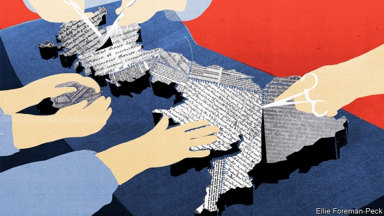
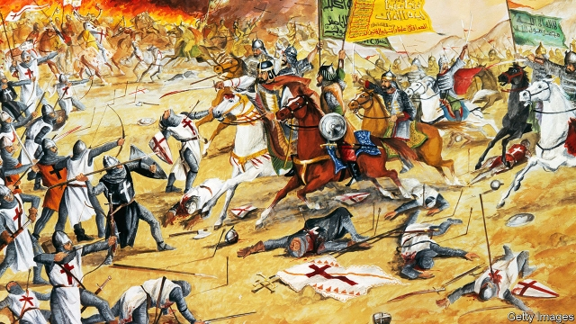
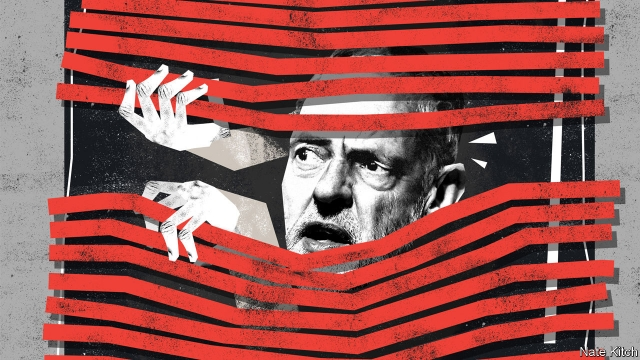
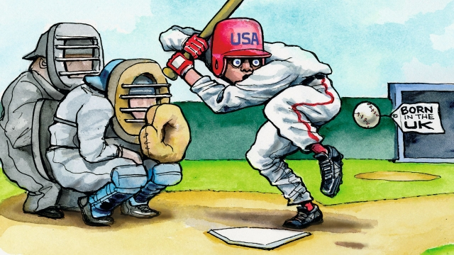

###### On Britain, Concorde, Nigeria, ships, Jeremy Corbyn, baseball

# Letters to the editor 

 

> Jun 22nd 2019 

You suggest that Britain may be on the brink of a constitutional crisis, and that the country’s “ramshackle, easily amended constitution is vulnerable to the radicalised politics produced by three years rowing about Brexit” (“The next to blow”, June 1st). However, the present crisis is also a consequence of that easily amended constitution. Constitutional tinkering by successive governments, particularly the transfer of powers to the European Union, brought about this situation. 

Both the Maastricht and Lisbon treaties were significant constitutional changes. With a proper constitution, governments could not have transferred those powers to the EU without the electorate’s consent. Had this consent been secured, the pressure to hold the Brexit referendum would never have developed. The people might then not have voted as they did, unequivocally and unconditionally, to leave the EU. So the fundamental basis of the constitutional crisis is not the lack of clarity over whether the executive or Parliament should prevail, but the fact that neither seem clear that the people’s choice should. 

A good constitution constrains the government. It anticipates amendments and makes that process difficult. If we do get a new constitution out of this mess it should make clear that the people are sovereign and it cannot be amended without their consent. 

NICOLAS BEARDWilsic, South Yorkshire 

 

Your briefing was unduly pessimistic (“The referendums and the damage done”, June 1st). Instead of the fundamentals, you focused on the fireworks of daily politics. Parliament is sovereign. That is the bedrock of our unwritten constitution. Parliament delegates power to the executive, but reclaims it when necessary. And the devolved assemblies are clearly subordinate to Parliament. 

The referendum in 2016 opted for a Brexit and Parliament gave notice to the EU that we are leaving by invoking Article 50 of the EU treaty. Parliament has so far decided to reject specific withdrawal measures, but it has not voted to rescind that notice. Unless it does so, Brexit will happen. Parliament has a choice. That is fundamental constitutional democracy, not a constitutional crisis. 

HODSON THORNBERLondon 

Vernon Bogdanor is rightly described in your piece as “one of Britain’s foremost commentators on the constitution”. He was also David Cameron’s tutor in politics at Oxford. May we ask the professor what he taught his pupil and what the latter learned? 

ALAN MALCOLMLondon 

“Faster than sound” (Technology Quarterly on aviation, June 1st) described Concorde as a vanity project that ignored issues like profitability. Whether or not it was a vanity project is a point of view, but the aircraft was designed in the 1960s to be profitable on the basis of fuel prices at the time. All the big airlines signalled their intention to purchase the plane. Unfortunately, when Concorde was about to enter service in the early 1970s OPEC quadrupled fuel prices, thereby affecting profitability. 

TERRY DOYLEComox, Canada 

 

Two articles on the Nigerian economy in your issue of June 1st (“More misery ahead” and “Protection racket”) were full of contradictions. You argued that energy production, consumption and prices must rise; then you reported that energy prices are too high. You then said that booming rice production is “mysteriously” culpable for rising rice imports—in another country. You also said tax revenues should increase, then criticised companies, such as cement producers, for making greater taxable profits. 

 There are no such contradictions in President Muhammadu Buhari’s economic policies. They are straightforward: curtail the decades-long flight of money from the country; build our own industrial base to lessen dependence on oil income; boost and diversify tax receipts through the same; and invest tax revenue in security, education and infrastructure, including power production, creating jobs for millions. 

The economy and Nigerian people are thriving. Take our textile industry, which you think is near-impossible to attain growth. Last year’s Lagos Fashion Week was the largest and most well-attended showcase for the rebirth of Nigeria’s textile industry we might hope for. 

GARBA SHEHU MEDIPress spokesman for the president of NigeriaAbuja 

 

In an otherwise excellent review of a new book about Saladin, the reviewer mentions that the Royal Navy named a “British battleship” after him (“A noble enemy”, June 1st). HMS Saladin was a destroyer, not a battleship. Big difference. 

CHARLEY SEAVEYRockport, Massachusetts 

 

Bagehot described Jeremy Corbyn as a “rebellious private-school” drop out (June 1st). In fact, the Labour leader attended a state grammar school for his secondary education: Adams’ Grammar School in Newport, Shropshire. Mr Corbyn did go to a small private school for his primary education, but it would be an error to suggest that his private education was on a par with Boris Johnson and David Cameron, both of whom were educated at Eton. I can assure you that Castle House School in the 1960s would have had very little in common with Eton. Headed by the formidable and unforgettable Miss Pitchford, it had a lasting influence on those of us who went there. 

CATHERINE RANDALLLondon 

 

Lexington wrote about the role baseball plays in Americans’ belief in their exceptionalism (June 8th). Racism, sexism and delusive pride have also plagued “the American game”, but at the same time it has provided us with countless stories of hardship, triumph and faith. Take Jackie Robinson or Lou Gehrig; if baseball is more stage than sport, we need these characters now more than ever. American patriotism is problematic if not outright dangerous, but I think we can afford baseball more credit. 

CAROLINE OGNIBENELondon 

Baseball is essentially American because it reflects traits that we value: the worth of the individual, self-assertion, proving oneself on personal merit, forgiveness (there but for the grace of God go I), tolerance (give him a break) and the support of the community. 

A man steps up to bat, alone and self-reliant, the essence of meritocracy. He uses his judgment, not trying to hit every ball, but is tolerated a couple of mistakes (three strikes). Once on first base, he has proved his worth and is no longer alone; now the team works for him. And he is engaged in the community’s objectives. Stealing a base is praised, because it shows daring and risk taking. Hitting a home run results in excellence rewarded. 

The pitcher too behaves in ways we approve. He uses skill, imagination and strategy. He is forgiven three balls, because we are human after all. 

ALEXANDER KUGUSHEVMenlo Park, California 

